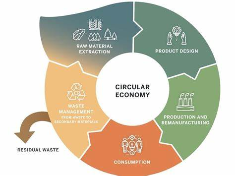

Die Circular Economy oder auch Kreislaufwirtschaft ist ein Wirtschaftsmodell, das danach ausgerichtet ist den Resourceneinsatz, die Abfallproduktion, die Emissionserzeugnisse zu 
minimieren. Dabei ist das Ziel die maximale Effizienz bei der Nutzung endlicher Ressourcen, den Übergang zu erneuerbaren Ressourcen und auch die volle Ausschöpfung von 
Materialien und Produkten bis zum Ende ihres Lebenszyklus zu erreichen.[^3] Im allgemeinen beschirebt die Circular Economy ein regeneratives Wirtschaftssystem.
Das dazustehende Gegenüber ist die Linearwirtschaft, welches ein "take-make-dispose" Modell beschreibt - in anderen Worten eine Wegwerfwirtschaft darstellt. Dabei zielt die 
Circular Economy nicht nur darauf ab, die Mängel einer linearen Wirtschaft auszubessern, sondern stellt auch ein systematischen Wandel dar, der das Wirtschaftssystem vollständig 
verändert.[^1]

# Die drei Grundsätze von Circular Economy

1. Umweltverschmutzung und Abfall überdenken und minimieren

Das Konzept bezieht sich auf die Minimierung von Abfällen und Umweltverschmutzung. Die Schäden durch wirtschaftliche Aktivitäten sollen reduziert werden. Dieser Einfluss auf die 
Umwelt kann bereits bei der Gestaltung und dem Design des Produkts bestimmt werden. Durch neue Technologien und Materialien kann die Verschmutzung und der Abfall vermieden 
werden. [^2]

2. Materialien und Produkte nachhaltig nutzen

3. Systeme umgestalten

Aspekte zu Themen können ganz unterschiedlich sein:

* Verschiedene Teile eines Themas 
* Historische Entwicklung
* Kritik 

*Circular Economy Modell

# Aspekt 2

* das
* hier 
* ist
* eine 
* Punkteliste
  - mit unterpunkt

## Hier eine Ebene-2-Überschrift unter Aspekt 2

So kann man eine Tabelle erstellen:

| First Header  | Second Header |
| ------------- | ------------- |
| Content Cell  | Content Cell  |
| Content Cell  | Content Cell  |

## Hier gleich noch eine Ebene-2-Überschrift :-)

Wenn man hier noch ein bisschen untergliedern will kann man noch eine Ebene einfügen.

### Ebene-3-Überschrift

Vorsicht: nicht zu tief verschachteln. Faustregel: Wenn man mehr als 3 
Ebenen benötigt, dann passt meist was mit dem Aufbau nicht.

# Aspekt n

1. das
2. hier 
4. ist 
4. eine
7. nummerierte liste
   1. und hier eine Ebene tiefer

# Siehe auch

* Nachhaltige_Entwicklung.md
* Nachhaltige_Projekte.md
* Sustainable_Development_Goals.md
* Nachhaltigkeit_im_PM.md
* Change_Projekte.md

# Weiterführende Literatur

* Walcher, D., Leube, M.(2017).Kreislaufwirtschaft in Design und Produktmanagement - Co-Creation im Zentrum der zirkulären Wertschöpfung. Wiesbaden: Soringer Gabler Fachmedien.
* 

# Quellen

[^1]: [Circular Economy - Overview, Principles, Types of Cycles (coporatedfinanceinstitute.com)](https://corporatefinanceinstitute.com/resources/knowledge/economics/circular-economy/#:~:text=What%20is%20a%20Circular%20Economy%3F%201%20Principles%20of,and%20an%20indicator%20of%20its%20standard%20of%20living.)
[^2]: [Circular Economy - Was ist eine Kreislaufwirtschaft? (tempo-world.com)](https://www.tempo-world.com/de-de/leben-mehr/wie-eine-circular-economy-der-umwelt-helfen-kann/)
[^3]: [Kreislaufwirtschaft in Design und Produktmanagement - Co-Creation im Zentrum der zirkulären Wertschöpfung (von Dominik Wlacher etc.)](https://link.springer.com/content/pdf/10.1007%2F978-3-658-18512-1.pdf)
[^4]: [Circular Economy Modell](Projektmanagement_fuer_Circular_Economy/circular economy modell.jpg)

