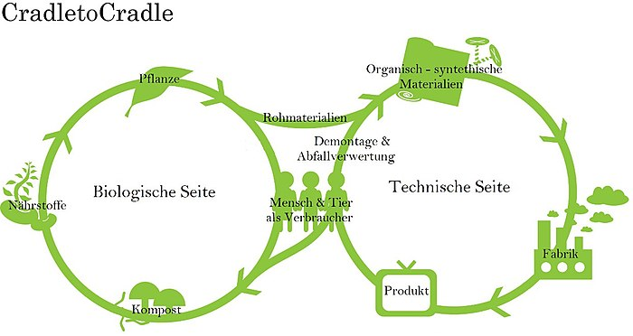

Die Circular Economy oder auch Kreislaufwirtschaft ist ein Wirtschaftsmodell, das danach ausgerichtet ist, den Ressourceneinsatz, die Abfallproduktion, die Emissionserzeugnisse 
zu minimieren. Dabei ist das Ziel die maximale Effizienz bei der Nutzung endlicher Ressourcen, den Übergang zu erneuerbaren Ressourcen und auch die volle Ausschöpfung von 
Materialien und Produkten bis zum Ende ihres Lebenszyklus zu erreichen.[^3] Im Allgemeinen beschreibt die Circular Economy ein regeneratives Wirtschaftssystem.
Das dazu stehende Gegenüber ist die Linearwirtschaft, welches ein "take-make-dispose" Modell beschreibt - in anderen Worten eine Wegwerfwirtschaft darstellt. Dabei zielt die 
Circular Economy nicht nur darauf ab, die Mängel einer linearen Wirtschaft auszubessern, sondern stellt auch ein systematischer Wandel dar, der das Wirtschaftssystem vollständig 
verändert.[^1]

*Circular Economy Modell[^4]

# Die drei Grundsätze von Circular Economy

1. Die Schonung der Ressourcen

Das Konzept bezieht sich auf die Minimierung von Abfällen und Umweltverschmutzung. Die Schäden durch wirtschaftliche Aktivitäten sollen reduziert werden. Dieser Einfluss auf die 
Umwelt kann bereits bei der Gestaltung und dem Design des Produkts bestimmt werden. Durch neue Technologien und Materialien kann die Verschmutzung und der Abfall vermieden 
werden. [^2]

2. Hohe effiziente Nutzung der Ressourcen

Die Circular Economy hat mitunter als Ziel, die Lebenszyklen, sowie die Nutzungsdauer von Produkten und Materialien zu verlängern. Dies kann nur dann funktionieren, indem ein 
Kreislauf für die in der Wirtschaft zirkulierenden Materialien und Produkte entsteht. Dabei erreicht man das Ziel durch die aktive Wiederverwendung, Reparatur und 
Wiederaufbereitung der verwendeten Produkte und Materialien.[^1]

3. Recycling/Regeneration

Die Regeneration vom Ökosystem ist ein fundamentaler Ansatz und deutet darauf hin bewusstes Recyclen anzuwenden, um so dem Ökosystem etwas zurück zugeben. Heißt: Die Ressourcen sind begrenzt und ein stäniges nehmen wird den Zustand verschlimmern.[^2]

# Denkansätze zur Circular Economy

1. Performance Economy

Dieser Denkansatz beschreibt eine Kreislaufwirtschaft und ihre Auswirkungen auf Abfallvermeidung, rationelle Nutzung begrenzter Ressourcen, die Schaffung neuer Arbeitsplätze und
das Wachstum.[^7]

2. Öko-industrielle Entwicklung

Hier beinhaltet es einen geschlossenen Produktionskreislauf zur Minimierung von Umweltprobleme, wie Boden- und Wasserverschmutzung, Energiemanagement, Ressourceneffizienz etc.
Dabei ist das Hauptziel die deutliche Verbesserung der wirtschaftlichen Umweltleistung.[^8]

3. Regenerative Gestaltung

In diesem Aspekt behandelt man, die Erneuerung oder Revitalisierung von Energie und Materialien für die Produktion und möchte Bedingungen schaffen für ein nachhaltiges
Wirtschaftssystem.[^8]

4. Biomimicry

Man spricht hierbei von Innovationen, die von der Natur inspiriert werden. 
Die drei Grundprinzipien von Biomimicry.
- Die Natur als Modell für die Lösung menschlicher Probleme.
- Die Natur als Messlatte.
- Die Natur als Mentor.[^8]

5. Cradle to Cradle

*Cradle to Cradle [^6]

Kreislaufwirtschaft bezieht sich normalerweise auf die Menge an recycelten Materialien oder die Reduzierung von Abfall. Das Design von Cradle zu Cradle konzentriert sich jedoch 
auf die Produktqualität, einschließlich der Sicherheit für Mensch und Umwelt. Weiterhin wird durch dieses Modell ersichtlicher, dass die in einer Kreislaufwirtschaft zwei 
verschiedene Produkte in Kreisläufen fließen. 
* Im biologischen Kreislauf kehren Ressourcen in die Natur zurück. 
* Im technologischen Kreislauf zirkulieren Ressourcen endlos im Kreislauf. [^7]

6. Blue Economy

Die Absicht dieses Wirtschaftsmodells ist die effiziente Nutzung der natürlichen Ressourcen durch Innovation und Unternehmertum.[^7]

# Vorteile einer Kreislaufwirtschaft

* Einsparungen bei den Kosten
* Die Treibhausgasemission wird gesenkt
* Die Umweltbelastung wird verringert
* Steigerung der Rohstoffversorgung
* stärkere Mitarbeiterbindung an das Unternehmen 
* Förderung der Innovation und Wachstum 
* Image Aufbesserung des Unternehmens[^5]

# Siehe auch

* Nachhaltige_Entwicklung.md
* Nachhaltige_Projekte.md
* Sustainable_Development_Goals.md
* Nachhaltigkeit_im_PM.md
* Change_Projekte.md

# Weiterführende Literatur

* Walcher, D., Leube, M.(2017).Kreislaufwirtschaft in Design und Produktmanagement - Co-Creation im Zentrum der zirkulären Wertschöpfung. Wiesbaden: Soringer Gabler Fachmedien.
* Läpple, F.(2007). Abfall- und kreislaufwirtschaftlicher Transformationsprozess in Deutschland und China - Analyse, Verglecih und Übertragbarkeit (Dissertation Fakultät für Wirschafts- und Sozialwissenschaften). Heidelberg

# Quellen

[^1]: [Circular Economy - Overview, Principles, Types of Cycles (coporatedfinanceinstitute.com)](https://corporatefinanceinstitute.com/resources/knowledge/economics/circular-economy/#:~:text=What%20is%20a%20Circular%20Economy%3F%201%20Principles%20of,and%20an%20indicator%20of%20its%20standard%20of%20living.)
[^2]: [Circular Economy - Was ist eine Kreislaufwirtschaft? (tempo-world.com)](https://www.tempo-world.com/de-de/leben-mehr/wie-eine-circular-economy-der-umwelt-helfen-kann/)
[^3]: [Kreislaufwirtschaft in Design und Produktmanagement - Co-Creation im Zentrum der zirkulären Wertschöpfung (von Dominik Wlacher etc.)](https://link.springer.com/content/pdf/10.1007%2F978-3-658-18512-1.pdf)
[^4]: [Circular Economy Modell](Projektmanagement_fuer_Circular_Economy/R.jpg)
[^5]: [Kreisaufwirtschaft: Definiton und Vorteile (Europäische Parlament)](https://www.europarl.europa.eu/news/de/headlines/economy/20151201STO05603/kreislaufwirtschaft-definition-und-vorteile)
[^6]: [Cradle to Cradle](Projektmanagement_fuer_Circular_Economy/Cradle_to_Cradle.jpg)
[^7]: [Towards the circular economy](https://www.mckinsey.com/~/media/mckinsey/dotcom/client_service/sustainability/pdfs/towards_the_circular_economy.ashx)
[^8]: [Circular Economy: Concepts and Principles](https://jss.utm.md/wp-content/uploads/sites/21/2020/06/JSS-2-2020_5-12.pdf)
