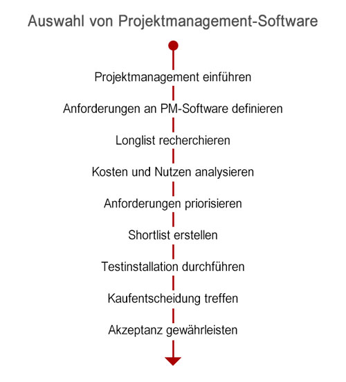

# 1. Einführung

Mit **"Projektmanagement-Software"** werden Software-Produkte bezeichnet, die Projektmanagement-Prozesse unterstützen und ein Grundgerüst für die Abwicklung der Projekte bieten[^1]. Die sind aber keine spezifischen Produkte – können damit alles gemeint sein vom E-Mail-Client, Standard Büro-Software bis zur Multiprojekt-Software.

# 2. Klassifizierung von Projektmanagement-Software

Im Prinzip lässt sich Projektmanagement-Software in folgende Klassen klassifizieren:

## 2.1.	Projektmanagement mit allgemeiner Software

Das Projektmanagement kann insgesamt durch allgemeine Office-Lösungen unterstützt werden. Zentrale Tools dafür sind Datenbank- und Tabellenkalkulationssoftware z. B. MS Excel. Weitere Aspekte des Projektmanagements können durch Textverarbeitungs- und Präsentationssoftware abgedeckt werden. Im Vergleich zu professioneller Projektmanagement-Software wirken alle diese allgemeinen Lösungen zwar recht zusammenhanglos und nicht sehr professionell, können aber je nach Ausgangslage eines Unternehmens dann einen Sinn ergeben, wenn Projekte nicht zum Kerngeschäft gehören und somit nicht in größerer Anzahl durchgeführt werden.

## 2.2.	Freeware-Lösungen zum Projektmanagement

Das Internet bietet eine Vielzahl an Freeware-Lösungen an, die meisten mittlerweile rein web-basierte Anwendungen sind. Diese Freeware-Lösungen bieten bereits eine etwas kompaktere Lösung an IT-Unterstützung für das Projektmanagement an. Die Möglichkeiten sind zwar auch begrenzt, reichen aber in der Regel für die Voraussetzungen des grundlegenden Projektmanagement aus.[^2] Einige Aktivitäten des Projektmanagements wie grafische Darstellung können hier wesentlich komfortabler und professioneller unterstützt werden als mit allgemeiner Software und Office-Lösungen. Insbesondere bei cloud-basierten Freeware-Lösungen sollte man allerdings auf die Eingabe von sensiblen Daten verzichten und bei der Entwicklung eines neuen Produkts ist es nicht sinnvoll Freeware umzusetzen.

## 2.3.	Professionelle Projektmanagement-Software-Lösungen

Die Menge der Projektmanagement-Software bietet aber weitestgehend komplette Lösungen an, die zumindest die Aufgaben, Kapazitäten und Kosten sowie Risiken und weitere Aspekte von einzelnen Projekten darstellen können. Da sie in der Regel mehr leisten können als Freeware-Lösungen und häufig Bestandteil eines Gesamtpakets sein können, sind die Projektmanagement-Software-Lösungen auch deutlich verbreitet.
	
Auf dem Markt für Projektmanagement-Software werden viele hunderte verschiedene IT-Lösungen für Projektmanagement angeboten. Es gibt also ausreichend Tools für die unterschiedlichsten Ansprüche. Problematisch ist daher nicht das Auffinden von Tools, sondern die Auswahl des am besten geeigneten Tools für die individuellen Anforderungen des Unternehmens an das Projektmanagement.[^2]

# 3. Auswahl von PM Software:

Die Zusammenstellung möglicher Anforderungen und ihrer Ausprägung ist ein erster Schritt, um eine Vorauswahl an Produkten zu treffen – und zwar eine "Longlist" in Frage kommender Produkte zu erstellen. Allerdings stellt man dann schnell fest, dass zum einen ein großer Funktionsumfang auch hohe Kosten bedeutet und dass zum anderen selbst bei sehr ähnlichen Leistungsmerkmalen zwei Produkte sehr unterschiedliche Preise haben können. Um eine qualifizierte Kaufentscheidung treffen zu können, muss man deshalb eine sorgfältige Kosten-Nutzen-Analyse durchführen.[^1]

# 4. Implementierung von Projektmanagementsoftware

Die Implementation der PM-SW kann grundsätzlich durch drei verschiedene Strategien stattfinden:
* Pilotprojekte,
*	Schritt-für-Schritt -Technik oder
*	Big Bang

Selbstverständlich können viele weiteren Strategien auf Basis dieser 3 Strategien entwickelt werden. 
Allerdings welche dieser Strategien am besten für die Unternehmenssituation geeignet ist, muss innerhalb des Einführungsprojekts entschieden werden.

# 5. Zusammenfassung

Die Verwendung von Software beim Management von Projekten ist heutzutage nahezu unverzichtbar, muss aber genau betrachtet werden. Kein Format von Software ersetzt das professionelle Projektmanagement, sondern kann dies nur unterstützen. Je nach Voraussetzungen und Anforderungen des Unternehmens und der Projekte sollte die Tools sorgfältig ausgewäht werden. 

# Siehe auch

* [A Comparison of Project ManagementSoftware Tools (PMST)](http://www.softwaresuccess.org/papers/2010_Demir_Comparison_Project_Management_Software_Tools.pdf)
* [Anforderungen und Auswahlkriterien für Projektmanagement-Software](https://dl.gi.de/handle/20.500.12116/21386)

# Quellen

[^1]: [Projektmanagement-Software kompakt](https://www.projektmagazin.de/projektmanagement-software-kompakt#auswahl-von-projektmanagement-software)
[^2]: [IT-Unterstützung in Projekten: Projektmanagement-Software](https://link.springer.com/chapter/10.1007/978-3-662-54432-7_18)
