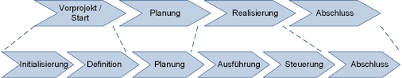

# Klassische Projektphasen

Eine Projektphase ist "ein definierter Zeitraum innerhalb der Laufzeit eines [Projekts](Projekt.md), der meist durch jeweils einen Meilenstein zu Beginn und Ende im Ablaufplan definiert ist".[^1]

Die Einteilung eines Projekts in verschiedene Phasen dient dabei das Projekt (egal ob groß oder klein) übersichtlicher zu machen und dabei die Kontrolle und Qualität zu erleichtern bzw. zu verbessern. Dies wird durch eine verbesserte Projektsteuerung, z.B. die genaue Verteilung von Aufgaben, und erleichterte Erfolgsprüfung dank genauer Definition von Beginn und Abschluss der Aufgaben/Phasen durch Meilensteine gewährleistet.[^2]

Je nach Quelle und Definition werden klassische Projekte in 4 bis 5 Phasen unterteilt und Schwerpunkt der einzelnen Phasen teilweise auch etwas anders gesetzt. Die Reihenfolge kann sich ändern bzw. können einzelne Schritte im Projekt auch gleichzeitig ausgeführt oder öfter wiederholt werden, bis man zu dem gewünschten Ergebnis kommt.
Im Folgenden wird ein Modell mit 5 Phasen betrachtet[^3]:

* Projektvorbereitung
* Projektplanung
* Projektdurchführung
* Projektüberwachung
* Projektabschluss

# Projektphasen im Detail

## 1. Projektvorbereitung / Projektstart

In dieser ersten Phase wird ein Projekt definiert, Ziele festgelegt und unter anderem Chancen und Risiken diskutiert.[^2] Zusätzlich werden die wichtigsten [Stakeholder](Stakeholderanalyse.md) identifiziert und das Projekt auf die Umsetzbarkeit und Wirtschaftlichkeit für das ausführende Unternehmen geprüft. Dazu gehören Themen wie die [Kosten-Nutzen-Analyse](Kosten_Nutzen_Analyse.md)  oder auch die Ausarbeitung eines Zeitplans.[^3] Dafür kann zum Beispiel die [Methode des kritischen Pfades](Methode_des_kritischen_Pfades.md) angewendet werden.[^9][^4]

Des Weiteren wird die grobe Planung von benötigten Ressourcen in punkto Arbeitskraft oder auch Rohstoffe bzw. Maschinen angegangen. Wichtig ist dabei auch die Beachtung des Ausführungsort des Projekts. Plant man beispielsweise den Bau einer Fabrik in einem anderen Land, so müssen eventuelle rechtliche Bestimmungen zum Thema Arbeitsrecht oder die Einfuhr von Gütern geklärt werden. Hat man keine Rohstoffe und Maschinen vor Ort, müsste man einen möglichen Import dieser Güter in das Zielland auf Rentabilität prüfen. Bei Projekten im IT-Sektor und nicht-physischen Endprodukten entfallen natürlich einige dieser Prüfungsschritte.

Viele Unternehmen haben auch bestimmte Wert- bzw. Umsatzgrenzen, ab wann ein Projekt von einer höheren Managementebene freigegeben werden muss. Wurden alle Rahmenbedingungen geklärt und der Projektantrag bewilligt, folgt die Projektplanung.[^4] 

## 2. Projektplanung

Hierbei werden mithilfe eines eventuell schon vorhandenen Zeitplans genau Termine herausgearbeitet und in diesem Zuge auch Aufgaben an einzelne Personen oder an zuvor zusammengestellte Teams verteilt. Es wird ebenfalls festgelegt wie ein erfolgreiches Ergebnis aussieht, d.h. ab wann das Projekt abgeschlossen ist. Durch die bereits erwähnten Meilensteine wird das Projekt und die Aufgaben in Abschnitte unterteilt und ein [Projektstrukturplan](Projektstrukturplan.md) wird erstellt, welcher "das Ergebnis einer Gliederung des Projekts in plan- und kontrollierbare Elemente"[^5] ist.[^6] Oft wird auch mit einem [Lasten-](Lastenheft.md) und [Pflichtheft](Pflichtenheft.md) gearbeitet.[^7]

Natürlich bergen Projekte unbeachtet ihrer Größe auch immer Risiken. In einem [Risikomanagementplan](Risikomanagement.md) werden diese aufgeführt und Lösungen für den Fall des Eintritts ausgearbeitet. Die Planung eines Projektes hört jedoch nach Abschluss dieser zweiten Phase nicht auf. Die beteiligten Teams müssen ständig im Austausch miteinander stehen und sich an eventuelle Veränderungen anpassen.[^4]

## 3. Projektdurchführung

Sind alle Aufgaben verteilt und man ist mit dem grundlegenden Planungsprozess fertig, so beginnt die Durchführung des Projekts. Der [Projektleiter](Faehigkeiten_Projektleiter.md) ist verantwortlich dafür, "das Team durch die einzelnen Meilensteine zu führen".[^3] 

In regelmäßigen Projekttreffen des Projektteams werden Informationen über den Status des Projektes ausgetauscht und gegebenenfalls Teile der Planung angepasst. [Statusberichte](Statusreport.md) oder auch die [Kosten-Trend-Analyse](Kosten_Trend_Analyse.md) geben einen Überblick über die aktuelle Sachlage.[^8] Es zeigt sich auch, ob Risiken aus der zweiten Phase eintreten.
Zusätzlich gewinnt das [Controlling](Projektcontrolling.md) an Wichtigkeit, da hierdurch früh unerwünschte Entwicklungen erkannt werden können.

## 4. Projektüberwachung

Diese Phase läuft meist parallel zur Projektdurchführung. Sie beinhaltet das bereits genannte Controlling und die Überwachung von Fristen, Budget und Ressourcen.[^3] 
Zum Einsatz kommen Methoden wie die [Kanbanmethode](Kanban.md) zur Produktionsprozesssteuerung[^10] oder der Plan/Soll/Ist-Vergleich, bei welchem der Projektfortschritt qualitativ und quantitativ analysiert wird.[^11]

Es besteht eine ständige Kommunikation zwischen allen relevanten Beteiligten und es wird auf unerwünschte Entwicklungen reagiert und gegengesteuert.[^6]

## 5. Projektabschluss

Der Auftraggeber kann nun das fertige Projekt abnehmen, sofern alle Qualitätsansprüche und Erwartungen erfüllt wurden.[^6] Oft werden vom Projektteam [Abschlussgespräche](Abschlussanalyse.md) geführt, in welchen die Mitwirkenden rückblickend zusammenfassen, was gut gelaufen ist und wo es Probleme gab. Dafür kann ein [Projektabschlussbericht](Projektabschlussbericht.md) erstellt werden. Die gesammelten Erfahrungen kommen dann den nächsten Projekten und der allgemeinen Performance des Teams zugute. 

Es beginnt außerdem die Gewährleistungsphase für die Endprodukte. Dazu können Kunden bei beispielsweise dem Bau von Industrieanlagen zusätzlich Serviceverträge mit dem beauftragten Unternehmen abschließen, um sich eine schnelle, fachgemäße Wartung und Instandhaltung zu sichern.[^4]

## Zusammenfassung

Bei der Planung eines Projektes kommt man nicht um die Eingliederung in Phasen herum. Ob man jedoch die Aufteilung in 4, 5 oder 6 Phasen vornimmt, ist eventuell von der Komplexität des Projektes abhängig, oder von der Art der Umsetzung. Hier noch ein Beispiel für 4 bzw. 6 Pasen-Projekte:

*vier und sechs Phasen im PM*[^12]

## Siehe auch:
* [Projektlebenszyklus - die Phasen im Projekt (Video)](https://www.youtube.com/watch?v=CSWCDIXKUoQ&ab_channel=Erfolgreich-Projekte-Leiten)
* [Projektphasen in der Realität (Humor)](https://twitter.com/ErnstvAll/status/1115568429438730240/photo/1)

## Weiterführende Literatur:
* [Crashkurs Projektmanagement: Grundlagen aller Projektphasen](https://www.katalog.fau.de/TouchPoint/singleHit.do?methodToCall=showHit&curPos=2&identifier=2_SOLR_SERVER_2101837480)
* [Projektmanagement als Führungskonzept (Springer Verlag)](https://link.springer.com/book/10.1007/978-3-642-60144-6)

# Quellen

[^1]: [projektmagazin: Projektphasen](https://www.projektmagazin.de/glossarterm/projektphase)
[^2]: [ProjectWizards: Wie Sie Projektphasen erfolgreich planen](https://www.projectwizards.net/de/blog/2019/06/project-phases)
[^3]: [MindManagerBlog: Die fünf Phasen dees Projektmanagement-Prozesses](https://blog.mindmanager.com/de/blog/die-funf-phasen-des-projektmanagement-prozesses/)
[^4]: Eigene Erfahrung aus Ausbildungsphase bei Finance-Abteilung der Siemens Energy AG Stuttgart
[^5]: [Wikipedia: Projektstrukturplan](https://de.wikipedia.org/wiki/Projektstrukturplan)
[^6]: [business-wissen.de: Phasen des Projektmanagements im Überblick](https://www.business-wissen.de/hb/phasen-des-projektmanagements-im-ueberblick/)
[^7]: [SoftSelect: Erläuterung: Lastenheft vs. Pflichtenheft](http://www.softselect.de/wissenspool/erlaeuterung_lastenheft_vs_pflichtenheft#:~:text=Das%20Lastenheft%20beschreibt%20die%20gesamte,Lastenheft%20gew%C3%BCnschten%20Funktionen%20umgesetzt%20werden.)
[^8]: [Julius-Maximilians-Universität Würzburg: Projektdurchführung](https://www.uni-wuerzburg.de/verwaltung/qualitaetsmanagement/projektmanagement/projektdurchfuehrung/)
[^9]: [Wikipedia: Methode des kritischen Pfades](https://de.wikipedia.org/wiki/Methode_des_kritischen_Pfades)
[^10]: [Wipedia: Kanban](https://de.wikipedia.org/wiki/Kanban)
[^11]: [ROLANDWANNER: Welches ist die beste Projektcontrolling-Methode?](https://rolandwanner.ch/die-beste-projektcontrolling-methode/)
[^12]: [Peter Johann Consulting: Projektphasen](https://www.peterjohann-consulting.de/projektphasen/)
