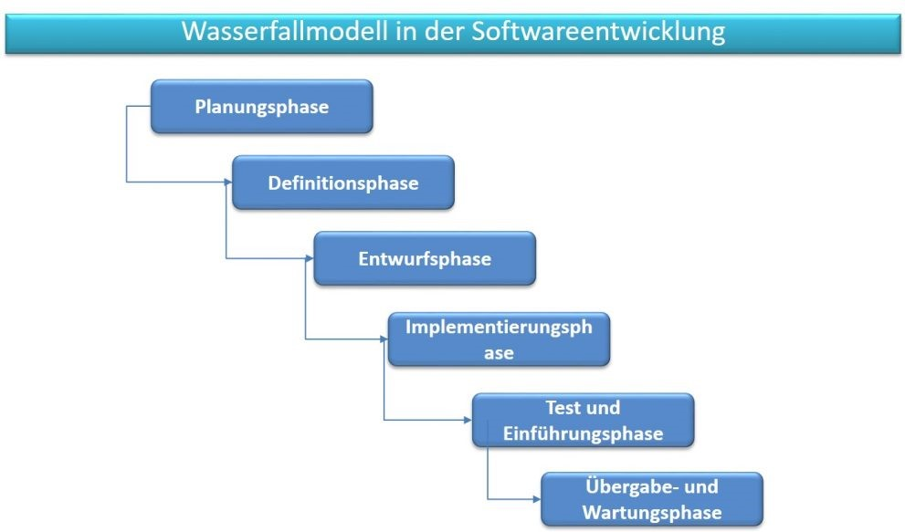
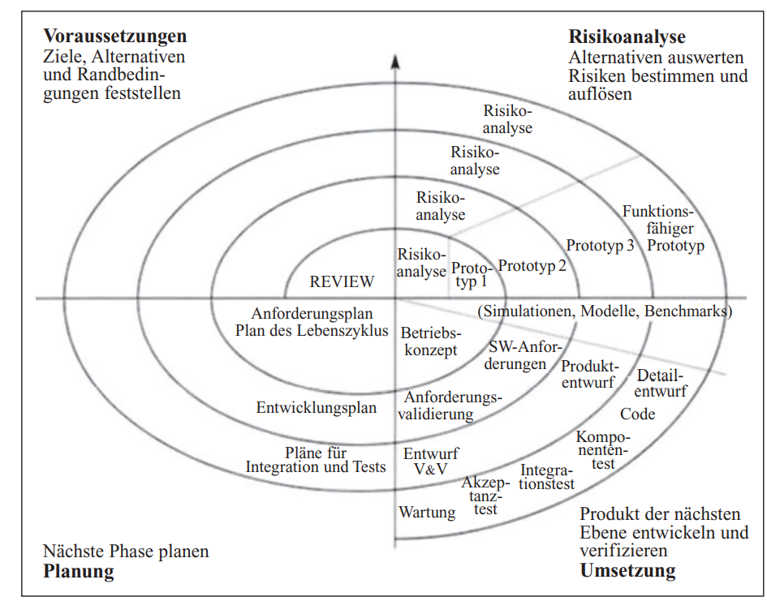

„Die Projektplanung ist eine der wichtigsten Aufgaben in dem weiten Feld des Projektmanagements"[^1], von der das Erreichen des angestrebten Ergebnisses abhängt. Sie stellt die zweite von vier Phasen eines Projekts dar, die für das Gelingen der Projektdurchführung verantwortlich ist und auf die Projektdefinition folgt.[^2] Unter Projektplanung versteht man die systematische Informationsgewinnung über den künftigen Ablauf des Projekts und die gedankliche Vorwegnahme des notwendigen Handelns im Projekt.“[^3]

# Projektplanung im klassischen Projektmanagement

Das Klassische Projektmanagement ist durch genaue Planung, Steuerung und Koordination geprägt. Dies bedeutet, dass die einzelnen Phasen der Projektplanung von Beginn an genaustens durchgeplant und die Anforderungen an das Endprodukt bereits bekannt sind.[^4] Durch das lineare Vorgehen und die genaue Terminplanung ist die Überschaubarkeit des Projekts gewährleistet. Klare Hierarchien und die genaue Definition der einzelnen Phasen verringern die Komplexität der Projekte.[^5] Durch die Rangordnung wird die Aufgabenteilung vorgegeben und die Kommunikation zwischen den Teammitgliedern erleichtert. Das Projektmanagement agiert im Spannungsfeld des Magischen Dreiecks, das heißt unter Beachtung der zur Verfügung stehenden Zeit, Qualität und Ressourcen. Die einzelnen Phasen des Projektmanagements sind alle auf den erfolgreichen Abschluss des Projekts ausgerichtet.[^6] Die genaue Dokumentation der einzelnen Arbeitsschritte macht die ständige Anwesenheit des Kunden überflüssig. Das Zugegensein des Kunden ist nur in der Anfangs- und Abschlussphase erforderlich.[^7]

Des Weiteren lässt sich das klassische Projektmanagement in das strategische und operative Projektmanagement unterteilen. Die Aufgabe des strategischen Projektmanagements ist die Projektplanung gemäß den Vorgaben der Unternehmensstrategie.[^8] Das operative Projektmanagement bezeichnet das Management eins Projekts von der Planung bis zum Abschluss. Dies beinhaltet „das Verwalten einzelner Projekte, das Erstellen von Schnittstellen zum strategischen Projektmanagement und die Koordination des Einsatzes von Instrumenten“[^9].

# Perspektiven des klassischen Projektmanagements

Das Klassische Projektmanagement kann aus der institutionellen, der funktionalen und der instrumentellen Sicht betrachtet werden. Die erste Perspektive beschäftigt sich mit den Organisationseinheiten. Aufgaben die während des Projektmanagements auftreten, wie beispielsweise die Projektüberwachung, werden von der funktionalen Sicht beobachtet. Die letzte Perspektive beschäftigt sich mit verschiedensten Planungsinstrumenten, die die funktionalen Aufgaben unterstützen sollen.[^10]

# Modelle der Projektplanung im klassischen Projektmanagement

## Wasserfallmodell 

Zwei bekannte Vorgehensmodelle des klassischen Projektmanagements sind einerseits das Wasserfallmodell und andererseits das Spiralmodell. „Das Wasserfallmodell ist die einfachste Form der Vorgehensmodelle und besteht in seiner ursprünglichen Form aus den Phasen Anforderungsdefinition, Analyse, Entwurf, Implementierung, Test und Inbetriebnahme.“[^11] Das lineare Modell eignet sich vor allem für Projekte mit bekannten Anforderungen, die wenige Änderungen vorhersehen.

 

*Wasserfallmodell*

## Spiralmodell

Eine Erweiterung des linearen Modells stellt das Spiralmodell dar. „Es besteht aus vier zyklischen Schritten, die durchgängig bis zur Außerbetriebnahme der Software stattfinden“[^12]. Dieses beginnt mit der Definition der Ziele in der Phase „Voraussetzungen“ gefolgt von der „Risikoanalyse“ in der Lösungsansätze in Bezug auf mögliche Risiken bewertet werden. Die „Umsetzung“ der angepeilten Ziele erfolgt im dritten Schritt. Die letzte Phase, die zugleich den Beginn eines neuen Zyklus darstellt, beschäftigt sich mit der „Planung“ der weiteren Vorgehensweise.[^13]

 

*Spiralmodell*

# Kritik an der Projektplanung im klassischen Projektmanagement

Die Ausrichtung aller Handlungsaspekte auf das Endprodukt und die genaue Vorausplanung und Festlegung der Vorgehensweise machen kurzfristige Änderungen nahezu unmöglich. Sie sind durch einen enormen Zeitaufwand und hohe Kosten gekennzeichnet. „Der Fokus liegt auf dem Einhalten eines Plans, nicht im ständigen Reagieren auf Änderungen im Projektumfeld.“[^14] Die Kunden werden außerdem nicht in den Entstehungsprozess des Produktes mit eingebunden, da das Endprodukt von Beginn an klar definiert ist.[^15] Aufgrund der mangelnden Zwischenergebnisse und des dadurch fehlenden Feedbacks der Kunden werden Fehler erst spät bemerkt. Aus diesen Gründen ist das klassische Projektmanagement für dynamische Märkte ungeeiget.[^16]

# Siehe auch

* Verlinkungen zu angrenzenden Themen
* [Link auf diese Seite](Projektplanung.md)

# Weiterführende Literatur

* Weiterfuehrende Literatur zum Thema z.B. Bücher, Webseiten, Blogs, Videos, Wissenschaftliche Literatur, ...

# Quellen

[^1]: https://www.projektarbeit-projektplanung.de/projektplanung-beispiele/projektplanung-definition/ 
[^2]: https://de.wikipedia.org/wiki/Projektplanung
[^3]: https://www.projektmagazin.de/pmplanung
[^4]: https://www.brainymotion.de/blog/projektmanagement-klassisch-und-agil-im-vergleich
[^5]: https://projekte-leicht-gemacht.de/projektmanagement/klassisches-projektmanagement/ 
[^6]: https://link.springer.com/content/pdf/10.1007%2F978-3-8349-4202-9_3.pdf Buch 
[^7]: https://projekte-leicht-gemacht.de/projektmanagement/klassisches-projektmanagement/ 
[^8]: https://www.projektmagazin.de/glossarterm/strategisches-projektmanagement 
[^9]: https://link.springer.com/content/pdf/10.1007%2F978-3-8349-4202-9_3.pdf 
[^10]: https://link.springer.com/content/pdf/10.1007%2F978-3-8349-4202-9_3.pdf 
[^11]: https://link.springer.com/content/pdf/10.1007%2F978-3-8349-4202-9_3.pdf 
[^12]: https://link.springer.com/content/pdf/10.1007%2F978-3-8349-4202-9_3.pdf 
[^13]: https://link.springer.com/content/pdf/10.1007%2F978-3-8349-4202-9_3.pdf 
[^14]: https://projekte-leicht-gemacht.de/projektmanagement/klassisches-projektmanagement/ 
[^15]: https://www.brainymotion.de/blog/projektmanagement-klassisch-und-agil-im-vergleich 
[^16]: https://projekte-leicht-gemacht.de/projektmanagement/klassisches-projektmanagement/ 
