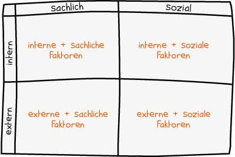

Das Thema "Projektstart" kann man definieren als dem "Termin, zu dem der Lenkungsausschuss den Beginn des Projekts genehmigt[^1]." Zudem stellen sich die Fragen "Wie beginne ich mit einem Projekt?", "Wie gehe ich bei einem Projekt vor?", "Welche Projektphasen gibt es?" oder auch "Welche Einflüsse gibt es auf den Projektstart?". Diese Fragen werden im Folgenden näher behandelt, um den Projektstart so fliessend und strukturiert wie möglich zu machen. 

# Der Beginn eines Projekts

Wie schon oben erwähnt stellt sich zunächst die Frage, wie man überhaupt einen Projekt beginnt. 
* [Auftragsklärung](http://www.projektmanagementhandbuch.de/handbuch/projektinitiierung/auftragsklaerung/): Um die Wünsche des Auftraggebers zu treffen und Auseinandersetzungen bei der Abnahme der Ergebnisse zu verhindern muss eine Auftragsklärung durchgeführt werden, wobei auch zusätzliche Ressourcen eingesetzt werden können. Dabei wird sichergestellt, dass Projektleitung, Auftraggeber und weitere [Stakeholder](Stakeholderanalyse.md) dieselben Erwartungen an das Projekt haben. 
* Zieldefinierung: Hinzu kommt vorallem auch die Zieldefinierung. Das Ziel sollte genau überprüft und sichergestellt werden, um die Aufgabenverteilung klarzustellen und die Absichten einzuordnen. Zusätzlich sollte das Ziel auf die Umsetzbarkeit überprüft werden, damit später keine Probleme entstehen.

* Verantwortlichkeiten: Die Festlegung der Rollen der beteiligten Personen stellt einen sehr wichtigen Faktor für den Projekterfolg dar. Je nach fachlicher Richtungen und sonstigen Kriterien sollten die Rollen im Projekt zugewiesen werden, um das Projekt erfolgreich durchzuführen. Der Auftraggeber muss auch in den Entscheidungsprozess einbezogen werden und ist somit erheblich verantwortlich für den Projekterfolg.
* [Kosten](Kostenplanung.md)- und Terminplanung: Das Projektteam hat den anfallenden zeitlichen und finanziellen Aufwand realistisch einzuschätzen und genügend Spielraum einzuplanen, damit das Vorhaben zugänglicher, detaillreicher und besser vorstellbar wird. Dazu gehört auch die Planung der Ressourcen wie Mitarbeiterinnen und Mitarbeiter, Maschinen, Fremdleistungen sowie Sachmittel.Der Projektstatus sollte regelmäßig ausgetauscht werden, um [Innovationen](Innovationsprojekte.md) und weitere kreative Ideen zur Verbesserung zu realisieren werden Stand-up-Meetings organisiert. Somit wird über den Status der eigenen Aufgabe und zu aktuellen Herausforderungen berichtet[^2].

# Vorgehensweise/Planung bei einem Projekt

Eine [Projektplanung](Projektplanung.md) ist der Grundstein für einen Projekterfolg. Hierbei gibt es sämtliche wichtige Faktoren zur Projektplanung:

* Projektstruktur: Die Strukturierung des Projekts stellt einen sehr wichtigen Schritt für die Durchführung dar. "Sie kann sich an Unternehmensbereichen, Projektphasen oder anderen Kriterien orientieren und sorgt für Transparenz und Überblick."
* Pakete und Maßnahmen richtig schnüren: Um der möglichen Komplexität eines Projekts entgegenzuwirken werden Projekte in Maßnahmenpakete und in einzelnen Maßnahmen eingeteilt. Thematisch zusammenpassende Maßnahmen werden zu "Paketen" gebündelt, wobei ein Paket nicht zu viele Maßnahmen enthalten sollte. "Maßnahmenpakete sollten möglichst weniger als 20% vom Gesamtprojekteffekt ausmachen, nicht länger als 1/3 der Zeit des Gesamtprojekthorizontes andauern und
innerhalb der ersten 2-4 Reportzyklen evaluierbar sein [^3]."
* Kick-Off: Anfangs werden alle Stakeholder im Projekt zusammengebracht, damit das Projekt, die einzelnen Teile und die Verantwortlichkeiten vorgestellt und besprochen werden. Somit wird eine hohe Akzeptanz, Motivation und Engagement sichergestellt.
* [Bottom Up](Bottom_Up_Planning.md) oder [Top Down](Top_Down_Planning.md): Aufgabenverteilung und der Führungsstil sind wichtige Fragen bei der Projektplanung. Hierbei wird die Mischung aus „Bottom Up“ und „Top Down“ meist als besonders effektiv empfunden. "Die Grundstruktur, wie Projektteile und Ziele, wird vom Management und der Projektleitung vorgegeben. Das kleinteilige Ausarbeiten des Projektplans wird wiederum Bottom Up ausgeführt." Somit wird ein Zusammenschluss von klarer Projektausrichtung und ambitionierten Zielen der Führung mit der Fachexpertise und dadurch eine klare Projektdefinition erreicht[^3].

# Die Projektphasen eines Projekts

Zur Risikominimierung wird ein Projekt idealerweise in die fünf Phasen Vorbereiten, Initiieren, Planen, Steuern, Abschließen eingeteilt.

1. Phase: Die Entscheidung für oder gegen ein Projekt wird vorbereitet. Es wird geprüft worum es geht, welches Ziel verfolgt wird und welche Ergebnisse erreicht werden sollen. In diesem Sinne wird der Projektantrag gestellt und die Entscheidung vorgelegt.
2. Phase: Im Zuge des Projektauftrags wird die Grundlage geschaffen und die Rahmenbedingungen geklärt. Ziele, Ergebnisse, Projektgegenstände werden bestimmt, die Risiken identifiziert und das Team zusammengestellt
3. Phase: Diese Phase, die Planung, erfolgt über das ganze Projekt. Aufgaben, Termine, Kosten, Kapazitäten, Ergebnisse und Meilensteine werden geplant und festgehalten
4. Phase: Die Umsetzung der einzelnen Maßnahmen, die Ergebnisse werden laufend überprüft und die Arbeitspakete freigegeben.
5. Phase: Abnahme des Projekts vom Auftraggeber und Überprüfung der Wirtschaftlichkeit vom Projektleiter[^4].

|  Vorbereiten                 | Initiieren                     | Planen            | Steuern                   | Abschließen        |
| ---------------------------- | ------------------------------ | ----------------- | ------------------------- | ------------------ |
| Ideen beschreiben            | Projektziele bestimmen         | Projektphasen     | Arbeitsfortschritt prüfen | Projektabnahme     |
| Projektcharakter definieren  | Risiken identifizieren         | Arbeitspakete     | Termine/Kosten prüfen     | Abschlussmeeting   |
| Projektumfeld analysieren    | Wirtschaftlichkeit analysieren | Aufgaben          | Qualität prüfen           | Rollout            |
| Projektmachbarkeit prüfen    | Projektteam zusammenstellen    | Liefergegenstände | Berichte erstellen        | Abweichungsanalyse |     

# Die Einflüsse auf den Projektstart

Um die Einflüsse auf den Projektstart klarzustellen wird unter anderem eine [Umfeldanalyse](https://dieprojektmanager.com/umfeldanalyse-stakeholderanalyse/) durchgeführt. Wie der Name schon sagt wird der Umfeld eines Projekts analysiert, also alle Rahmenbedingungen, Einflüsse und äußere Faktoren gesammelt, welche auf das Projekt wirken können. Die Umfeldanalyse wird durchgeführt, um bereits bestehende Anforderungen zu ermitteln, eventuelle Probleme zu erkennen, Schnittstellen nach außen zu identifizieren, die [Stakeholderanalyse](Stakeholderanalyse.md) oder die [Risikoanalyse](Risikoanalyse_und_Visualisierung.md) vorzubereiten.

Hierbei gibt es verschiedene Kriterien:

* Soziale Umweltfaktoren: Personen/Personengruppen, die das Projekt beeinflussen können. Diese werden gesammelt, um sie anschließend in der Stakeholderanalyse näher zu beleuchten. (z.B. Betriebsrat, Bauamt, Mitarbeiter des Projektteams, Anwohner beim Bau der neuen Abwasseranlage)
* Sachliche Umweltfaktoren: Fakten oder Themen, die auf das Projekt wirken. (Z.b. Datenschutzrichtlinien, veraltete Technik, zu wenig Knowhow, vorliegendes Lastenheft, Trend zu mehr Nachhaltigkeit)
* Interne Faktoren: Faktoren innerhalb des Projekts/ des Unternehmens (Z.b. bestehende Anforderungen an das Projekt)
* Externe Faktoren: Faktoren außerhalb des Projekts/des Unternehmens (Z.b. gesetzliche, geografische und klimatische Faktoren)[^5].

# Siehe auch

* [Umfeldanalyse](Umfeldanalyse.md)
* [Projektabscluss](Projektabschluss.md)
* [Projektplanung](Projektplanung.md)

# Weiterführende Literatur

* [V. M. BrenneckeS. KrugC. M. Winkler: "Projektstart"](https://link.springer.com/chapter/10.1007/978-3-642-58743-6_2)
* [Christian BärJens FiegeMarkus Weiß : "Projektstart/Kick-Off"](https://link.springer.com/chapter/10.1007/978-3-662-52974-4_19)
* [Levend Seyhan: "Der Projektstart"](https://link.springer.com/chapter/10.1007/978-3-658-35036-9_7)

# Quellen

[^1]: [Projektmagazin](https://www.projektmagazin.de/glossarterm/projektstart)
[^2]: [Business-wissen.de](https://www.business-wissen.de/artikel/projektmanagement-ein-projekt-starten/)
[^3]: [Projekte richtig planen in 8 Schritten](https://www.nordantech.com/de/blog/project-management/projekte-richtig-planen://www.nordantech.com/de/blog/project-management/projekte-richtig-planen)
[^4]: [Phasen des Projektmanagements im Überblick](https://www.business-wissen.de/hb/phasen-des-projektmanagements-im-ueberblick/)
[^5]: [Die Umfeldanalyse einfach erklärt](https://projekte-leicht-gemacht.de/blog/methoden/projektstart/die-umfeldanalyse-einfach-erklaert/)

