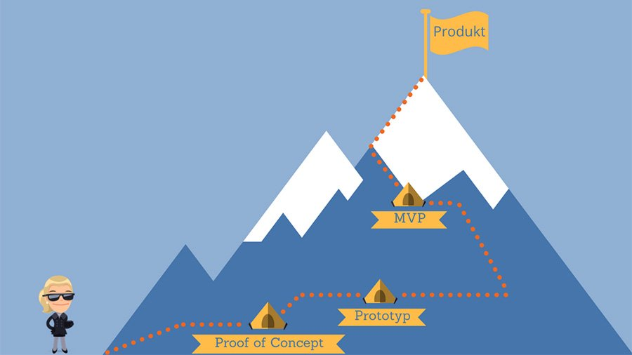

Der englische Begriff Proof of Concept (kurz POC) bezeichnet die Evaluation eines kleinen Ausschnittes eines Großprojekts und die Anfertigung einer Machbarkeitsstudie. Proof of Concept bedeutet übersetzt so viel wie Prüfung des Konzeptes, wobei sich die Kriterien auf technische oder betriebswirtschaftliche Faktoren beziehen können.[^3]

# Was ist der Proof of Concept und wie läuft er ab?

Proof of Concept bezeichnet das Prüfen eines Konzeptes bzw. eines Projektes auf dessen [Machbarkeit](Machbarkeit.md). Dabei wird anhand von Faktoren wie Investitionsrisiken, Anforderungen an technische Applikationen oder Software, Funktions- und Akzeptanztests von Produkten oder Dienstleistungen validiert ob das Umsetzungsprojekt durchgeführt werden soll, er dient also als Entscheidungsbasis für den weiteren Projektverlauf. Mit einem kleinen Projektteam wird die Idee verprobt um anschließend eine Entscheidung zur Durchführung treffen zu können. Neben der generellen Entscheidung werden bereits viele Erkenntnisse für das Umsetzungsprojekt gewonnen, sodass das Risiko eines späteren Scheiterns sinkt[^3]. 

Der Proof of Concept ist einer der ersten [Meilensteine](Meilensteine.md) im Projektmanagement und legt den Grundstein für ein erfolgreiches Projekt.

*Einordnung des Proof of Concept* [^4]

# Proof of Concept in der IT 

Ein klasschischer Anwendungsbereich eines Proof of Concepts sind IT-Projekte. Bei komplexen Implementierungsprojekten wird die zu implementierende Software zunächst rudimentär und mit technischen Durchstichen in die bestehenede Systemlandschaft integriert. Diese Integration zeigt Abhängigkeiten und Schwierigkeiten zu den Umsystemen auf die Umsetzungsprojekt geachtet werden muss. In einem Entwicklungsprozess für neue Anwendungssoftware oder für IT-Sicherheitslösungen wird dieser Projektschritt sehr häufig integriert und legt den Grundstein für die folgenden Projektabschnitte. Das Projektteam erhält durch den Proof of Concept eine konkrete Arbeitsbasis, auf die in der Folge aufgesetzt werden kann. In der IT-Sicherheit dienen solche Konzepttests auch dazu, Sicherheitslücken in Betriebssystemen oder Anwendungssoftware nachzuweisen.[^1]

# Proof of Concept in der Betriebswirtschaft 

Nicht nur in der Softwareentwicklung ist der Proof of Concept weit verbreitet, auch Geschäftsideen, Unternehmensgründungen und die Entwicklung von Neuprodukten können einem Proof of Concept unterworfen werden. Hierbei wird, neben der generellen [Machbarkeit](Machbarkeit.md), auch getetset inwieweit die Idee, das geplante Geschäftsmodell oder das neue Produkte und Dienstleistungen aus betriebswirtschaftlicher Sicht funktionieren. In der Praxis ist ein umfangreicher und aussagefähiger Proof of Concept eine entscheidenede Voraussetzung dafür, Investoren für das eigene Projekte zu gewinnen.[^1]

Kern des betriebswirtschaftlichen Proof of Concepts ist die wirtschaftlichen Chancen der Neuentwicklung mit Blick auf die reale Marktentwicklung zu testen. Eine [Kosten Nutzen Analyse](Kosten_Nutzen_Analyse.md) ist dabei oftmals eine sehr hilfreiche Methodik, da sie betriebswirtschaftliche Kalkulationen ebenso, wie Markt- und Wettbewerbsbeobachtungen einschließt. Darüber hinaus ist der Erwerb umfassenden Wissens über potentielle Kunden entscheidend. Soweit es die neue Idee zulässt sollten reale Kunden beziehungsweise spätere Nutzer frühstmöglich in den Produktentwicklungsprozess eingebunden werden.[^1]

Anders als bei einem Proof of Concept im IT-Bereich werden betriebswirtschaftliche Proofs of Concepts idealerweise nicht als einmaliger Akt oder durch das Erreichen eines [Meilensteins](Meilensteine.md) definiert, sondern als ein andauernder fortlaufender Prozess begriffen. Das eigene Geschäfts- oder Produktmodell wird während des Entwicklungprozesses stetig mit der Markt- und Gewinnreife und der Realitäten des Marktes und den Bedürfnissen potentieller Kunden abgeglichen. Durch diese Form lassen sich Kosten und Risiken des Markteintritts deutlich reduzieren.[^1]

# Siehe auch

* [Business Cases](Business_Cases.md)
* [Funktionale Anforderungen](Funktionale_Anforderungen.md)
* [Kosten Nutzen Analyse](Kosten_Nutzen_Analyse.md)
* [Machbarkeit](Machbarkeit.md)
* [Meilensteine](Meilensteine.md)
* [Projektplanung](Projektplanung.md)
* [Proof-Of-Technologie](Proof_of_Technologie.md)

# Weiterführende Literatur

* Proof of Concept [https://de.wikipedia.org/wiki/Proof_of_Concept](https://de.wikipedia.org/wiki/Proof_of_Concept)
* Proof of Konzept: Zeig die Machbarkeit deiner Idee [https://www.avantgarde-experts.de/de/magazin/proof-of-concept/](https://www.avantgarde-experts.de/de/magazin/proof-of-concept/)

# Quellen

[^1]: [https://www.it-business.de/was-ist-ein-proof-of-concept-a-666615/](https://www.it-business.de/was-ist-ein-proof-of-concept-a-666615/)
[^2]: [https://de.wikipedia.org/wiki/Proof_of_Concept](https://de.wikipedia.org/wiki/Proof_of_Concept)
[^3]: [https://www.businessinsider.de/gruenderszene/lexikon/begriffe/proof-of-concept/](https://www.businessinsider.de/gruenderszene/lexikon/begriffe/proof-of-concept/)
[^4]: [https://smartbusinessplan.de/businessplan-lexikon/proof-of-concept/]

