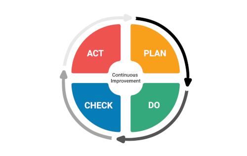

# Qualitätsmanagement
Das Qualitätsmanagement ist in erster Linie ein Vorgang, dessen Fokus auf der Verbesserung der Qualität von Prozessen oder Produkten liegt. Die Qualität selbst kann dabei vor allem anhand des Grades der Erfüllung der Kundenerwartungen festgestellt werden[^1].

## Definitionen Qualitätsmanagement
### DIN EN ISO 9000:2005
Genauer gesagt versteht man unter Qualitätsmanagement – "entsprechend der Definition nach [DIN EN ISO 9000:2005](https://de.wikipedia.org/wiki/Genormte_Qualit%C3%A4tssicherung#Definition_nach_DIN_EN_ISO_9000) – aufeinander abgestimmte 
Tätigkeiten zum Leiten und Lenken einer Organisation, die darauf 
abzielen, die Qualität der produzierten Produkte oder der angebotenen Dienstleistung zu verbessern"[^2]. Im Projekt wird hiebei vor allem auf die Sicherung der Qualität während des gesamten Zeitraums geachtet[^3].
### PMBOK
Das Qualitätsmanagement ist außerdem eine wichtige Wissenssparte des [PMBOK](PMBOK_Guide.md) (Project Management Body of Knowledge). Hier wird es in drei Elemente aufgeteilt: Plan Quality Management, Manage Quality und Control Quality.[^5]

## Ziele des Qualitätsmanagements
* Verbesserung der Kundenbeziehungen durch Qualitätssicherheit und Zuverlässigkeit
* kontinuierliche Verbesserung der Prozesse im Projekt mithilfe des [PDCA-Prozesses](https://de.wikipedia.org/wiki/Demingkreis)[^4]

## Ablauf des Qualitätsmanagements
### grobe Bestandteile
* genaue Planung und Ausarbeitung der Arbeitsschritte
* überprüfen, ob Qualitätsansprueche eingehalten werden (Qualitäts-Controlling)
* Abweichungen erkennen und Gegenmaßnahmen einleiten[^3]
* Dokumentation des Qualitätsmanagements
* Austausch mit Kunden und Mitarbeitern[^4]
### Die vier Phasen des klassichen Qualitätsmanagements
* Phase 1: Qualitätsplanung
  - In dieser Phase wird die vorliegende Situation zunächst analysiert, erste Abläufe werden erstellt und Qualitätsziele festgelegt. Dies geschieht unter Berücksichtigung der vorliegenden Ressourcen und der für das Projekt notwendigen Prozesse.
* Phase 2: Qualitätslenkung
  - Die vorher bestimmten Maßnahmen werden nun umgesetzt und überwacht. Bei Abweichungen werden Regulierungen vorgenommen.
* Phase 3: [Qualitätssicherung](Qualitätssicherung.md) / Qualitätskontrolle
  - Die Ergebnisse werden ausgewertet und schriftlich dokumentiert. Dieser Vorgang dient der Kontrolle der anfangs festgelegten Ziele und der Aufdeckung von Fehlern.
* Phase 4: Qualitätsgewinn
  - In der letzten Phase werden die gewonnenen Erkenntnisse genutzt um gegen Abweichungen vorzugehen und Prozesse zu verbessern. Dafür ist eine Kommunikation der Ergebnisse erforderlich[^6][^7]

## Qualitätsmanagementmodelle
### Total Quality Management (TQM)
Das [Total Quality Management](https://de.wikipedia.org/wiki/Total-Quality-Management) ist eines der bekanntesten Modelle des Qualitätsmanagements neben [Six Sigma](Six_Sigma.md) und [EFQM](https://de.wikipedia.org/wiki/EFQM-Modell)[^8].
Es dient zur Fehlereliminierung in allen Bereichen eines Projektes oder einer Organisation. Dabei werden alle Parteien, die am Prozess beteiligt sind miteinbezogen[^9]. Die Maßnahmen, welche bei dieser Art des Qualitätsmanagements im Vordergrund stehen sind die effektive Datenanalyse, Kommunikation und Strategieplanung[^10]. Die Ziele, die mit dem Total Quality Management verfolgt werden, sind die Verbesserung des Supply Chain Managements und der Kundenbeziehungen[^9] sowie eine Förderung des Engagements der Mitarbeiter in Bezug auf das Qualitätsmanagement. Dies geschieht durch einen fortlaufenden Prozess und kontinuierlichen Fortschritt[^10].
### Six Sigma
Im Gegensatz zum Total Quality Management, welches eher eine auf die lange Frist ausgerichtete Methode ist, konzentriert sich Six Sigma auf die Implementierung kleiner, notwendiger Veränderungen, um die Qualität zu steigern und Fehler zu minimieren. Deshalb ist dieses Modell auch etwas komplizierter in der Praxis, als das TQM[^11].
### EFQM
Ziel des EFQM-Modells ist es einen europäischen Ansatz für das Qualitätsmanagement zu schaffen[^12]. Es basiert auf drei grundlegenden Fragen, nach welchen ein Unternehmen sein Qualitätsmanagement gestalten sollte. Zentral sind hierbei der Unternehmensgegenstand, die Stragie, mit der es diesen verwirklichen will und die Resultate, die das Unternehmen bisher erzielt hat und zu erzielen plant[^13].

## Nachteile des Qualitätsmanagements
Trotz seiner vielen Vorteile bringt das Qualitätsmanagement auch Belastungen mit sich. Diese sind vor allem die verursachten Kosten, bei denen zwischen Kosten durch die Nicht-Erfüllung der Qualitätsansprüche und Kosten für die Sicherstellung der Qualität unterschieden werden kann. Zudem spielt hier auch der zeitliche Aufwand eine wichtige Rolle[^2].

# Weiterführende Literatur

* "Grundlagen Qualitätsmanagement: Von den Werkzeugen über Methoden zum TQM" (Brüggemann, H.)
* "Qualitätsmanagement: - Kompaktes Wissen - Konkrete Umsetzung - Praktische Arbeitshilfen" (Weidner, G.E.)

# Quellen

[^1]: [Was ist Qualitätsmanagement?](https://www.innolytics.de/was-ist-qualitaetsmanagement)
[^2]: [Qualitätsmanagement in Projekten](https://www.hsbund.de/SharedDocs/Downloads/0_Abschlussarbeiten/FB_FIN/2011/01_11_Baetz.pdf?__blob=publicationFile)
[^3]: [Was bedeutet Qualitätsmanagement für das Projektmanagement?](http://blog.bepartner.de/qualitaetsmanagement/#:~:text=Was%20bedeutet%20Qualit%C3%A4tsmanagement%20f%C3%BCr%20das%20Projektmanagement%3F%201%20Qualit%C3%A4tsmanagement,Qualit%C3%A4ts-Prinzipien%20f%C3%BCr%20erfolgreiche%20Projekte.%20...%20Weitere%20Artikel...%20)
[^4]: [Qualitätsmanagement als Berufsfeld: Definition, Aufgaben und ISO 9000](https://ifm-business.de/aktuelles/business-news/qualitaetsmanagement-als-berufsfeld-definition-aufgaben-und-aussichten.html)
[^5]: [Project Quality Management According to the PMBOK](https://www.projectengineer.net/project-quality-management-according-to-the-pmbok/)
[^6]: [Die 4 Phasen des klassischen Qualitätsmanagements](https://www.weiterbildung-im-fernstudium.de/qualitaetsmanagement/die-4-phasen-des-klassischen-qualitaetsmanagements-260#:~:text=Die%204%20Phasen%20des%20klassischen%20Qualit%C3%A4tsmanagements%201%20Qualit%C3%A4tsplanung.,Verbesserung%20von%20Strukturen%20und%20Prozessen%20genutzt%20und%20eingesetzt.)
[^7]: [Die 5 Phasen des klassischen Qualitätsmanagements](https://www.brewes.de/magazin/die-5-phasen-des-qualitatsmanagements)
[^8]: [Modelle und Werkzeuge im Qualitätsmanagement](https://www.business-wissen.de/hb/modelle-und-werkzeuge-im-qualitaetsmanagement/)
[^9]: [Total Quality Management (TQM)](https://www.investopedia.com/terms/t/total-quality-management-tqm.asp)
[^10]: [What is Total Quality Management(TQM)?](https://asq.org/quality-resources/total-quality-management#Elements)
[^11]: [Comparison of Six Sigma and Total Quality Management](https://www.managementstudyguide.com/six-sigma-and-total-quality-management.htm)
[^12]: [TQM](https://keytodata.com/glossar/tqm/)
[^13]: [The EFQM Model](https://www.efqm.org/efqm-model)

