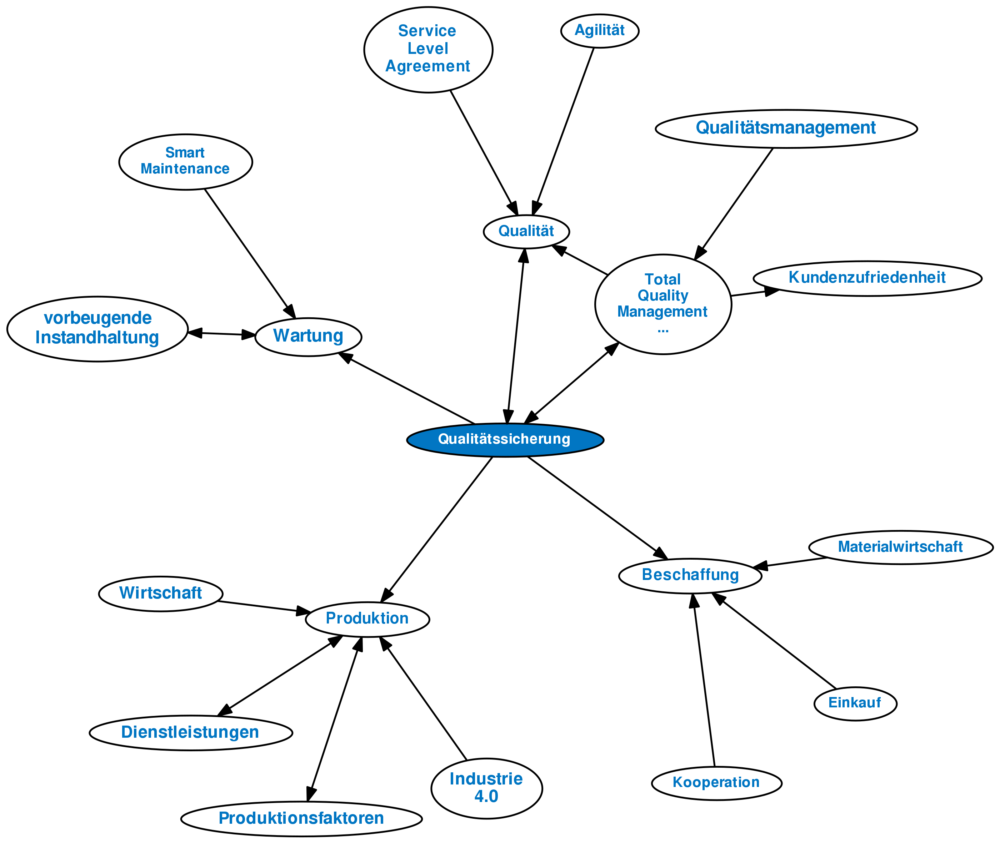

# Qualitätssicherung
Definition: Was ist "Qualitätssicherung"?
Die Qualitätssicherung ist entscheidend für die Festlegung und Einhaltung von Qualitätsstandards und kommt bei sämtlichen technischen und organisatorischen Maßnahmen zum Einsatz. Mit der Qualitätssicherung soll bereits von Beginn an definierte Qualitätsanforderungen bei der Produktion und Dienstleistungserstellung erfüllt werden. Die Norm DIN EN ISO 9000:2015 ordnet die Qualitätssicherung dem Bereich des Qualitätsmanagements zu[^3].
Weder die Industrie noch der Dienstleistungssektor kann heutzutage auf die Qualitätssicherung verzichten.
Ein Unternehmen legt seine qualitativen Vorgaben in der Regel selbst fest, sofern diese den gesetzlichen Regelungen und Normvorschriften entsprechen. Qualitätsstandards werden zudem auch durch den Kunden definiert.[^1]

# Inhaltsverzeichnis

1. [Begriff](#begriff)
2. [Teilfunktionen](#teilfunktionen)
    
     2.1. Qualitätsplanung
     
     2.2. Qualitätssteuerung
     
     2.3. Qualitätskontrolle
3. [Beurteilung](#beurteilung) 
4. [Zielverfolgung](#zielverfolgung)

# Begriff

### Qualitätssicherung
Die Anforderungen an die Qualität von Dienstleistungen und Produkten steigen kontinuierlich. Maßgeblich für die Kaufentscheidung ist daher die Produktqualität bzw. die Qualität der angebotenen Dienstleistung.[^1]

Damit Unternehmen präzise hergestellte und hochwertige Produkte anbieten können, ist die Qualitätssicherung unverzichtbar.[^1]

*Qualitätsmanagement*, alle organisatorischen und technischen Maßnahmen, die der Schaffung und Erhaltung der Konzept- und Ausführungsqualität (Qualität) dienen.[^2]

# Teilfunktionen

2.1. In der **Qualitätsplanung** werden die Qualitätsmerkmale sowie ihre geforderten und zulässigen Ausprägungen für ein Produkt und Verfahren festgelegt. Dies geschieht im Hinblick auf die durch die Anwendung oder eine Norm gegebenen Erfordernisse und deren Realisierbarkeit.[^2]

2.2. **Qualitätssteuerung**, die auch als Qualitätslenkung oder Qualitätsregelung bezeichnet wird, beinhaltet die Vorgabe der Produkt- und Ausführungsanforderungen sowie die Überwachung der Erfüllung dieser Anforderungen bei der Leistungserstellung mit ggf. erforderlichen Korrekturen. Unter Verwendung der Ergebnisse der Qualitätskontrolle können zum einen Maßnahmen veranlasst werden, die qualitätsmindernde Störungen im Produktionsprozess beseitigen helfen. Zum anderen können auch Maßnahmen geplant und veranlasst werden, die auf eine Änderung der Entwurfsqualität oder der eingesetzten Produktionsverfahren abzielen.[^2]

2.3. Die **Qualitätskontrolle** oder auch Qualitätsprüfung beinhaltet einen Soll-Ist-Vergleich, bei dem festgestellt wird, inwieweit Produkte die an sie gestellten Qualitätsanforderungen erfüllen. Die Qualitätskontrolle i.w.S. beinhaltet sowohl die Überprüfung der Entwurfsqualität als auch der Ausführungsqualität[^3]. Die Überprüfung der Ausführungsqualität als Qualitätskontrolle i.e.S. kann nach dem Umfang der durchzuführenden Kontrollmaßnahmen in Totalkontrolle und Partialkontrolle unterschieden werden. Durch die Partialkontrolle (statistische Qualitätskontrolle) wird versucht, mithilfe statistischer Methoden entweder Aussagen über den Zustand des Produktionsprozesses zu machen (Produktionskontrolle) oder Informationen über den Ausschussanteil eines gefertigten Loses zu erhalten (Abnahmeprüfung). Bei der Abnahmeprüfung werden Stichprobenprüfpläne verwendet, während bei der Produktionskontrolle die Kontrollkartentechnik zur Anwendung kommt. Eine Verbindung zwischen Produktionskontrolle und Abnahmeprüfung stellt die kontinuierliche Stichprobenprüfung dar.[^2]

 
[^2]

# Beurteilung

Zur Erhöhung der Qualität von Produkten und Dienstleistungen hat die ISO 1987 eine Normenreihe (Norm) mit den Nummern 9000 - 9004 erlassen, die von mehr als 100 Ländern (u.a. von der Bundesrepublik Deutschland) als nationale Normvorschrift anerkannt ist. Ziel des Normenwerkes ist es, Modelle für Qualitätsmanagement-Systeme zur Verfügung zu stellen, die der Qualitätssicherung in Design/Entwicklung, Beschaffung, Produktion, Montage, Wartung und Endprüfung des Produktes dienen sollen. Unternehmen, die Qualitätsmanagement-Systeme nach diesen Normen entwickeln, können von einer autorisierten Stelle (z.B. TÜV) ein Zertifikat mit der Dokumentation erhalten, dass ihre Qualitätssicherung den in der Normenreihe niedergelegten Forderungen entspricht. Diese Zertifizierung kann eine Vertrauensbasis zwischen Lieferanten und Kunden schaffe.[^2][^3]

# Zielverfolgung

Die Qualitätssicherung (QS) verfolgt das Ziel, Produkte und Dienstleistungen mit einem gleichbleibend hohen Qualitätsstandard zu entwickeln und herzustellen und dabei die Kundenanforderungen ganzheitlich zu erfüllen.[^1]

# Quellen

[^1]: (Qualitätssicherung in der Technik)[https://www.vario-software.de/lexikon/qualitaetssicherung/]

[^2]: (Qualitätssicherung Produkte)[https://wirtschaftslexikon.gabler.de/definition/qualitaetssicherung-44396#:~:text=Die%20Qualit%C3%A4tssicherung%20umfasst%20als%20Bestandteil,Produkts%20oder%20einer%20Dienstleistung%20dienen.]

[^3]: (Qualitätssicherung Planung)[https://www.vorest-ag.com/Qualitaetssicherung-Methoden]
