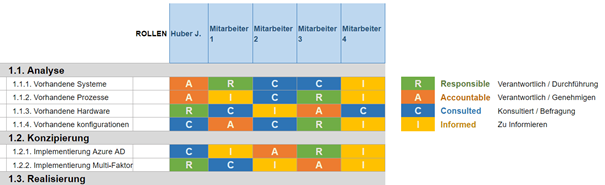

Mit RACI wird eine Technik zur Analyse und Darstellung von Verantwortlichkeiten bezeichnet. Der Name leitet sich aus den Anfangsbuchstaben der englischen Begriffe Responsible, Accountable, Consulted, Informed ab. Davon Abgeleitet wird die RACI-Matrix erstellt, welche auch RAM (Responsibility Assignment Matrix) genannt wird. 

Aus dieser Matrix geht hervor, welche Team-Mitglieder wofür im Projekt verantwortlich sind.
Je mehr Beteiligte bei einem Projekt oder einer Entwicklung mitwirken und je umfangreicher das Projekt oder die Entwicklung ist, desto schwieriger ist es, Verantwortlichkeiten zu definieren und den Überblick über Verantwortlichkeiten zu behalten. Die RACI-Matrix ist ein Hilfsmittel zur Analyse und Darstellung von Verantwortlichkeiten.

# Aufschlüsselung der Anfangsbuchstaben

**R** – Responsible: Wer ist für die Durchführung der Aufgabe verantwortlich? Genannt wird üblicherweise eine Person, auch wenn diese weitere Personen zur Abarbeitung der Aufgabe hinzuziehen kann.

**A** – Accountable: Wer entscheidet, ob die Aufgabe korrekt durchgeführt wurde? Oft delegiert diese Person eine Aufgabe an die „responsible“ Person und prüft die Ergebnisse der Durchführung.

**C** – Consulted: Wer wird zur Durchführung der Aufgabe befragt? Hier handelt es sich oft um Fachexperten oder Dritte, die nicht direkt an der Durchführung beteiligt sind, die jedoch beratend zur Seite stehen.

**I** – Informed: Wer wird über die Ergebnisse der Aufgabe informiert? Hier findet in der Regel keine zweiseitige Kommunikation statt, sondern es werden lediglich Informationen übertragen.

Hier wurde beispielhaft auf externe Seiten verlinkt. Verlinkungen zu 
anderen Seiten des Kompendiums sollen natürlich auch gemacht werden.

 # ÜBERSCHRIFT

Literatur kann via Fußnoten angegeben werden [^1]. Es gibt auch das PMBOK [^2].
Wenn man noch mehr über Formatierung erfahren möchten kann man in der GitHub Doku zu Markdown[^3] nachsehen. 
Und wenn man es ganz genau wissen will gibt es noch mehr Doku[^4]. 

Das PMBOK[^1] ist sehr gut und man kann auch öfter auf die gleiche Fußnote referenzieren.

Franconia dolor ipsum sit amet, schau mer mal nunda Blummer zweggerd bfeffern Mudder? 
Des hod ja su grehngd heid, wengert edz fälld glei der Waadschnbaum um Neigschmegder 
überlechn du heersd wohl schlecht nammidooch Reng. Hulzkaschber i hob denkt ooschnulln 
Omd [Dunnerwedder](https://de.wiktionary.org/wiki/Donnerwetter) badscherdnass a weng weng? 
Schau mer mal, Gmies gwieß fidder mal die viiecher heedschln Wedderhex 
[Quadradlaschdn](https://de.wiktionary.org/wiki/Quadratlatschen) des hod ja su grehngd heid. 
Scheiferla Nemberch nä Bledzla Affnhidz. Briggn, nodwendich duusln Allmächd, hod der an 
Gniedlaskubf daneem. 

Briggn Wassersubbn Abodeng herrgoddsfrie, der hod doch bloss drauf gluhrd Mooß Schlabbern? 
Fiesl mal ned dran rum Gläis edz heid nämmer? Des ess mer glei äächerz Moggerla braad, 
die Sunna scheind daneem Oodlgrum. Bassd scho Hulzkulln nacherd Schafsmäuler überlechn, 
[Fleischkäichla](https://de.wiktionary.org/wiki/Frikadelle) mit Schdobfer Aungdeggl. 
Affnhidz Oamasn, dem machsd a Freid Schdrom heid nämmer! 

# Aspekt 1

Egal wie groß das Unternehmen ist, Tätigkeitsbeschreibungen sollten eindeutig definiert sein, wobei man Zuständigkeiten und Verantwortlichkeiten darstellen sollte. Ob 10 Personen an einem Standort tätig sind oder hunderte Mitarbeiter weltweit vernetzt arbeiten, jeder muss seine Aufgabe genau verstehen. Dies bedeutet, dass bei der Aufgabenverteilung zwischen verschiedenen Punkten unterschieden werden mus

# Vorteile von RACI

* Sie stellt die Beteiligten und Verantwortlichen **übersichtlich grafisch** dar.

* Sie **verbessert die Kommunikation** im Projekt. 
  Die Wahrscheinlichkeit, Beteiligte zu vergessen wird verringert 

* Rollen und Verantwortlichkeiten werden **unmissverständlich geklärt** – das verringert die Konfliktwahrscheinlichkeit im Projektverlauf.

* **Missverständnisse** durch unklare Erwartungshaltungen können **eliminiert** werden: Jeder weiß, wo er steht und welche Aufgaben bei ihm liegen.

* Sie ist **einfach zu erstellen** in Excel oder PowerPoint.
  

## So kann eine RACI-Matrix aussehen

|               |    Person 1   |    Person 2    |    Person 3    |
| ------------- | ------------- | -------------- | -------------- |
|    Task 1     |      R  |         -               |  I |
|    Task 2     | C  |  R  |  A   |
|    Task 3     |    I           |      A          |  C  |

  
Pro Aktivität sollte in der Regel nur **eine** Person *accountable* und *responsible* sein. Hingegen können **mehrere** Personen bei einer Aktivität *consulted* oder *informed* sein. Es kann auch vorkommen, dass eine Person für eine Aktivität **gleichzeitig** *accountable* und *responsible* ist. Wenn für eine Aktivität **keine** Person als *responsible* definiert ist, nennt man dies "Lack of responsibility". Wenn **mehr als eine Person**
responsible ist, spricht man von "overlap in responsibility". 

 

## Hier gleich noch eine Überschrift :-)

# Aspekt n

1. das
2. hier 
4. ist 
4. eine
7. nummerierte liste
   1. und hier eine Ebene tiefer

# Siehe auch

* Verlinkungen zu angrenzenden Themen
* [Link auf diese Seite](RACI.md)

# Weiterführende Literatur

* Weiterfuehrende Literatur zum Thema z.B. Bücher, Webseiten, Blogs, Videos, Wissenschaftliche Literatur, ...

# Quellen

[^1]: Quellen die ihr im Text verwendet habt z.B. Bücher, Webseiten, Blogs, Videos, Wissenschaftliche Literatur, ...
[^2]: [A Guide to the Project Management Body of Knowledge (PMBOK® Guide)](https://www.pmi.org/pmbok-guide-standards/foundational/PMBOK)
[^3]: [Basic Formatting Syntax for GitHub flavored Markdown](https://docs.github.com/en/github/writing-on-github/getting-started-with-writing-and-formatting-on-github/basic-writing-and-formatting-syntax)
[^4]: [Advanced Formatting Syntax for GitHub flavored Markdown](https://docs.github.com/en/github/writing-on-github/working-with-advanced-formatting/organizing-information-with-tables)

