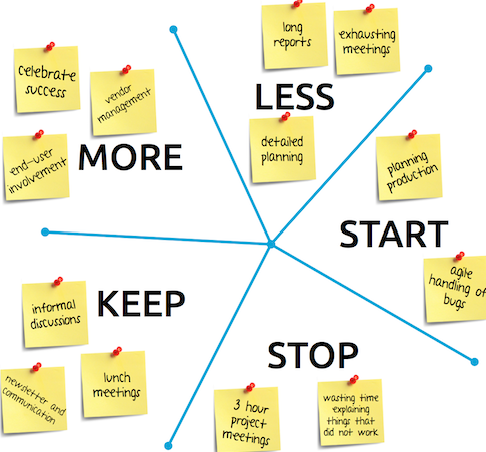

Die Retrospective ist ein wiederkehrendes Meeting aus dem agilen Management. Dieses findet am Ende jeder [Iteration](https://de.wiktionary.org/wiki/Iteration) statt. Es wird kritisch reflektiert wie der vorgehende Sprint gelaufen ist. [^1]

*Retrospective*[^3]

# Einführung

text [^2]

## Vorgehen

## Ablauf

Die cc läuft wie folgt ab:

| x   | x | 
| ------------- | ------------- |
| x  | y  |
| x | y |
| .  | x|
| x x|  x |

*Abbildung: Vorgehen bei x*[^3]

## Bewertung und Verarbeitung

text 

# Vor- und Nachteile der x

## Vorteile

Die Verwendung der Methode bietet verschiedene Vorteile, darunter[^2][^4]:

* ..
* ..

## Nachteile

Schwächen der 6_3_5_Methode sind die Folgenden[^6]:

* xx
* xx

# Außerdem wissenswert

x

# Siehe auch
bsp
* [Ideen_Marathon](Ideen_Marathon.md)
* [Walt_Disney_Methode](Walt_Disney_Methode.md)

# Weiterführende Literatur
bsp
* Christian Schawel, Fabian Billing (2009): "Top 100 Management Tools"
* Joachim H. Becker, Helmut Ebert, Sven Pastoors (2018): "Praxishandbuch berufliche Schlüsselkompetenzen"

# Quellen

[^1]: https://www.easyagile.com/blog/retrospectives/
[^2]: https://luis-goncalves.com/de/agile-retrospektiven/
[^3]: https://itadvisory.dk/wp-content/uploads/2018/11/retrospective-starfish-with-post-its.png

bsp [Joachim H. Becker, Helmut Ebert, Sven Pastoors (2018): "Praxishandbuch berufliche Schlüsselkompetenzen"](https://link.springer.com/content/pdf/10.1007%2F978-3-662-54925-4_11.pdf)

