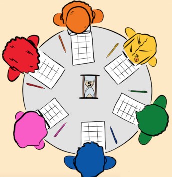

Die Retrospective ist ein wiederkehrendes Meeting aus dem agilen Management. Dieses findet am Ende jeder [Iteration](https://de.wiktionary.org/wiki/Iteration) statt. Es wird kritisch reflektiert wie der vorgehende Sprint gelaufen ist. [^1]

*Retrospective*[^3]

# Einführung

Die Methode ist dem  sehr ähnlich. Es können bei dieser in wenigen Minuten bis zu 108 Ideen gesammelt werden. Eine mündliche Absprache gibt es während des Ablaufes nicht.[^2]

## Vorgehen

## Ablauf

Die 3_6_5_Methode läuft wie folgt ab:

| x   | x | 
| ------------- | ------------- |
| x  | y  |
| x | y |
| .  | x|
| x x|  x |

*Abbildung: Vorgehen bei der 6_3_5_Methode*[^3]

## Bewertung und Verarbeitung

Im Anschluss werden die Ergebnisse analysiert. Es können Ideen kombiniert oder erweitert werden. Offene Fragen können geklärt werden. 
Alternativ kann der Initiator des Termins die Ergebnisse auch allein auswerten und in einem Folgetermin präsentieren und diskutieren. [^6]

Bei einer gemeinsamen Analyse im Team gibt es die Möglichkeit die Vordrucke noch einmal im Uhrzeigersinn durchzureichen. Jede Person setzt je Zettel ein Kreuz bei der persönlich als am besten bewerteten Idee. Der Initiator kann so die Priorisierung feststellen und diese vorstellen.[^7]

# Vor- und Nachteile der 6_3_5_Methode

## Vorteile

Die Verwendung der Methode bietet verschiedene Vorteile, darunter[^2][^4]:

* Vermeidung von Spannungen im Team während der Ideenfindung
* Alle Teilnehmer*innen werden gleichermaßen aktiv, somit bringt sich jeder ein und die Lösungsvorschläge können sehr vielfältig sein
* Kreativitätssteigerung durch einen Aufbau auf bereits genannte Ideen möglich
* Größere Gruppe können in kleine Sechser-Gruppen aufgeteilt werden, die Methode ist somit auch für große Teams anwendbar
* Die Ideen werden von der Person getrennt, die objektive Bewertung wird sichergestellt
* Mittels virtuellen Vordruckes auch digital möglich 

## Nachteile

Schwächen der 6_3_5_Methode sind die Folgenden[^6]:

* Doppelungen sind nicht ausgeschlossen (Können jedoch gegebenenfalls für die Gewichtung der Ideen herangezogen werden)
* Rücksprache bei Verständnisproblemen bezüglich der Ideen während des Ablaufs der Methode nicht vorgesehen
* Bei Aufteilung in Kleingruppen sollten alle Untergruppen gleichgroß sein

# Außerdem wissenswert

Die Methode wurde erstmals 1969 vom Unternehmensberater Bernd Rohrbach erwähnt.[^6]

Die 3_6_5_Methode ist eine kreativ-intuitive Methoden und basiert auf Assoziation. Assoziation beschreibt automatische Denkvorgänge.
Spontanität und Leichtigkeit sind von Bedeutung, die Ergebnisse müssen nicht von Anfang an perfekt sein.[^5]

Die Zeit pro Runde wird vorab festgelegt. Hierbei wird meistens ein Zeitraum von zwei bis fünf Minuten empfohlen.[^2][^5]

# Siehe auch

* [Ideen_Marathon](Ideen_Marathon.md)
* [Walt_Disney_Methode](Walt_Disney_Methode.md)

# Weiterführende Literatur

* Christian Schawel, Fabian Billing (2009): "Top 100 Management Tools"
* Joachim H. Becker, Helmut Ebert, Sven Pastoors (2018): "Praxishandbuch berufliche Schlüsselkompetenzen"

# Quellen

[^1]: https://www.easyagile.com/blog/retrospectives/
[^2]: https://luis-goncalves.com/de/agile-retrospektiven/
[^3]: https://itadvisory.dk/wp-content/uploads/2018/11/retrospective-starfish-with-post-its.png

bsp [Joachim H. Becker, Helmut Ebert, Sven Pastoors (2018): "Praxishandbuch berufliche Schlüsselkompetenzen"](https://link.springer.com/content/pdf/10.1007%2F978-3-662-54925-4_11.pdf)

