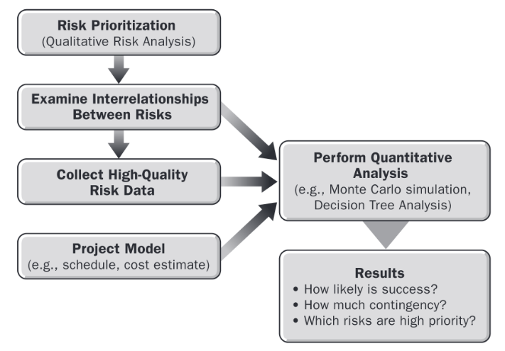
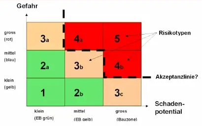

# Risikoanalyse

Risikoanalyse ist ein Teil des [Risikomanagements](Risikomanagement.md), welcher sich mit der Analyse und Einordnung von, durch Risikoidentifikation aufgedeckten, Risiken beschäftigt.

## Begriffsdefinitionen Risiko und Risikoanalyse

Unter einem Risiko versteht man ein ungewisses Ereignis oder eine ungewisse Bedingung, die, wenn sie eintritt, einen positiven oder negativen Effekt auf ein oder mehrere Projektziele hat[^1].

Risikoanalyse ordnet sich neben Risikoaggregation, Risikobewältigung, Risikoüberwachung im [Risikomanagement](Risikomanagement.md) ein[^4].

Je nach Quelle unterteilt sich der Prozess der Risikoanalyse in zwei Unterteile: 
1. Die Risikoidentifikation und 
2. Die Risikoquantifizierung[^3] [^5] 

Oder die Risikoanalyse und die Risikoidentifikation werden als separate Schritte des [Risikomanagements](Risikomanagement.md) gesehen [^2].
Unter Risikoidentifikation versteht man den Prozess des systematischen Auffindens von Risiken für ein Projekt und unter Risikoquantifizierung die konkrete Analyse und Bewertung der aufgefundenen Risiken.

## Qualitative und quantitative Risikoanalyse

Risikoanalyse lässt sich in zwei Kategorien unterteilen:
1. Qualitative Risikoanalyse
2. Quantitative Risikoanalyse

Quantitative Risikoanalyse ist die objektive, mathematische Analyse von Risiken, bei welcher durch Simulationen oder deterministischen Statistiken Risikomodelle erstellt werden. Risikomodelle arbeiten meistens Annahmen und Zufallsvariablen [^7]. Ein Beispiel für eine quantitative Risikoanalyse ist die Monte Carlo Simulation.

Dagegen ist qualitative Risikoanalyse eine Analysemethode, bei der Risiken nicht mit numerisch und quantitativen Werten ermittelt und bewertet werden. Stattdessen werden die einzelnen Risikomerkmale eines Projekts, die Wahrscheinlichkeit des Eintretens und die Auswirkungen, die sie im Falle des Eintretens auf das Projekt haben würden, anhand einer Skala bewertet. Ein prominentes Beispiel zur qualitativen Risikoanalyse ist die [Risikomatrix](Risikomatrix.md).

Die Abbildung rechts [^2] zeigt das Zusammenspiel von qualitativer und quantitativer Risikoanalyse.

## Ziel der Risikoanalyse

> _Ziel der Risikoanalyse ist es, durch ein möglichst strukturiertes Vorgehen die wesentlichen Risiken z.B. eines Unternehmens, Geschäftsbereichs oder Projektes zu erkennen und zu priorisieren; möglichst basierend auf einer nachvollziehbaren quantitativen Beschreibung des Risikos_[^3]. 

## Ablauf von Risikoanalysen

Im Allgemeinen besteht der Prozess der Risikoanalyse aus drei aufeinander folgenden Schritten:[^5] [^2]
1. Identifikation von Risiken
2. Qualitative Risikoanalyse
3. Quantitative Risikoanalyse

Die quantitative Risikoanalyse baut oft auf den Ergebnissen der qualitativen Risikoanalyse auf.
Je nach Definition von Risikoanalyse wird der erste Schritt als ein gesonderter Prozess des [Risikomanagements](Risikomanagement.md) betrachtet.

<!-- ![Project Risk Management Process Flow Diagram  [^2]](Risikoanalyse_und_Visualisierung/riskManagement_process.png)
<!-- !{Hier Grafik 3-1 aus [^2] einfuegen.} -->
 <!-- _Project Risk Management Process Flow Diagram_  [^2]. -->

## Methoden der Risikoanalyse
Die verschiedenen Methoden der Risikoanalyse fallen entweder unter die Kategorie der qualitativen oder der quantitativen Risikoanalyse.
<!-- [TODO]: Evtl einige Methoden zur genaueren Erlaeuterung rauspicken -->
<!-- ### Methoden der qualitativen Risikoanalyse

### Methoden der quantitativen Risikoanalyse -->

### Methodentabelle[^6]

| Methode  | Kategorie | Kurzbeschreibung |
| ------------- | ------------- | ------------- |
| Zwei dimensionale Matrix Auswirkung/ Eintrittswahrscheinlichkeit  | Qualitativ | Einfach zu bedienen und am häufigsten verwendet, kann auf drei oder mehr Dimensionen erweitert und mit FMEA kombiniert werden  |
| Pareto Diagramm  | Qualitativ |Einfache qualitative Methode zur Priorisierung von Risikoelementen  |
| Fehlermöglichkeits- und Einflussanalyse (FMEA) |  Qualitativ |Nur für ein erstes Screening, wirksam in einer Teamumgebung  |
|  Project Definition Rating Index  |  Qualitativ |Einsatz in der Front-End-Projektplanung, effektiv in einer Teamumgebung  |
| | | |
|  Modell der Systemdynamik  |  Qualitativ und quantitativ |Selten verwendet, aber effektiv, erfordert erfahrene Modellierer  |
|  Projekt-Simulation  |  Qualitativ und quantitativ |Nützlich für die Teambildung, teuer in der Umsetzung  |
| | | |
|  Multivariate Statistikmodelle  |  Quantitativ |Erfordert eine historische Datenbank  |
|  Ereignisbaum  |  Quantitativ |Selten für Risikoanalysen verwendet  |
|  Sensitivitätsanalyse  |  Quantitativ |Nützlich unabhängig davon, welches andere Verfahren verwendet wird, nützlich, wenn keine harten Daten vorliegen  |
|  Stochastische Simulation  |  Quantitativ |Häufig verwendet, oft missbraucht, daher müssen die Grenzen deutlich gemacht werden  |
|  Additiver Modus  |  Quantitativ |Kann bei Projektfortschritt angepasst werden  | 

<!-- tabelle von hier zitieren: (https://www.nap.edu/read/11183/chapter/6#39) -->

# Risikovisualisierung

> _“Risk visualization is the systematic effort of using images to augment thequality of risk communication alongthe entire risk management cycle”_[^8]

Risikovisualisierung ist der systematische Einsatz von Bildern zur Verbesserung der Qualität der Risikokommunikation während des gesamten Risikomanagementzyklus. Risikovisualisierung ist eine Art von Risikokommunikation. 
Risikovisualisierung kann sich verschiedener Methoden bedienen, zum Beispiel Bilder, Fotografien, Filme, Grafiken oder Modelle[^9]. Ein bekanntes explizites Beispiel von Risikovisualisierung ist die [Risikomatrix](Risikomatrix.md).

## Stärken und Schwächen von Risikovisualisierung [^9]

Gut gestaltete Risikovisualisierungen sind sowohl für Experten als auch für Laien oft leichter zu verstehen als rein textliche oder numerische Risikoinformationen. Zudem können mit Risikovisualisierung mehr dimensionierte Risikoinformationen besser kommuniziert werden. Risikovisualisierungen sind gerade auch für die Risikokommunikation ein wichtiges Hilfsmittel, da
durch die einfachere und klarere Darstellung von Risiko eine größere Zielgruppe in die Risikokommunikation eingebunden werden kann.

Jedoch ist es oft schwierig, Unsicherheiten und Ungenauigkeiten in der zugrundeliegenden Datenlage richtig und deutlich darzustellen. Auch kann es vorkommen, dass durch Risikovisualisierung ein falsches oder übermäßiges Gefühl an Objektivität suggeriert wird.

 

## Eigenschaften guter und schlechter Risikovisualisierung

Laut dem Risk and Resilience Research GroupCenter for Security Studies (CSS) an der  ETH Zürich [^9] sind die Eigenschaften einer wirksamen Risikovisualisierung die folgenden:

* Steigerung des Risikobewusstseins und der Selbstverantwortung
* Erreichen eines Publikums, das nicht mit Statistik vertraut ist
* Einbeziehen von Bürgern und Interessengruppen in die Datengenerierung
* Aktivierung des Publikums mit interaktiver Risikovisualisierung

Sowie die Eigenschaften einer ungeeigneten Risikovisualisierung:
* Einschränkung der Risikokommunikation auf Risikovisualisierung
* Unkritisches Darstellen von sehr unsicheren oder ungenauen Daten
* Verwendung von Risikovisualisierung, um ein falsches Gefühl von Objektivität zu erzeugen

<!-- Add Good/Bad risk vis table from [^8] here!! -->

<!-- ## Limitierungen von Risikoanalysen -->

<!-- [TODO]: Maybe add this chapter later; still needs sources -->

# Siehe auch

* [Risikomatrix](Risikomatrix.md)
* [Risikodimensionen](Risikodimensionen.md)
* [Risikomanagement](Risikomanagement.md)
* [PMBOK Guide](PMBOK_Guide.md)

# Bildquellen
* Abbildung 1: Abbildung 7-2 Structure of a Quantitative Risk Analysis aus Quelle 2
* Abbildung 2: Ausschnitt aus Quelle 9

# Quellen

[^1]: [A Guide to the Project Management Body of Knowledge (PMBOK® Guide)](https://www.pmi.org/pmbok-guide-standards/foundational/PMBOK)
[^2]: [Practice Standart for Project Risk Management](https://www.pmi.org/-/media/pmi/documents/public/pdf/certifications/practice-standard-project-risk-management.pdf?v=1e0b5985-74af-4c57-963c-b91a9af6fecb)
[^3]: [Gabler Wirtschaftslexikon: Risikoanalyse](https://wirtschaftslexikon.gabler.de/definition/risikoanalyse-45109/version-335506)
[^4]: [Gabler Wirtschaftslexikon: Risikomanagement](https://wirtschaftslexikon.gabler.de/definition/risikomanagement-42454)
[^5]: [Rausand, Marvin. “Risk Assessment: Theory, Methods, and Applications.” (2011).](https://www.semanticscholar.org/paper/Risk-Assessment%3A-Theory%2C-Methods%2C-and-Applications-Rausand/ff184e6edb9105c6056a995d6f97b778462201a6)
[^6]: [The Owner's Role in Project Risk Management
(2005)](https://www.nap.edu/catalog/11183/the-owners-role-in-project-risk-management#stats)
[^7]: [Investopedia: Risk Analysis](https://www.investopedia.com/terms/r/risk-analysis.asp)
[^8]: [Eppler, M. J., & Aeschimann, M. (2009). A Systematic Framework for Risk Visualization in Risk Management and Communication. Risk Management, 11(2), 67–89.](http://www.jstor.org/stable/40468432)
[^9]: [Focal Report 9: Risk Analysis Visualizing Risk: The Use of Graphical Elements in Risk Analysis andCommunications, Risk and Resilience Research GroupCenter for Security Studies (CSS), ETH Zürich, 2012](https://www.academia.edu/2094584/Visualizing_Risk_The_Use_of_Graphical_Elements_in_Risk_Analysis_and_Communications)

