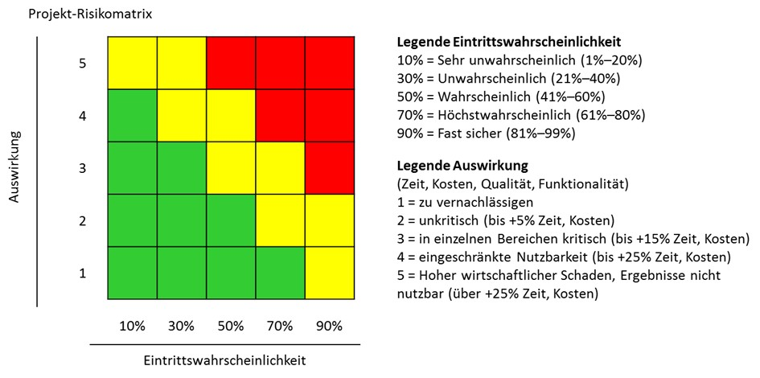

 # 1. Warum Risikomanagement?
 
Ob Gesetzesänderungen, Wechselkursschwankungen oder Umweltkatastrophen – Firmen unterliegen, je nach Branche und Unternehmensgröße, diversen Risiken, die mit unterschiedlichen Faktoren zusammenhängen.[^1]
Dabei versteht man unter einem Risiko die Eintrittswahrscheinlichkeit eines negativen Ereignisses, welches zu einem möglichen Schaden führen kann.[^2]

Es wird zwischen zwei Arten von Risiken unterschieden.

interne Risiken:
-  oft durch operative Abläufe oder Fehlentscheidungen verursacht
- z.B.: Bereiche wie Produktentwicklung, Marketing, Versicherungen, Vertrieb etc.

externe Risiken:
- äußere Einflüsse, die Unternehmen nicht beeinflussen kann
- z.B.: politische Entscheidungen, Wettbewerbs- und Marktsituationen, Rezession oder Steuererhöhungen[^3]

Zentrale Aufgabe des Risikomanagements ist es diese frühmöglich zu erkennen und analysieren, sodass Gegenmaßnahmen definiert werden können. 

Im Folgenden soll sich auf das klassische Risikomanagement beschränkt werden.

# 2. Definition
Unter Risikomanagement werden alle Aktivitäten zusammengefasst, die sich mit der Identifizierung von Risiken beschäftigen, sodass diese systematisch erfasst und bewertet werden können.[^4]  

# 3. ISO 31000 als Basis-Norm
Seit 2008 gilt die internationale Norm ISO 31000 Risiko Management als weltweit gültiger Standard im Risikomanagement, welcher drei wesentliche Prinzipien berücksichtigt: 

1. Risikomanagement wird als Führungsaufgabe verstanden und basiert auf dem Prinzip des PDCA-Zyklus (Plan-Do-Check-Act)

2. Umsetzung des Top-Down-Ansatzes, d.h. der Anstoß zur Umsetzung der zu planenden Maßnahmen kommt von „oben“ und wird in die untergeordneten Hierarchiebereiche einer Organisation transportiert [^5]

3. Berücksichtigung aller (strategisch/finanziell/operativ/personell/regulatorisch/politisch/technisch) Risiken in einer Organisation [^6]

# 4. Ablauf

## 1. Risikoidentifizierung

- Risikoanalyse mit detaillierter Bestandsaufnahme
- alle bestehenden und potenziellen Risiken, die das Erreichen der Ziele gefährden können, werden aufgelistet
- Möglichkeiten: SWOT-Analyse, PEST-Analyse, Checklisten, Frühwarnsysteme

Bsp.: SWOT-Analyse

Sie dient der besseren Einschätzung der eigenen Situation im Hinblick auf S=Strenghts, W=Weaknesses, O=Opportunities und T=Threats. Dabei wird die Konkurrenz analysiert und die Ergebnisse als Chancen-Risiken-Katalog zusammengestellt und anschließend in Relation zum internen Profil des Unternehmens gesetzt.
Dann werden die Überschneidungen zwischen externen und internen Bereichen erfasst und in einer SWOT-Matrix dargestellt, welche die ausbaufähigen Chancen und abzusichernden Risiken zeigt.

## 2. Risikobewertung

- Bewertung anhand Schadensausmaß (1=geringfügiges Ausmaß; 10= existenzgefährdend) und Eintrittswahrscheinlichkeit (1=unwahrscheinlich, 10= sehr wahrscheinlich) z.B. auf einer Skala von 1 bis 10, kann aber auch anders kategorisiert werden (siehe Graphik)
- Schadensausmaß * Eintrittswahrscheinlichkeit = Schadenserwartungswert
- Risikodiagramm anfertigen, welches auf der X-Achse die Wahrscheinlichkeit und auf der Y-Achse das Ausmaß zeigt
- Risiken mittels ermittelten Schadenswert in Matrix eintragen
somit: visualisierte Darstellung von Rangfolge und Handlungsbedarf der Risiken 

## 3. Risikosteuerung

- notwendige Handlungsmaßnahmen planen & durchsetzen
- nach Wichtigkeit geordnet müssen zuerst Maßnahmen gegen rote Risiken geplant werden, dann gegen gelbe und grüne Risiken 
- zentrale Fragestellung: Lohnt sich der Aufwand für die Umsetzung einer Maßnahme in Relation zum Risiko?

Möglichkeiten
- Risiken akzeptieren (Nulloption), da unvermeidbar/nicht reduzierbar
- Risiken vermeiden, d.h. potenzieller Gefahrenquellen beseitigen
- durch vorausschauende Maßnahmen Risiken reduzieren & Eintrittswahrscheinlichkeit verringern
- Risiken abwälzen bzw. verlagern, d.h. Absicherung der (finanziellen) Auswirkungen eines Risikos durch Verlagerung an Personen außerhalb des Projekts

## 4. Risikoüberwachung

- kontinuierlicher Prozess der Prüfung auf Effizienz der umgesetzten Maßnahmen ist erforderlich, da sich die Eintrittswahrscheinlichkeit im Laufe der Zeit verschieben kann. 
- Transparenz gegenüber Stakeholdern ausweisen [^7]

# 5. Fazit

Ob im [Projektmanagement](Projektmanagement.md), Compliance oder Hedging – die Mindmap zeigt, dass die Absicherung gegenüber Risiken jederzeit gewährleistet sein muss, damit Prozesse langfristig erfolgreich ablaufen können und die benötigte Liquidität stets sichergestellt ist.[^8]

# 6. Quellen

[^1]: [Einführung Risiko](https://sevdesk.de/blog/risikomanagement/#definition)
[^2]: [Begriffserkärung Risiko](https://www.business-wissen.de/hb/ziele-und-aufgaben-des-risikomanagements-im-unternehmen/)
[^3]: [Kategorisierung von Risiken](https://treuenfels-personalberatung.com/fokusthemen/risikomanagement/)
[^4]: [Defintion Risikomanagement](https://www.business-wissen.de/premium/risiken-identifizieren/)
[^5]: [ISO 31 000](https://www.risikomanagement-wissen.de/risikomanagement/risikomanagement-einfuehrung/iso_31000/)
[^6]: [Arten von Risiken](https://sevdesk.de/blog/risikomanagement/#ziele)
[^7]: [Ablauf Risikomanagement](https://sevdesk.de/blog/risikomanagement/#definition)
[^8]: [relevante Bereiche des Risikomanagements](https://wirtschaftslexikon.gabler.de/sites/default/files/graph/extended/risikomanagement-42454.png)
