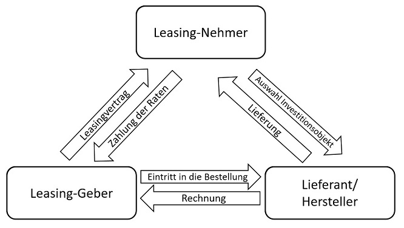

# Inhaltsverzeichnis
1. [Definition](https://github.com/niru1999/ManagingProjectsSuccessfully.github.io/blob/main/kb/Risikotransfer.md#definition)
2. [Verschiedene Methoden des Risikotransfers](https://github.com/niru1999/ManagingProjectsSuccessfully.github.io/blob/main/kb/Risikotransfer.md#verschiedene-methoden-des-risikotransfers)  
* 2.1 [Versicherungen](https://github.com/niru1999/ManagingProjectsSuccessfully.github.io/blob/main/kb/Risikotransfer.md#versicherungen)  
* 2.2 [Derivate](https://github.com/niru1999/ManagingProjectsSuccessfully.github.io/blob/main/kb/Risikotransfer.md#derivate)  
* 2.3 [Factoring](https://github.com/niru1999/ManagingProjectsSuccessfully.github.io/blob/main/kb/Risikotransfer.md#factoring)  
* 2.4 [Leasing](https://github.com/niru1999/ManagingProjectsSuccessfully.github.io/blob/main/kb/Risikotransfer.md#leasing)
3. [Vorteile](https://github.com/niru1999/ManagingProjectsSuccessfully.github.io/blob/main/kb/Risikotransfer.md#vorteile)
4. [Nachteile](https://github.com/niru1999/ManagingProjectsSuccessfully.github.io/blob/main/kb/Risikotransfer.md#nachteile)
5. [Siehe auch](https://github.com/niru1999/ManagingProjectsSuccessfully.github.io/blob/main/kb/Risikotransfer.md#siehe-auch)
6. [Weiterführende Literatur](https://github.com/niru1999/ManagingProjectsSuccessfully.github.io/blob/main/kb/Risikotransfer.md#weiterf%C3%BChrende-literatur)
7. [Quellen](https://github.com/niru1999/ManagingProjectsSuccessfully.github.io/blob/main/kb/Risikotransfer.md#quellen)

# Definition 
Unter den Begriff des Risikotransfers, auch Risikoüberwälzung genannt, versteht man im [Risikomanagement](https://github.com/jnsdhr/ManagingProjectsSuccessfully.github.io/blob/main/kb/Risikomanagement.md) die Verteilung zukünftiger Risiken, oder die Auswirkung von Risiken einer Person oder einer Organisation, auf eine andere Partei. Dabei kann diese Partei für eine einzelne Person oder auch eine Organisation stehen wie z.B. eine Versicherungsgesellschaft. Diese Risiken müssen nicht zwangsläufig auftreten. Eines der gängigsten Methode des Risikotransfers ist das Abschließen einer Versicherung bei einer Versicherungsgesellschaft, und dadurch den Erwerb einer Versicherungspolice. [^1]

# Verschiedene Methoden des Risikotransfers
* ## Versicherungen
Durch den Kauf einer Versicherungspolice wird eine Partei bei einer Versicherungsgesellschaft auf zukünftigen potentiellen finanziellen Risken abgesichert. Als Gegenleistung erhält die Versicherungsgesellschaft regelmäßige Zahlungen um die Police aufrecht zu halten. [^1]
* ## Derivate
Derivate sind Anlageprodukte die von Unternehmen erworben werden um sich vor Wechselkursrisiken und ähnliches abzusichern und somit dem finanziellen Risiko entgegen zu wirken. [^2]
* ## Factoring
Auch das Factoring ist eine Methode des Risikotransfers. Dabei schaltet ein Factoring Nutzer (das Unternehmen) einen Factor ein, falls ein Kauf von einem Debitor (Kunden) nicht sofort vollständig bezahlt wird und der Käufer diesen später oder sogar in Raten bezahlen möchte. Der Factor prüft dann die Bonität des Kunden und kauft dann dem Unternehmen die Forderung ab. Somit ist für die Liquidität des Unternehmens gesorgt und der Kunde zahlt den offenen Betrag an den Factor. [^3]
* ## Leasing 
Beim Leasing wird zwischen dem Operating-Leasing und das Financial-Leasing unterschieden. Der wesentliche Unterschied dabei liegt daran, dass beim Operating-Leasing eine kurzfristige Kündigung möglich ist, wodurch nur das Financial-Leasing unter den Risikotransfer fällt. Beim Leasing wird ein Leasingobjekt durch ein Leasingnehmer bei einem Lieferanten ausgewählt und durch eine Leasinggeber erworben. Ein Leasingvertrag zwischen Leasingnehmer und Leasinggeber ist entstanden. Darin wird die allgemeine Laufzeit, die Mindestvertragslaufzeit und die Höhe der Leasingrate festgelegt, die der Leasingnehmer dann beim Leasinggeber zu begleichen hat. Der Risikotransfer entsteht dadurch, dass die Leasingrate die Kosten des Leasinggebers deckt. 
Jedoch hat der Leasingnehmer trotz Risikos Vorteile wie z.B. der Zugang zur neusten Technologie nach Ablauf der Leasingzeit, da danach ein neues Model ausgesucht werden darf, falls das Leasingobjekt nicht erworben wird. [^3]

*Leasingdreieck* [^3]

# Vorteile
Durch den Risikotransfer können gegen Risiken, die bei einer [Risikoanalyse](https://github.com/CTM-development/ManagingProjectsSuccessfully.github.io/blob/main/kb/Risikoanalyse_und_Visualisierung.md) hervorgekommen sind, vorgegangen werden. Selbst Risiken, die nicht vorhersehbar sind, wie z.B. Schäden durch den Einfluss der Umwelt können abgesichert werden. Eine Privatperson oder auch ein Unternehmen schützt sich und seine Zukunft so vor den finanziellen Abgrund da er durch eine Versicherung nicht selbst für solche Schäden aufkommen muss. [^3]

# Nachteile
Eines der Nachteile vom Risikotransfer ist, dass eine Absicherung immer mit Kosten verbunden ist, da auch Organisationen wie Versicherungsgesellschaften ihren Gewinn erwirtschaften müssen.
Ein weiterer Nachteil ist das meistens der Abschluss einer Versicherung oder die Absicherung mit Derivaten auch mit einem zeitlichen Aufwand verbunden ist. Dies führt vor allem bei Einzelpersonen dazu, dass sie kein Risikotransfer betreiben, was denen dann in der Zukunft zur lasst fällt. [^1]

# Siehe auch

* [Katastrophenanleihe](https://de.wikipedia.org/wiki/Katastrophenanleihe)

* [Versicherungsderivate](https://www.versicherungsmagazin.de/lexikon/versicherungsderivate-1947038.html)

# Weiterführende Literatur

* [Alternativer Risikotransfer: Vorteile und Risiken des Transfers](https://www.bafin.de/SharedDocs/Veroeffentlichungen/DE/Fachartikel/2013/fa_bj_2013_06_alternativer_risikotransfer.html)

# Quellen

[^1]: [HAUPT RISIKOMANAGEMENT-TUTORIALS
Risikotransfer(teamaftermarket)](https://teamaftermarket.com/691-risk-transfer)
[^2]: [Was sind Derivate? Derivate einfach erklärt!](https://www.finanzfluss.de/geldanlage/derivate/)  
[^3]: [Risikoüberwälzung](https://de.wikipedia.org/wiki/Risiko%C3%BCberw%C3%A4lzung)

