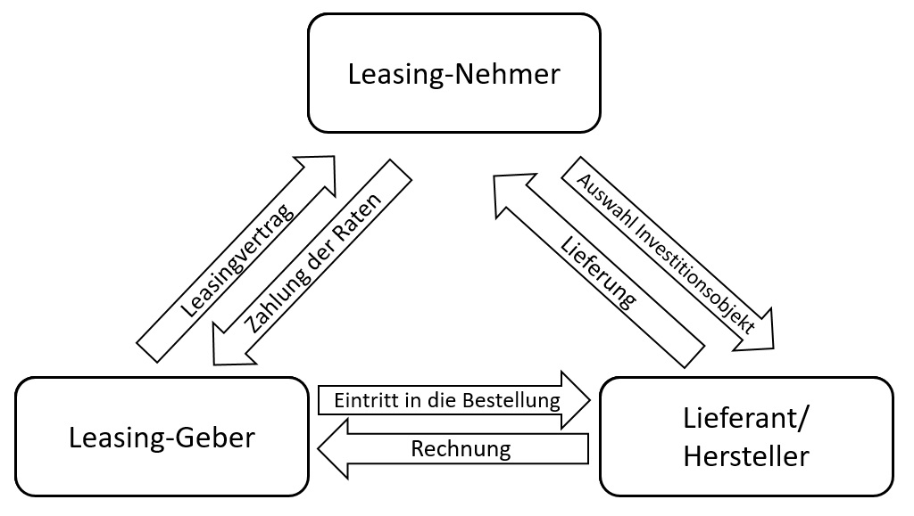

# Definition: 
Unter den Begriff des Risikotransfers, auch Risikoüberwälzung genannt, versteht man im Risikomanagement die Verteilung zukünftiger Risiken, oder die Auswirkung von Risiken einer Person oder einer Organisation, auf eine andere Partei. Dabei kann diese Partei für eine einzelne Person oder auch eine Organisation stehen wie z.B. eine Versicherungsgesellschaft. Diese Risiken müssen nicht zwangsläufig auftreten. Eines der gängigsten Methode des Risikotransfers ist das Abschließen einer Versicherung bei einer Versicherungsgesellschaft, und dadurch den Erwerb einer Versicherungspolice. (1)

# Verschiedene Methoden des Risikotransfers:
* ## Versicherungen:
Durch den Kauf einer Versicherungspolice wird eine Partei bei einer Versicherungsgesellschaft auf zukünftigen potentiellen finanziellen Risken abgesichert. Als Gegenleistung erhält die Versicherungsgesellschaft regelmäßige Zahlungen um die Police aufrecht zu halten. (1)
* ## Derivate:
Derivate sind Anlageprodukte die von Unternehmen erworben werden um sich vor Wechselkursrisiken und ähnliches abzusichern und somit dem finanziellen Risiko entgegen zu wirken. (2)
* ## Factoring:
Auch das Factoring ist eine Methode des Risikotransfers. Dabei schaltet ein Factoring Nutzer (das Unternehmen) einen Factor ein, falls ein Kauf von einem Debitor (Kunden) nicht sofort vollständig bezahlt wird und der Käufer diesen später oder sogar in Raten bezahlen möchte. Der Factor prüft dann die Bonität des Kunden und kauft dann dem Unternehmen die Forderung ab. Somit ist für die Liquidität des Unternehmens gesorgt und der Kunde zahlt den offenen Betrag an den Factor. (3)
* ## Leasing: 
Beim Leasing wird zwischen dem Operating-Leasing und das Financial-Leasing unterschieden. Der wesentliche Unterschied dabei liegt daran, dass beim Operating-Leasing eine kurzfristige Kündigung möglich ist, wodurch nur das Financial-Leasing unter den Risikotransfer fällt. Beim Leasing wird ein Leasingobjekt durch ein Leasingnehmer bei einem Lieferanten ausgewählt und durch eine Leasinggeber erworben. Ein Leasingvertrag zwischen Leasingnehmer und Leasinggeber ist entstanden. Darin wird die allgemeine Laufzeit, die Mindestvertragslaufzeit und die Höhe der Leasingrate festgelegt, die der Leasingnehmer dann beim Leasinggeber zu begleichen hat. Der Risikotransfer entsteht dadurch, dass die Leasingrate die Kosten des Leasinggebers deckt. 
Jedoch hat der Leasingnehmer trotz Risikos Vorteile wie z.B. der Zugang zur neusten Technologie nach Ablauf der Leasingzeit, da danach ein neues Model ausgesucht werden darf, falls das Leasingobjekt nicht erworben wird. (3)

# Siehe auch

* Verlinkungen zu angrenzenden Themen
* [Link auf diese Seite](Risikotransfer.md)

# Weiterführende Literatur

* Weiterfuehrende Literatur zum Thema z.B. Bücher, Webseiten, Blogs, Videos, Wissenschaftliche Literatur, ...

# Quellen

[^1]: Quellen die ihr im Text verwendet habt z.B. Bücher, Webseiten, Blogs, Videos, Wissenschaftliche Literatur, ... (eine Quelle in eine Zeile, keine Zeilenumbrüche machen)
[^2]: [A Guide to the Project Management Body of Knowledge (PMBOK® Guide)](https://www.pmi.org/pmbok-guide-standards/foundational/PMBOK)
[^3]: [Basic Formatting Syntax for GitHub flavored Markdown](https://docs.github.com/en/github/writing-on-github/getting-started-with-writing-and-formatting-on-github/basic-writing-and-formatting-syntax)
[^4]: [Advanced Formatting Syntax for GitHub flavored Markdown](https://docs.github.com/en/github/writing-on-github/working-with-advanced-formatting/organizing-information-with-tables)

