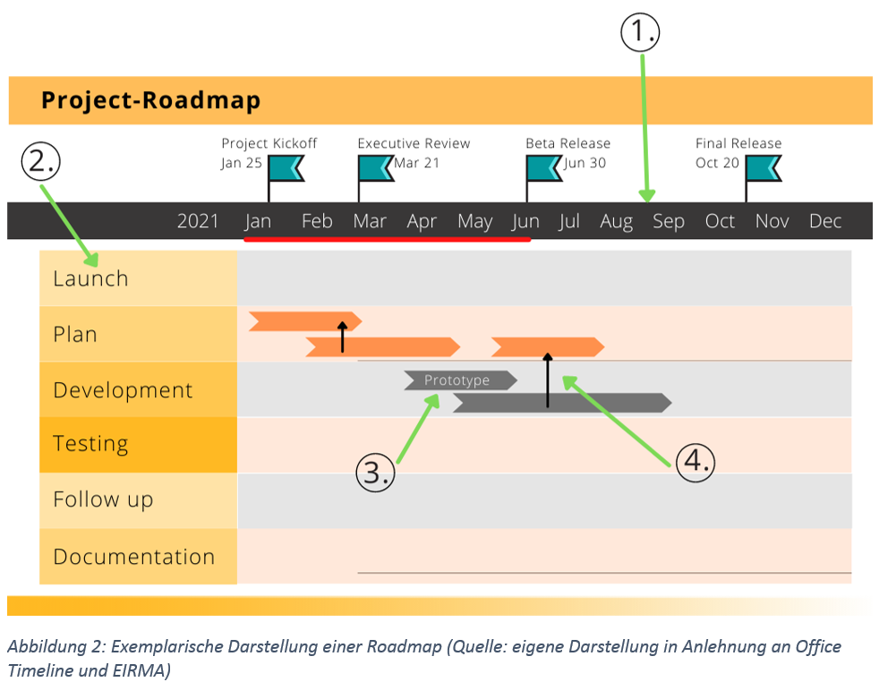

---
title: Roadmap
tags: agil klassisch
author: uc00ekun
anrechnung: k 
--- 

Der in verschiedenen Branchen verbreitete Anglizismus Roadmap bedeutet in der deutschen Übersetzung 
wörtlich "Straßenkarte"[^1]. In Analogie dazu kann sie einen groben Fahrplan für verschiedene 
Entwicklungsbereiche eines Unternehmens prognostizieren und darstellen. Im [Projektmanagement](Projektmanagement.md) dient die 
Roadmap vorallem als strategisches Planungswerkzeug.

# Kategorisierung

In der Literatur sind verschiedene Strukturierungsansätze für Roadmaps zu finden. Laut Behrendt 
unterscheidet man zwischen vier Arten:
* Unternehmensspezifische Roadmap
* Branchenbezogene Roadmap
* Problemorientierte Roadmap
* Forschungs- und Entwicklungs-Roadmap für die Politik [^2]

Darüber hinaus können Roadmaps auch nach ihren Anwendungsbereichen differenziert werden. So existieren 40 
verschiedene Typen an Roadmaps. Die häufigst verwendeten sind die Produkt-Roadmap, Technologie-Roadmap, 
Integrierte Produkt- und Technologie-Roadmap sowie die Projekt-Roadmap [^3].

# Projekt-Roadmap
Speziell im Projektmanagement dient die sogenannte Projekt-Roadmap als strategisches Planungswerkzeug. Es 
wird ein grober visueller Gesamtüberblick über Aufgaben, Ziele und Ergebnisse geschaffen und dabei das 
[Projekt](Projekt.md) in zeitliche Etappen bzw. Zwischenprojekte unterteilt. Damit wird eine einheitliche Basis zur 
Kommunikation zwischen den Interessensgruppen auf allen Ebenen des Vorhabens erstellt [^4]. 
Charakteristisch ist außerdem der Instrumentenmix, aus dem eine Roadmap besteht. Bekannte 
Vorausschau-Methoden wie etwa die [Szenario-Technik](Szenario_Technik.md) oder auch die Delphi-Methode vereinfachen den 
Prozess, zukünftige Entwicklungen darzustellen und zu bewerten [^2].

# Roadmapping
Der Prozess, eine Roadmap zu erstellen und stets auf dem aktuellen Stand zu halten wird auch „Roadmapping“ 
genannt. Die Entwicklung einer Roadmap lässt sich in fünf Kernschritte unterteilen, die in der 
nachfolgenden Abbildung zusammengefasst werden. Die Vorgehensweise kann ebenfalls auf die verschiedenen 
Arten von Roadmaps übertragen werden. 
.

## Definition von Untersuchungsfeldern
Im ersten Schritt findet eine Abgrenzung der zu untersuchenden Objekte statt. Hierzu werden die 
Untersuchungsfelder sowie das betrachtete Umfeld definiert. Weiter werden Ziele sowie die Zeitskalierung 
festgelegt [^2].

## Trend-, Bedarfs-/Potenzialanalyse
Danach findet eine Analyse der Trends, des Bedarfs sowie des Potenzials statt. Herangezogen werden dabei 
verschiedenste Quellen, wie Literatur, Datenbanken oder auch Expertenbefragungen[^2].

## Identifizierung von Chancen und Risiken
Im dritten Schritt werden Chancen und Risiken identifiziert. In Folge dessen können Wild Cards bestimmt 
und Zukunftsbilder gestaltet werden. Zudem werden Arbeitsgruppen zusammengestellt und Aufgaben verteilt 
[^2].

## Erstellung der Roadmap
Für die Erstellung der Roadmap werden alle Ergebnisse der vorherigen Schritte in [Meilensteine](Meilensteine.md) überführt 
und in die Zeitskala eingetragen. Hiervon lassen sich schließlich Handlungsempfehlungen ableiten und 
Aktivitäten definieren. Wichtig ist außerdem die Vollständigkeits- und Konsistenzanalyse, bei der die 
Roadmap auf Lücken sowie inhaltliche und zeitliche Konsistenz überprüft wird [^2].

## Transfer
Die Erstellung der Roadmap schließt mit dem Transfer und der zielgruppengerechten Aufbereitung zur 
weiteren Kommunikation mit allen Stakeholdern [^2].

# Exemplarische Darstellung
Die Visualisierung einer Roadmap kann je nach Projekt variieren. Kennzeichnend sind jedoch folgende 
Kernelemente, die von der European Industrial Research Management Association (EIRMA 1997) empfohlen 
werden:

1. Zeitstrahl im festgelegten Projekt-Zeitraum
2. Ebenen der zu untersuchenden Objekte
3. Aufgaben, Meilensteine und Ergebnisse in Balkenform
4. Verknüpfung zwischen den Objekten zur Darstellung der Wirkungszusammenhänge [^3]

In der nachfolgenden Abbildung ist eine beispielhafte Visualisierung einer Roadmap skizziert:
.

# Siehe auch

* [Meilensteine](Meilensteine.md)
* [Projekt](Projekt.md)
* [Projektmanagement](Projektmanagement.md)
* [Projektplanung](Projektplanung.md)
* [Szenario-Technik](Szenario_Technik.md)

# Weiterführende Literatur

* Dieter Specht, Stefan Behrens: _Kapitel 8: Strategische Planung mit Roadmaps - Möglichkeiten für das Innovationsmanagement und die Personalbedarfsplanung_. Bremen 2008 (URL: https://link.springer.com/book/10.1007%2F978-3-540-74755-0, zuletzt aufgerufen am 23.11.2021)
* Siegfried Behrendt: _Integriertes Roadmapping_. Berlin 2010 (URL: https://link.springer.com/book/10.1007%2F978-3-642-10754-2, zuletzt aufgerufen am 19.11.2021)

# Quellen

[^1]: Dudenredaktion, o.D. (URL: https://www.duden.de/rechtschreibung/Roadmap, zuletzt abgerufen am 19.11.2021)
[^2]: Siegfried Behrendt: _Integriertes Roadmapping_. Springer-Verlag, Berlin 2010, ISBN 978-3-64210-7535-5 (URL:https://link.springer.com/book/10.1007%2F978-3-642-10754-2, zuletzt aufgerufen am 19.11.2021) 
[^3]: Oliver Gassmann, Philipp Sutter: _Praxiswissen Innovationsmanagement_. Hanser-Verlag, München 2013, ISBN 978-3-44643-513-1 (URL: https://www.hanser-elibrary.com/doi/book/10.3139/9783446435131, zuletzt aufgerufen am 19.11.2021)
[^4]: Dieter Specht, Christian Mieke: _Projekt-Roadmapping_. Zeitschrift für wirtschaftlichen Fabrikbetrieb, 24. Februar 2004, ISSN 0947-0085 , 2511-0896 , 0947-0085 (URL: https://www.degruyter.com/journal/key/zwf/html, zuletzt aufgerufen am 19.11.2021)

