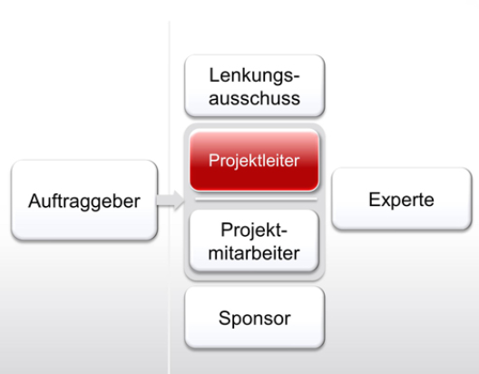

Für die erfolgreiche Durchführung eines [Projektes](Projekt.md) ist es oft von Vorteil feste Projektrollen zu vergeben. Dadurch ist es möglich sicherzustellen, dass alle Teilbereiche des Projekts betrachtet und zuverlässig ausgeführt werden. Zudem können durch eine klare Abgrenzung der Rollen mit fest definierten [Verantwortlichkeiten](Verantwortlichkeiten.md) und Kompetenzen Konflikte vermieden werden.[^2]

# Unterschiedliche Rollen im klassischen Projektmanagement
Daher gibt es im klassischen [Projektmanagement](Projektmanagement.md)
 verschiedene Rollen, die vor dem Beginn eines Projekts besetzt werden müssen. Dazu gehören: 

* Der Auftraggeber
* Der Lenkungsausschuss
* Der Projektleiter
* Die Projektmitarbeiter/ Das Projektteam
* Experten
* Sponsoren[^4]

*Übersicht über die wichtigsten Rollen im klassischen Projektmanagement* [^4]

# Aufgabenbereiche und Kompetenzen der einzelnen Rollen
Diesen verschiedenen Rollen können unterschiedliche Aufgaben, Kompetenzen und Verantwortungen innerhalb eines Projektes zugeordnet werden. Diese werden im Folgenden kurz beschrieben.[^4]

## Der Projektauftraggeber:
Der Auftraggeber ist der Initiator des Projekts. Er beauftragt das Projekt, gibt die wichtigsten Ziele vor und stellt die benötigten Ressourcen (z.B.: finanzielle Mittel) bereit.[^4]
Für interne Projekte ist dies oft der Geschäftsführer oder Vorstand des Unternehmens, bei externen Projekten sind es die Kunden, die ihre Anforderungen an das Projekt oft in einem Lastenheft formulieren. Sofern es neben dem Auftraggeber eine spezielle Kundenrolle gibt, ist der Kunde der Abnehmer aller Ergebnisse aus dem Projekt.[^1]

## Projektlenkungsausschuss:
Der Projektlenkungsausschuss besteht aus mehreren Mitgliedern, die innerhalb des Projekts als Berater und Entscheidungsträger auftreten. Da dieses Gremium eine außenstehende und neutrale Funktion einnehmen soll, sollte der Projektleiter möglichst kein Mitglied des Ausschusses sein.[^2]

## Projektleiter:
Der [Projektleiter](Projektleiter.md) ist verantwortlich für das Ergebnis des Projekts. Er überwacht und plant das Projekt und weist den Projektmitarbeitern ihre Aufgaben zu.[^3] Bei größeren Projekten ist es oft sinnvoll die Leitung des Projekts auf mehrere Personen aufzuteilen, die jeweils einen Teilaspekt des Projekts übernehmen und dafür verantwortlich sind. Diese werden als Teilprojektleiter bzw. Modulleiter bezeichnet.[^1] Zudem muss ein Projektleiter verschieden [Kompetenzen](Faehigkeiten_Projektleiter.md) aufweisen. * [Teammanagement](Teammanagement.md)

 
## Projektteam:
Das Projektteam besteht aus [Projektmitarbeiter](Projektmitarbeiter.md), die für die im Projekt nötigen Aufgaben qualifiziert sind und diese erfüllen können. [Spezialistenteams](Spezialistenteams.md). Dabei werden von verschieden Teammitgliedern [unterschiedliche Aufgaben](Aufgabenteilung.md) erfüllt. Dazu gehören unter anderem:

* Der [Projektcontroller](Projektcontrolling.md): Er ist für die Überwachung und Steuerung des Projektfortschritts verantwortlich. Zum Teil gehört es auch zu seinen Aufgaben die Kosten des Projektes zu überwachen.
* Der Projektkaufmann: Der Projektkaufmann trägt die Verantwortung über die Finanzen des Projekts. Er ist sowohl für die Beschaffung der finanziellen Mittel aus als für die Überwachung der Kostenentwicklung zuständig.
* Der [Qualitätsmanager](Qualitaetsmanagement.md): Bei größeren Projekten ist es möglich einen Qualitätsmanager im Team zu benennen. Dieser nimmt eine neutrale Position innerhalb des Projektes ein und überwacht die Erreichung der zuvor [definierten Qualitätsziele](Qualitaetssicherung.md) und trägt somit zur [Qualitätssicherung](Qualitätssicherung.md) bei.

Je nach Größe des Projektes bzw. des Teams können diese Rollen auch vom Projektleiter übernommen werden.[^1]

Wichtig ist es dabei eine gute [Kultur](Projektteam_Kultur.md) der Zusammenarbeit im Team zu etablieren und durch [Kommunikation](Kommunikation_Projektbeteiligte.md) aufrecht zu erhalten.

## Experten:
Innerhalb und außerhalb der Projektorganisation kann es zudem Experten geben, die selektiv in das Projekt miteingebunden werden und das Projekt mit ihrem Fachwissen unterstützen können.[^4]

## Sponsoren
Sponsoren sind unternehmensinterne Befürworter des Projektes, die zumeist im oberen Management zu finden sind. Sie unterstützen seine Durchführung, indem sie Widerstände abbauen, sind jedoch nicht in den operativen Ablauf eingebunden.[^4]

## Zusätzliche Rollen im Multiprojektmanagement
Neben diesen Hauptrollen gibt es im Multiprojektmanagement Organisationseinheiten, die 
Dazu zählen:

### Das Projekt Management Office:
Das [Projekt Management Office](Project_Management_Office.md) (PMO) unterstützt den Projektleiter bei seiner Arbeit. Allerdings sind die Aufgaben und Kompetenzen des PMO sehr heterogen verteilt. Sie können zudem die Rollen des Projektkaufmanns oder des Projektcontrollers übernehmen.[^1]

### Der Multiprojektlenkungsausschuss
Der Multiprojektlenkungsausschuss nimmt eine strategische Funktion innerhalb eines Unternehmens ein und entscheidet über die strategische Ausrichtung des Unternehmens, indem er bestimmt, welche Projekte im Unternehmen durchgeführt werden. Er ist der Projektauftragsgeber auf der Gesamtunternehmensebene.[^1]

# Festlegung der Projektrollen
Die Frage wer innerhalb eines Projektes welche Projektrolle einnimmt wird meist in der Planungsphase zu Beginn eines Projekts festgelegt. Dabei wird neben der Verteilung der Rollen auch geklärt, welche Aufgaben, Kompetenzen und Verantwortungen die einzelnen Rollen erhalten, wie die Zusammenarbeit zwischen den Rollen organisiert wird und wie das Einzelprojekt in die Stammorganisation eigebunden wird.[^2]

# Siehe auch

* [Projekt](Projekt.md)
* [Projektmanagement](Projektmanagement.md)
* [Projektteam_Kultur](Projektteam_Kultur.md)
* [Project_Management_Office](Project_Management_Office.md)
* [Faehigkeiten_Projektleiter](Faehigkeiten_Projektleiter.md)
* [Projektcontrolling](Projektcontrolling.md)
* [Qualitaetsmanagement](Qualitaetsmanagement.md)
* [Qualitaetssicherung](Qualitaetssicherung.md)
* [Verantwortlichkeiten](Verantwortlichkeiten.md)
* [Kommunikation_Projektbeteiligte](Kommunikation_Projektbeteiligte.md)
* [Teammanagement](Teammanagement.md)
* [Projektleiter](Projektleiter.md)
* [Projektmitarbeiter](Projektmitarbeiter.md)
* [Spezialistenteams](Spezialistenteams.md)
* [Aufgabenteilung](Aufgabenteilung.md)

# Weiterführende Literatur

* [A Guide to the Project Management Body of Knowledge (PMBOK® Guide)](https://www.pmi.org/pmbok-guide-standards/foundational/PMBOK)

# Quellen

[^1]: [Bea, Franz X., Projektmanagement, UTB, 2019 (S.83ff)](https://elibrary.utb.de/doi/book/10.36198/9783838587066) 
[^2]: [Projektrollen diese Stellen müssen besetzt sein](https://projekte-leicht-gemacht.de/blog/methoden/projektorganisation/rollen-im-projekt-diese-stellen-muessen-besetzt-sein/)
[^3]: [Projektmanagement erklärt](https://omr.com/de/projektmanagement/#Welche%20Projektbeteiligten%20bzw.%20Projektrollen%20gibt%20es?)
[^4]: [Rollenbeschreibung im Projekt](https://projektmanagement24.de/rollenbeschreibung-im-projekt-als-powerpoint-vorlage-zum-download)

