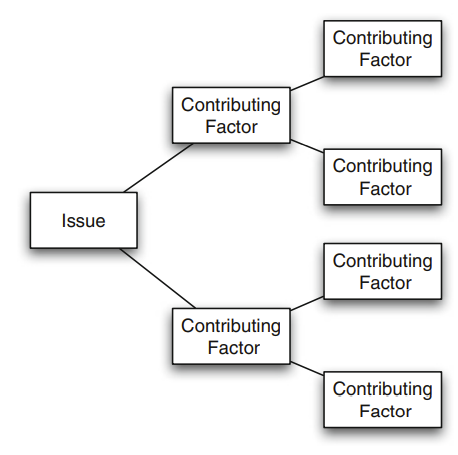
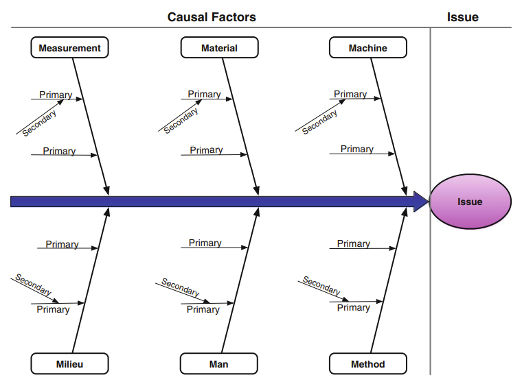

Die Root-Cause-Analysis (oder Fehler-Ursachen-Analyse) ist eine Sammlung von Techniken, deren Ziel die Identifikation der Hauptursache eines Problems ist, um daraus folgend langfristige Maßnahmen zur Fehlerreduzierung einzuleiten [^1]. Konkret geht es darum, die Kernprobleme zu ermitteln sowie deren Abhängigkeiten darzustellen, um die Beziehung zwischen Ursachen und Wirkung nachzuvollziehen [^2].

# Einordnung in das Unternehmensgeschehen
Die Techniken der Root-Cause-Analysis werden unter anderem in Analysen zu Stör- und Zwischenfällen oder Geschäftsprozess- und Herstellungsprozessanalysen eingesetzt [^5]. Generell gibt es zwei Arten der Störungsbeseitigung und Problembehebung: das reaktive und das proaktive Management. Bei Ersterem liegt der Fokus auf der schnellen und kurzfristigen Beseitigung von Symptomen eines Problems. Das geschieht unter anderem durch adaptive Systeme. Bei proaktivem Management geht es vor allem darum zu verhindern, dass Probleme überhaupt entstehen. Die Root-Cause-Analysis wird deshalb dem proaktiven Management zugeordnet [^4].

# Grundlegende Vorgehensweise
Das Fundament der Analyse beruht darauf, die Ursachen von Fehlern zu analysieren, wobei meist eine Gruppierung der Ursachen sinnvoll ist. Denn gemäß dem [Pareto-Prinzip](Pareto_Prinzip.md) beruhen oft viele unterschiedliche Fehler auf nur wenigen, gleichen Ursachen [^1]. Dementsprechend ist es effizienter, zugrundeliegende Probleme zu verhindern, anstelle die Symptome zu behandeln [^3].  Darauf aufbauend werden Maßnahmen zur Reduzierung der Fehler sowie der möglichen, daraus resultierenden, Kosten eingeführt (vgl. [Kosten-Nutzen-Analyse](Kosten_Nutzen_Analyse.md). Dieser Prozess ist allerdings nicht nach einer einmaligen Durchführung beendet, sondern besteht aus mehreren iterativen Durchläufen (vgl. [Kontinuierlicher Verbesserungsprozess](https://de.wikipedia.org/wiki/Kontinuierlicher_Verbesserungsprozess)).

# Schritte [^4]
1. Problemidentifikation und -definition
2. Zeitlichen Ablauf von normaler Situation bis zum Auftreten des Problems
3. Unterscheidung zwischen Kernursache und anderen Faktoren (vgl. Kausalität vs. Korrelation)
4. Darstellung des Kausaldiagramms (zwischen Kernursache und Fehler)

# Grundprinzipien [^3]
- Ursachenbehebung / -korrektur vor Symptombehandlung
- Jedoch: Behandlung der Symptome für kurzfristige Lösungen
- Mehrere Ursachen für ein Problem oder eine Ursache für mehrere Probleme
- Leitfragen: WIE ist es passiert? WARUM ist es passiert?
- Methodisches und analytisches Vorgehen relevant
- Ausreichende Informationen als Belege für Kausalzusammenhänge und Basis für Korrekturmaßnahmen

# Techniken und Werkzeuge
Im Folgenden werden die zwei bekanntesten Techniken der Root-Cause-Analysis dargestellt.
## 5-Why-Methode
Kernidee dieser Methode ist, sich ausgehend von einem Problem, fünf-mal die Frage "Warum?" zu stellen, um so an die eigentliche Ursache zu gelangen. 
Nachdem ein zu untersuchendes Problem identifiziert und definiert wurde, wird die Frage gestellt: "Warum ist das passiert?" bzw. "Welche Unter-Probleme könnten zu diesem Problem führen?". Als Resultat ergeben sich mehrere mögliche Faktoren, die zum Problem beitragen. Ist dies geschehen, wird wieder pro Faktor gefragt, "Warum ist das passiert?" bzw. "Welche Unter-Probleme könnten zu diesem Problem führen?", wobei sich hier wieder mehrere Faktoren als Resultat ergeben. Insgesamt wird dies fünf-mal ausgeführt und führt letztendlich zu einer Baumstruktur (siehe Abbildung 1) aus mehreren möglichen Kernursachen. Häufig wird diese Technik zu Beginn eingesetzt, um beispielsweise erste Brainstorming-Sessions zu strukturieren [^5].

*Schema der 5-Why-Methode*[^5]

## Fischgrätendiagramm
Das Fischgräten- oder auch Cause-Effect-Diagramm stellt die Beziehung zwischen einem gegebenen negativen Effekt und potenziellen Ursachen dar. Wobei zwischen kausalen und beitragenden Ursachen unterschieden wird. Ersteres sind Faktoren, deren Vorhandensein direkt zu dem Fehler führen, während Letzteres Faktoren sind, deren Vorhandensein das Auftreten eines Fehlers wahrscheinlicher machen. Die Besonderheit des Fischgrätendiagramms ist, dass Faktoren in Kategorien gruppiert werden, um sie zu strukturieren. Dabei ist zu beachten, dass die vorgeschlagenen Kategorien einen Rahmen bieten und nicht als obligatorisch gesehen werden sollen. Bekannte Kategorien sind z.B. Technologie, Methoden, Material, Personal, Milieu und Messung. Pro Kategorie können Ursachen wiederum in primäre und sekundäre aufgeteilt werden, um Ursachenketten zu identifizieren (siehe Abbildung 2) [^5].

*Schema des Fischgrätendiagrams*[^5]

# Siehe auch

* [Pareto-Prinzip](Pareto_Prinzip.md)
* [Konfliktmanagement](Konfliktmanagement.md)
* [Risikomanagement](Risikomanagement.md)
* [Six Sigma](Six_Sigma.md)
* [Nutzwertanalyse](Nutzwertanalyse.md)

# Weiterführende Literatur

* Dumas, M., La Rosa, M., Mendling, J., & Reijers, H. A. (2013). Fundamentals of business process management (Vol. 1, p. 2). Heidelberg: Springer
* Williams, P. M. (2001, April). Techniques for root cause analysis. In Baylor University Medical Center Proceedings (Vol. 14, No. 2, pp. 154-157). Taylor & Francis

# Quellen

[^1]: [Fehler-Usachen-Analyse](https://de.wikipedia.org/wiki/Fehler-Ursachen-Analyse)
[^2]: [Was ist die Ursachenanalyse](https://asq.org/quality-resources/root-cause-analysis)
[^3]: [Die Ursacheenanalyse](https://www.tableau.com/de-de/learn/articles/root-cause-analysis)
[^4]: [Root cause analysis](https://en.wikipedia.org/wiki/Root_cause_analysis)
[^5]: [Fundaments of Business Process Management](http://fundamentals-of-bpm.org/)
