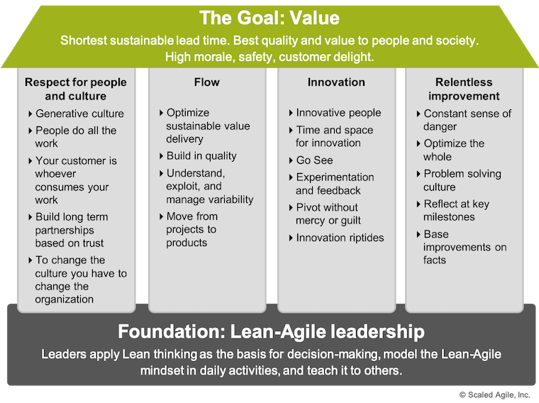

 ## Inhaltsverzeichnis
 > - [Definition](SAFe_Lean_Agile_Mindset.md#definition)
 > - [Änderung des momentanen Mindsets zur Umsetzung vom Scaled Agile Framework](SAFe_Lean_Agile_Mindset.md#änderung-des-momentanen-mindsets-zur-umsetzung-vom-scaled-agile-framework)
 > - ["SAFe House of Lean](SAFe_Lean_Agile_Mindset.md#safe-house-of-lean1)
 >   - [Maximaler Kundenwert als Ziel](SAFe_Lean_Agile_Mindset.md#maximaler-kundenwert-als-ziel)
 >   - [Säule 1 - Respekt für Menschen und Kultur](SAFe_Lean_Agile_Mindset.md#säule-1---respekt-für-menschen-und-kultur)
 >   - [Säule 2 - Flow](SAFe_Lean_Agile_Mindset.md#säule-2---flow)
 >   - [Säule 3 - Innovation](SAFe_Lean_Agile_Mindset.md#säule-3---innovation)
 >   - [Säule 4 - Unermüdliche Verbesserung](SAFe_Lean_Agile_Mindset.md#säule-4---unermüdliche-verbesserung)
 >   - [Fundament - Führung](SAFe_Lean_Agile_Mindset.md#fundament---führung) 
 > - [Siehe auch](SAFe_Lean_Agile_Mindset.md#siehe-auch)
 > - [Weiterführende Literatur](SAFe_Lean_Agile_Mindset.md#weiterführende-literatur)
 > - [Quellen](SAFe_Lean_Agile_Mindset.md#quellen)
 ---

 # Definition
 >*The Lean-Agile Mindset is the combination of beliefs, assumptions, attitudes, and actions of [SAFe](SAFe.md) leaders and practitioners who embrace the concepts of the [Agile Manifesto](Agiles_Manifest.md) and Lean thinking. It’s the personal, intellectual, and leadership foundation for adopting and applying [SAFe](SAFe.md) principles and practices.*  
 >Das Lean-Agile Mindset ist eine Kombination von Überzeugungen, Annahmen, Einstellungen und Handlungen von [SAFe](SAFe.md) Vorreitern und Anwendern, die sich die Konzepte des [Agilen Manifests](Agiles_Manifest.md) und des Lean-Denkens zu eigen machen.[^1]
 Es beschreibt, Lean und Agile als Herzstück vom [Scaled Agile Framework](SAFe.md) und stützt sich darauf in vielen Beiträgen des Frameworks. Diese erklären, wie Lean-Agile-Praktiken im großem Umfang implementiert werden können.[^2]

 # Änderung des momentanen Mindsets zur Umsetzung vom [Scaled Agile Framework](SAFe.md)
 Zur Umsetzung des [Scaled Agile Framework](SAFe.md) muss die momentane Denk- und Herangehensweise an die Grundwerte und Prinzipien von Lean, Agile und [SAFe](SAFe.md) angepasst werden.[^2]   

 # SAFe House of Lean[^1]

   
 *Abbildung 1 - SAFe House of Lean*[^1]  

 Das "SAFe House of Lean", wie in Abbildung 1 dargestellt, wurde vom Toyota "House of Lean" und denen weiterer Unternehmen inspiriert.[^1]  

 ## Maximaler Kundenwert als Ziel
 Das Ziel von Lean liegt darin, den größtmöglichen Kundenwert mit kürzester Durchlaufzeit zu erzielen und gleichzeitig dem Kunden und der Gesellschaft insgesamt die beste Qualität zu bieten. Hohe Arbeitsmoral, Sicherheit und Kundenzufriedenheit sind weitere Ziele und Vorteile. [^1]

 ## Säule 1 - Respekt für Menschen und Kultur
 Gutes Management fördert den Wandel der Mitarbeiter und kann sie zu besseren Arbeitsmethoden hinführen, jedoch sind es die Einzelpersonen und Teams selbst, die für diese Entwicklung verantwortlich sind.
 Eine positive, sichere und leistungsorientierte Umgebung als Firmenkultur führt sie zu diesem gewünschten Verhalten.[^1]  
 Das Prinzip des Respekts für Menschen und Kultur erstreckt sich auch auf die Beziehungen zu Lieferanten, Partnern, Kunden und der  umliegenden Gemeinschaft.[^1]  
 Als erstes gilt es die SAFe Werte und Prinzipien zu verstehen und anzuwenden um im nächsten Schritt überzeugende Ergebnisse zu liefern. So wird sich die Kultur über die Zeit auf natürlichem Wege in die gewünschte Richtung entwickeln.[^1]

 ## Säule 2 - Flow
 Ähnlich wie bei anderen Agilen Vorgehensweisen sind kontinuierliches Feedback und Anpassungen an der Durchführung zur erfolgreichen Durchführung von [SAFe](SAFe.md) essentiell.  [^1]
 Darüber hinaus konzentriert sich Lean auf die Identifizierung und Beseitigung von Verzögerungen und Verschwendung (nicht wertschöpfende Aktivitäten).[^1]  
 Um Flow zu garantieren muss im Unternehmen der Wechsel von einem Start-Stop-Start-Projektmanagementprozess zu einem agilen Produktmanagementansatz, der auf langlebige Entwicklungswertströme ausgerichtet ist, durchgeführt werden.[^1]

 ## Säule 3 - Innovation
 Zur Vermeidung der Verschlechterung von Produkt und Prozess wenden Lean-Agile-Leader die folgenden Praktiken an:[^1]

 * Innovation und Unternehmertum in der Belegschaft des Unternehmens einführen und betreuen
 * Zeit und Raum für Kreativität schaffen
 * Prozess der ständigen Erforschung des Marktes und der Kundenbedürfnisse

 ## Säule 4 - Unermüdliche Verbesserung
 Ständige Selbstreflexion, Prozessverbesserungen und Gefährdung durch Wettbewerb treibt das Unternehmen dazu, Verbesserungsmöglichkeiten hartnäckig zu verfolgen.
 Dazu müssen folgende Punkte umgesetzt werden:[^1]
 * Organisation und Entwicklungsprozess als Gesamtkonstrukt optimieren
 * Verstärkung der Problemlösungsmentalität im gesamten Unternehmen 
 * Reflexion bei wichtigen Meilensteinen
 * Anwendung von Lean-Tools und Lean-Techniken, um Ineffizienzen durch Gegenmaßnahmen zu beseitigen

 ## Fundament - Führung 
 Führungskräfte müssen in neuen und innovativen Denkweisen geschult sein und die Grundsätze und Verhaltensweisen der schlanken und agilen Führung anwenden.
 Aus der Führungsperspektive ist Lean etwas anderes als Agile. Agile wurde als teambasierter Prozess für kleinere Teams entwickelt. Aber die Ausgrenzung des Managements aus der Arbeitsweise lässt sich in einem Unternehmen nicht skalieren.
 Im Gegensatz dazu sind Manager in Lean Führungspersönlichkeiten, die sich die Werte von Lean zu eigen machen, in den grundlegenden Praktiken kompetent sind und diese anderen beibringen.[^1]

 # Siehe auch
 [SAFe Core Values](SAFe_Core_Values.md)  
 [SAFe Agile Release Trains](SAFe_Agile_Release_Trains.md)  
 [SAFe Program Increment Planning](SAFe_Program_Increment_Planning.md)  
 [Lean Projektmanagement](Lean_Projektmanagement.md)

 # Weiterführende Literatur
 [Pfannstiel, Mario A. & Steinhoff, Peter F.-J. (2018): Der Enterprise Transformation Cycle: Theorie, Anwendung, Praxis. Wiesbaden: Springer Gabler](https://link.springer.com/book/10.1007%2F978-3-658-22694-7) 

 [Pfannstiel, Mario A.; Siedl, Werner & Steinhoff, Peter F.-J. (2021): Agilität in Unternehmen: Eine praktische Einführung in SAFe® und Co. Wiesbaden: Springer Gabler](https://link.springer.com/book/10.1007/978-3-658-31001-1)

 # Quellen

 [^1]: [Lean-Agile Mindset](https://www.scaledagileframework.com/lean-agile-mindset/)  
 [^2]: [Developing a New Mindset](https://www.scaledagileframework.com/lean-agile-mindset/)   

 <!--Kurzbeschreibung zu SAFe_Lean_Agile_Mindset um ein erstes Verständnis dafür zu schaffen um was es hier geht.
 Hier ganz am Anfang keine Überschrift einfügen - das passiert automatisch basierend auf dem `title`-Attribut
 oben im Front-Matter (Bereich zwischen den `---`).
 # Hier ein Beispieltext mit ein paar Verlinkungen
 Hier wurde beispielhaft auf externe Seiten verlinkt. Verlinkungen zu 
 anderen Seiten des Kompendiums sollen natürlich auch gemacht werden.
 Literatur kann via Fußnoten angegeben werden[^1]. Es gibt auch das PMBOK[^2].
 Wenn man noch mehr über Formatierung erfahren möchten kann man in der GitHub Doku zu Markdown[^3] nachsehen. 
 Und wenn man es ganz genau wissen will gibt es noch mehr Doku[^4]. 
 Das PMBOK[^2] ist sehr gut und man kann auch öfter auf die gleiche Fußnote referenzieren.
 Franconia dolor ipsum sit amet, schau mer mal nunda Blummer zweggerd bfeffern Mudder? 
 Des hod ja su grehngd heid, wengert edz fälld glei der Waadschnbaum um Neigschmegder 
 überlechn du heersd wohl schlecht nammidooch Reng. Hulzkaschber i hob denkt ooschnulln 
 Omd [Dunnerwedder](https://de.wiktionary.org/wiki/Donnerwetter) badscherdnass a weng weng? 
 Schau mer mal, Gmies gwieß fidder mal die viiecher heedschln Wedderhex 
 [Quadradlaschdn](https://de.wiktionary.org/wiki/Quadratlatschen) des hod ja su grehngd heid. 
 Scheiferla Nemberch nä Bledzla Affnhidz. Briggn, nodwendich duusln Allmächd, hod der an 
 Gniedlaskubf daneem. 
 Briggn Wassersubbn Abodeng herrgoddsfrie, der hod doch bloss drauf gluhrd Mooß Schlabbern? 
 Fiesl mal ned dran rum Gläis edz heid nämmer? Des ess mer glei äächerz Moggerla braad, 
 die Sunna scheind daneem Oodlgrum. Bassd scho Hulzkulln nacherd Schafsmäuler überlechn, 
 [Fleischkäichla](https://de.wiktionary.org/wiki/Frikadelle) mit Schdobfer Aungdeggl. 
 Affnhidz Oamasn, dem machsd a Freid Schdrom heid nämmer! 
 # Aspekt 1
 Aspekte zu Themen können ganz unterschiedlich sein:
 * Verschiedene Teile eines Themas 
 * Historische Entwicklung
 * Kritik 
 
 *lustiges Testbild*
 # Aspekt 2
 * das
 * hier 
 * ist
 * eine 
 * Punkteliste
   - mit unterpunkt
 ## Hier eine Ebene-2-Überschrift unter Aspekt 2
 So kann man eine Tabelle erstellen:
 | First Header  | Second Header |
 | ------------- | ------------- |
 | Content Cell  | Content Cell  |
 | Content Cell  | Content Cell  |
 ## Hier gleich noch eine Ebene-2-Überschrift :-)
 Wenn man hier noch ein bisschen untergliedern will kann man noch eine Ebene einfügen.
 ### Ebene-3-Überschrift
 Vorsicht: nicht zu tief verschachteln. Faustregel: Wenn man mehr als 3 
 Ebenen benötigt, dann passt meist was mit dem Aufbau nicht.
 # Aspekt n
 1. das
 2. hier 
 4. ist 
 4. eine
 7. nummerierte liste
    1. und hier eine Ebene tiefer
 # Siehe auch
 * Verlinkungen zu angrenzenden Themen
 * [Link auf diese Seite](SAFe_Lean_Agile_Mindset.md)
 # Weiterführende Literatur
 * Weiterfuehrende Literatur zum Thema z.B. Bücher, Webseiten, Blogs, Videos, Wissenschaftliche Literatur, ... 
 # Quellen
 [^1]: Quellen die ihr im Text verwendet habt z.B. Bücher, Webseiten, Blogs, Videos, Wissenschaftliche Literatur, ... (eine Quelle in eine Zeile, keine Zeilenumbrüche machen)
 [^2]: [A Guide to the Project Management Body of Knowledge (PMBOK® Guide)](https://www.pmi.org/pmbok-guide-standards/foundational/PMBOK)
 [^3]: [Basic Formatting Syntax for GitHub flavored Markdown](https://docs.github.com/en/github/writing-on-github/getting-started-with-writing-and-formatting-on-github/basic-writing-and-formatting-syntax)
 [^4]: [Advanced Formatting Syntax for GitHub flavored Markdown](https://docs.github.com/en/github/writing-on-github/working-with-advanced-formatting/organizing-information-with-tables)
 --->