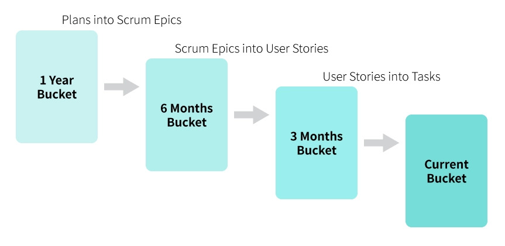
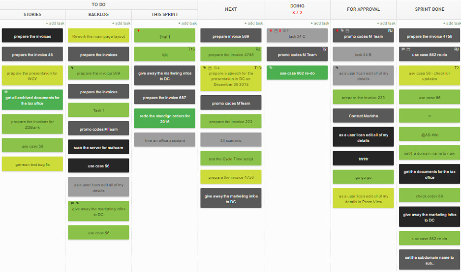

Scrumban ist ein aus [Scrum](SCRUM.md) und [Kanban](Kanban.md) gebildetes Kunstwort und beschreibt einen Methodenmix der beiden agilen Frameworks im Bereich der Softwareentwicklung und des [Projektmanagements](Projektmanagement.md)[^1]. Dafür werden verschiedene Aspekte beider Methoden angewandt, auf die ich hier anschließend näher eingehen werde.

# 1. Historie
Der Scrum Begiff wurde bereits in den 1990er Jahrewn von Jeff Sutherland und Ken Schwaber geprägt, wohingegen Kanban sich erst zehn Jahre später in der Softwareentwicklung etablierte. Man erkannte jedoch realtiv schnell dass Scrum von den Visualisierungstechniken aus Kanban stark profitieren kann.
Scrumban wurde entwickelt um das beste aus beiden agilen Frameworks zu kombinieren und Scrum-Teams neue Möglichkeiten zu eröffnen und Kanban Konzepte in ihre Arbeit mit einzubinden[^2]. Der Schwerpunkt liegt darin Scrum durch einige Ideen aus dem Kanban Framework vor allem flexibler und reaktiver zu gestalten[^3].

# 2. Methodik
Die Idee von Scrumban lässt den dem Anwender eine gewisse Freiheit in der Frage welche Methoden und Konzepte man aus beiden agilen Frameworks für sein Team verwenden möchte. Es ist flexibler als in Scrum, welches klare Aufgaben und Rollen für bestimmte Personen im Team festlegt, während bei Kanban jeder im Team seine ursprüngliche Arbeit einfach weiter macht. Im Folgenden werden die wichtigesten Ansätze aus den beiden Frameworks, welche für Scrumban essentiell sind, näher dargestellt.

## 2.1 Methoden aus Scrum
### 2.1.1 Meetings 
Die Meetingstruktur verhält sich sehr ähnlich zu der von Scrum. Empfohlen sind sogenannte Dailys, also kurze 15-minütige Treffen im Team, um sich über den aktuellen Bearbeitungsstand auszutauschen und möglichen Probleme oder Verzögerungen im Arbeitsablauf zu notieren[^4].
### 2.1.2 Sprints
Die Arbeit wird in einzelne Sprints aufgeteilt. Ein Sprint ist ein Arbeitsabschnitt, in dem ein Inkrement einer Produktfunktionalität implementiert wird[^4]. Die Länge eines Sprints wird jedoch nicht auf ein bis vier Wochen begrenzt, wie es bei Scrum der Fall ist, sodass die Erfüllungsphase so lange andauern kann, wie es für das gewünchte Endergebnis erforderlich ist[^1].
### 2.1.3 Langzeitorientierte Planung
Scrumban implementiert, im Gegensatz zu Scrum, langfristige Planungsmöglichkeiten durch das sogenannte "bucket-size-planning". Auf der folgenden Abbildung ist dieses Prinzip näher dargestellt. 

Man unterscheidet zwischen vier verschiedenen "buckets" mit jeweils unterschiedlichen Zielen und Inhalten:
* der 1 Year Bucket enthält grob definierte Ziele, welche ein Team innerhalb eines Jahres erreichen möchte.
* der 6 Months Bucket definiert Ziele die kurz vor der Umsetzung stehen.
* der 3 Months Bucket ist für Pläne die fast fertig sind vorbehalten.
* der Current Bucket beinhaltet alle Aufgaben die das Team als nächstes bearbeiten wird.[^3]
Bevor ein Arbeitselement im Current Bucket erscheint, und dadurch auf die Scrumban-Tafel kommt, muss es erst alle drei vorherigen Eimer durchlaufen.
## 2.2 Methoden aus Kanban
### 2.2.1 Scrumban Tafel
Ein wichtiger Aspekt mit dem Scrum verbessert werden kann ist die Visualisierung der Arbeitsmenge auf einer Scrumban Tafel oder auch Scrumban Board genannt. Das Scrumbanboard ist ähnlich zu einem [Kanban Board](Kanban_Boards.md), jedoch mit deutlich mehr Spalten. In der folgenden Abbildung ist ein Beispiel eines Scrumban Boards zu sehen.

Man erkennt auf der linken Seite die To Do's die in vorherigen Sprints noch nicht bearbeitet wurden, sowie Aufgaben die im aktuellen Sprint noch zu erledigen sind. Mittig sind die aktuellen Aufgaben zu finden, welche derzeit bearbeitet werden und welche im nächsten Sprint zu erledigen sind. Auf der rechten Seite des Boards sind die Pläne zu finden die noch genehmigt werden müssen sowie alles was im aktuellen Sprint schon erledigt worden ist.[^5]
### 2.2.2 WIP-Begrenzung
Eine weitere sehr wichtige Praktik aus Kanban ist die Limitierung des sogenannten "Work in Progress", also der laufenden Arbeit. Diese Praktik zielt auf die Reduzierung und dadurch auch Stabilisierung des Arbeitsvolumens ab. Es verbessert den Arbeitsfluss und ist für ein Pull-basiertes System von zentraler Bedeutung.[^6]
### 2.2.3 Pull-Prinzip
Das Pull Prinzip ist ein aus Kanban entnommenes Konzept wonach jedes Teammitglied sich seine Aufgaben selbst aus dem Sprint-Backlog ziehen darf. Dadurch wird keine Arbeit von außen zugeteilt, sondern das Team entscheidet selbst welche Aufgaben sie als nächstes bearbeiten wollen.[^5]
# 3. Fazit
Wie in den obigen Absätzen dargestellt verbindet Scrumban die beiden agilen Frameworks Scrum und Kanban zu einem neuen alleinstehenden Rahmenkonzept, dass deutlich dynamischer auf Veränderungen reagieren kann als dies bei Scrum alleine der Fall ist. Zusätzlich hilft die Visualisierung auf dem Scrumban Board bei der Arbeitsaufteilung und der Begrenzung des Arbeitsflusses.

# Siehe auch

* [Scrum](Scrum.md)
* [Kanban](Kanban.md)
* [Kanban Boards](Kanban_Boards.md)
* [Projektmanagement](Projektmanagement.md)
* [Daily Scrum](Daily_Scrum.md)

# Weiterführende Literatur

* [Scrumban-essays on kanban systems for lean software development](https://books.google.de/books?hl=de&lr=&id=SQFdAgAAQBAJ&oi=fnd&pg=PA7&dq=wip+limits+scrumban&ots=ca61YFYzSf&sig=lvA3ZpYKeCpF959zZPPAFbsO3vI&redir_esc=y#v=onepage&q=wip%20limits%20scrumban&f=false)
* [DevOps by Scrumban](https://link.springer.com/article/10.1365/s40702-017-0301-x)
* [The Scrum Guide 2017](https://scrumguides.org/docs/scrumguide/v2017/2017-Scrum-Guide-US.pdf)

# Quellen

[^1]: [Kanban Guide](https://kanbantool.com/de/kanban-guide)
[^2]: [Scrumban Wiki](https://en.wikipedia.org/wiki/Scrumban#Tooling)
[^3]: [Agile Ressourcen](https://teamhood.com/de/agile-ressourcen/was-ist-scrumban/)
[^4]: [Sprints Wiki](https://de.wikipedia.org/wiki/Scrum#Sprint)
[^5]: [Das beste aus Scrum und Kanban](https://www.agile-heroes.de/magazine/scrumban-das-beste-aus-scrum-und-kanban-einfach-erklaert/)
[^6]: [WIP-Limits](https://www.scrum.org/resources/blog/limiting-work-progress-wip-scrum-kanban-what-when-who-how)
