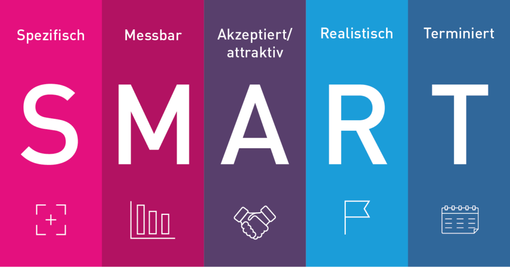

Die SMART-Methode und deren damit verbundenen Zielanforderungen werden im Projektmanagement oft genutzt, um Ziele einzelner Projekte besser definieren zu können. Der US-amerikanische Management Consultant und Ökonom Peter F. Ducker hat die einzelnen SMART-Merkmale erstmals formuliert. Das [Akronym](https://de.wiktionary.org/wiki/Akronym) S.M.A.R.T steht für spezifisch, messbar, attraktiv, realistisch und terminiert. Im Projektmanagement tragen SMARTe Ziele dazu bei, aus einem Ist-Zustand einen gewollten Soll-Zustand zu erzeugen und dabei nie den Fokus auf das Projekt zu verlieren.[^1][^2][^3][^5]

# S.M.A.R.T im klassischen Projektmanagement

Ein Ziel ist nur dann SMART, wenn es alle fünf Aspekte der SMART-Methode berücksichtigt. Da es zu Konflikten zwischen den einzelnen Kriterien kommen kann, ist es wichtig diese gegeneinander abzuwägen.[^1] 

*Die einzelnen SMART-Kriterien im Überblick*[^6]

## Spezifisch

Laut der SMART-Methode müssen Ziele stets spezifisch formuliert sein. Das heißt, um ein Projekt erfolgreich abschließen zu können, benötigt man unmissverständliche und detaillierte Angaben. Vage Beschreibungen und Vorgaben könnten für Verwirrung sorgen und die Erreichung der einzelnen Ziele somit gefährden. Wird ein Ziel spezifisch definiert, sollten folgende Fragen beantwortet werden:

* Welches Ziel wird verfolgt?
* Was soll in welchem Umfang erreicht werden?[^2][^4]

## Messbar

Die Erfolge innerhalb des Zielerreichungsprozesses sollten jederzeit messbar sein. Dabei kann anhand quantitativer und qualitativer Kriterien ermittelt werden, ob einzelne Etappen während des Prozesses erreicht wurden. Es soll jederzeit ein Vergleich zwischen dem derzeitigen Ist-Zustand und dem gewollten Soll-Zustand gemacht werden können. Wichtige Fragen bei diesem Schritt der Zieldefinition sind beispielsweise:

* Wie ist der derzeitige Stand?
* Welche Kriterien oder Meilensteine müssen definiert werden, um den Erfolg messen zu können?[^2][^4]

## Attraktiv

Ein Ziel sollte für alle involvierten Personen attraktiv gestaltet sein, um deren Motivation positiv und nicht negativ zu beeinflussen. Das persönliche Engagement der Verantwortlichen steigt an, wenn sie sich mit dem Ziel identifizieren können und dieses akzeptieren. Folgende Punkte sollten den Beteiligten vermittelt werden, um die Attraktivität des Ziels zu erhöhen:

* Gründe, die für die Zielerreichung sprechen?
* Welcher positive Nutzen resultiert aus der Zielerreichung?[^2][^4]

## Realistisch

Ziele sollten zwar herausfordernd, jedoch nicht utopisch sein. Ist ein Ziel schon bei erster Betrachtung zu kompliziert, oder aufgrund von fehlenden Kompetenzen und Ressourcen nicht umsetzbar, kann das schnell demotivierend wirken. Wichtig ist deshalb, dass das Ziel nach folgenden Kriterien ausgerichtet werden soll:

* Was ist aufgrund der vorhandenen Fähigkeiten und Ressourcen möglich?
* Müssen weitere Kompetenzen und Ressourcen mit einbezogen werden?
* Können Hindernisse auftreten, wenn ja, welche?[^2][^4]

## Terminiert

Der fünfte Punkt von SMARTen Zielen ist die Terminierung. Für ein Ziel sollte ein zeitlicher Rahmen mit vorgegebenem Fristende festgelegt werden. Zu einem bestimmten Zeitpunkt zu erreichende Meilensteine dienen zur Kontrolle und motivieren die Beteiligten. Bei der Planung von Zielen sollten deshalb folgende Punkte immer mit einbezogen werden:

* Bis zu welchem Zeitpunkt soll das Ziel erreicht werden?
* Wann werden die Meilensteine und deren Fälligkeiten sein?
* Wie viel Zeit muss für die Zielerreichung eingeplant werden?
* Gibt es Konsequenten bei nicht Einhaltung der Fristen, wenn ja, welche?[^2][^4]

# Ein Beispiel für ein SMARTes Ziel

| Falsch                                                  | Richtig       |
| -------------                                           | ------------- |
| „Ich möchte einen Beitrag über SMART-Ziele verfassen.“  | „Ich werde für eine gute Note innerhalb von zwei Wochen einen GitHub-Beitrag mit 500 Wörtern über              SMART-Ziele verfassen, indem ich jeden zweiten Tag daran arbeite.“  |[^1]

1. Spezifisch: Ich werde einen GitHub-Beitrag über SMART-Ziele verfassen.
2. Messbar: Ein Beitrag mit 500 Wörtern.
3. Attraktiv: Eine gute Note wird erzielt.
4. Realistisch: Der Zeitumfang wirkt herausfordernd, jedoch nicht unerreichbar.
5. Terminiert: Ich werde den Beitrag innerhalb von zwei Wochen schreiben, indem ich jeden zweiten Tag daran arbeite.

# Siehe auch

* [Zeitplanung](Zeitplanung.md)
* [Timeboxing](Timeboxing.md)
* [Projektplanung](Projektplanung.md)

# Weiterführende Literatur

* Hilmer S. und Krieg A. (2014): [Stanardisierung vs. Kultur: Klassisches und agiles Projektmanagement im Vergleich.](https://dl.gi.de/handle/20.500.12116/3061). In: Engstler, M., Hanser, E., Mikusz, M. & Herzwurm, G. (Hrsg.), Projektmanagement und Vorgehensmodelle 2014 - Soziale Aspekte und Standartisierung. Bonn: Gesellschaft für Informatik e.V.. (S. 47-57). 
* Drews G. und Hillebrand N. (2007): [Lexikon der Projektmanagement-Methoden](https://books.google.de/books?hl=de&lr=&id=1dJE3EYYpasC&oi=fnd&pg=PA6&dq=Projektmanagement+methoden&ots=8tbNjJVYTi&sig=f2JWMSfJpp2Lfyq78Jin1lhXwBk&redir_esc=y#v=onepage&q=Projektmanagement%20methoden&f=false). München: Rudolf Haufe Verlag GmbH & Co. KG.
* Eremit B. und Weber K. (2016): [Individuelle Persönlichkeitsentwicklung: Growing by Transformation](https://link.springer.com/chapter/10.1007/978-3-658-09453-9_16). Wiesbaden: Springer Fachmedien Wiesbaden. (Kapitel 16, S. 93-99)

# Quellen

[^1]: [SMART-Methode: Ziele richtig setzen und erreichen](https://karrierebibel.de/smart-methode/)
[^2]: [S.M.A.R.T.-Methode- Specific Measurable Accepted Realistic Timely](https://link.springer.com/content/pdf/10.1007%2F978-3-658-09453-9.pdf)
[^3]: [SMART-Ziele ein Überblick](https://projektmanagement-manufaktur.de/smart-ziele)
[^4]: [There´s a S.M.A.R.T way to write management´s goals and objectives](https://community.mis.temple.edu/mis0855002fall2015/files/2015/10/S.M.A.R.T-Way-Management-Review.pdf)
[^5]: [Die SMART-Methode: So setzen Sie SMART-Ziele](https://blog.hubspot.de/marketing/smart-ziele)
[^6]: [Abbildung SMART-Kriterien](https://blog.iconnewmedia.de/de/warum-sollte-ich-mir-nur-ziele-setzen-die-smart-sind/)
