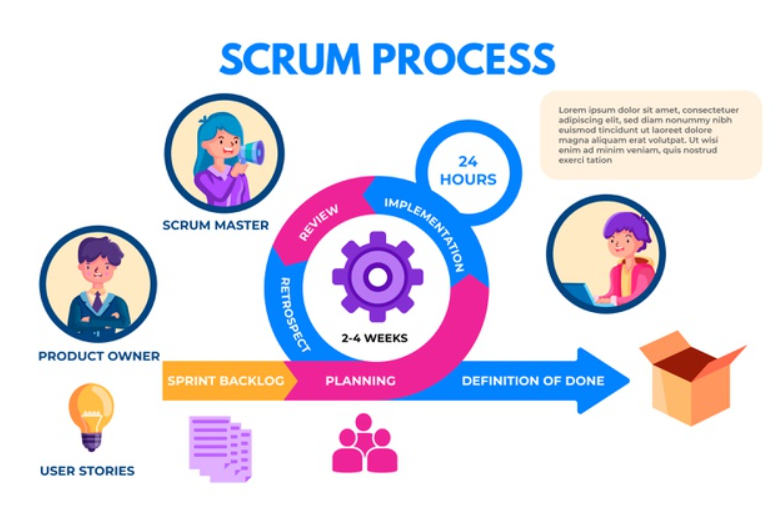

Um zu Beginn ein grobes Verständnis über den Scrum-Guide zu schaffen, soll zunächst eine Kurzbeschreibung folgen. Der Scrum_Guide ist ein Rahmenwerk für die Entwicklung, 
Bereitstellung und Aufrechterhaltung komplexer Produkte im Bereich der Softwareentwicklung.
Dieser Leitfaden enthält die Definition von Scrum, bestehend aus den Scrum-Rollen, Ereignissen, Artefakten und den Regeln, die sie miteinander verbinden. 
Ken Schwaber und Jeff Sutherland haben Scrum entwickelt. Der Scrum Guide wurde von ihnen geschrieben und bereitgestellt. Gemeinsam stehen sie hinter dem Scrum Guide[^1]. 

# Der Scrum-Guide

Die wichtige Bedeutung von Scrum im agilen Projektmanagement ist unumstritten, so fallen die beiden Begriffe Scrum und agiles Projektmanagement häufig im gleichen Kontext. 
Es ist also wenig überraschend, dass Scrum der beliebteste agile Ansatz im Projektmanagement ist[^2]. Bevor der konkrete Scrum_Guide beschrieben wird, soll ein allgemeiner 
Überblick über Scrum gegeben werden. Was also genau ist Scrum. 

Scrum ist ein Rahmenwerk, in dem Menschen komplexe, adaptive Probleme angehen und dabei produktiv und kreativ Produkte von größtmöglichem Wert liefern können.
Scrum hilft Menschen, Teams und Organisationen adaptive Lösungen für komplexe Probleme zu schaffen. Die Scrumgründer haben den Scrum Guide geschrieben, um Scrum klar und 
prägnant zu erklären. Dieser Leitfaden enthält die Definition von Scrum. Diese Definition besteht aus den Verantwortlichkeiten, Ereignissen, Artefakten und den Regeln, die Scrum 
miteinander verbinden[^3].

## Konkrete Inhalte des Scrum-Guides

Laut dem offiziellen Scrum_Guide aus dem Jahr 2020 enthält der Scrum_Guide folgende Inhalte:
*Scrum-Definition 

*	Scrum-Theorie

*	Scrum-Werte

*	Scrum Team

*	Scrum Events 

*	Scrum Artefakte 

*	Sprint Backlog

*	Increment

*	Schlussbemerkung [^4]

## Visualisierung des Scrum-Prozesses

  [^5]

*Visualisierung des Scrum-Prozesses*

# Aspekt 2

* das
* hier 
* ist
* eine 
* Punkteliste
  - mit unterpunkt

## Hier eine Ebene-2-Überschrift unter Aspekt 2

So kann man eine Tabelle erstellen:

| First Header  | Second Header |
| ------------- | ------------- |
| Content Cell  | Content Cell  |
| Content Cell  | Content Cell  |

## Hier gleich noch eine Ebene-2-Überschrift :-)

Wenn man hier noch ein bisschen untergliedern will kann man noch eine Ebene einfügen.

### Ebene-3-Überschrift

Vorsicht: nicht zu tief verschachteln. Faustregel: Wenn man mehr als 3 
Ebenen benötigt, dann passt meist was mit dem Aufbau nicht.

# Aspekt n

1. das
2. hier 
4. ist 
4. eine
7. nummerierte liste
   1. und hier eine Ebene tiefer

# Siehe auch

* Verlinkungen zu angrenzenden Themen
* [Link auf diese Seite](Scrum_Guide.md)

# Weiterführende Literatur

* Weiterfuehrende Literatur zum Thema z.B. Bücher, Webseiten, Blogs, Videos, Wissenschaftliche Literatur, ...

# Quellen

[^1]: [The Scrum Guide](https://scrumguides.org/docs/scrumguide/v2017/2017-Scrum-Guide-US.pdf)
[^2]: [Agiles Projektmanagement: Der ultimative Überblick](https://projekte-leicht-gemacht.de/projektmanagement/agiles-projektmanagement/)
[^3]: [What is Scrum](https://www.scrum.org/resources/what-is-scrum )
[^4]: [Der Scrum Guide](https://scrumguides.org/docs/scrumguide/v2020/2020-Scrum-Guide-German.pdf)
[^5]: [Bild](https://www.bing.com/images/search?view=detailV2&ccid=QfyEah%2b1&id=B7DECA9FBBB98F3723EEFC0B8DAFA331DE30B322&thid=OIP.QfyEah-1aXpqK7RSJJJ7qAHaE7&mediaurl=https%3a%2f%2fimage.freepik.com%2fvektoren-kostenlos%2fscrum-infografik_23-2148582396.jpg&cdnurl=https%3a%2f%2fth.bing.com%2fth%2fid%2fR.41fc846a1fb5697a6a2bb45224927ba8%3frik%3dIrMw3jGjr40L%252fA%26pid%3dImgRaw%26r%3d0&exph=417&expw=626&q=scrum+guide+grafik&simid=607988806035197205&FORM=IRPRST&ck=902968CA6FB2836A04D392B51E5415C9&selectedIndex=3&qpvt=scrum+guide+grafik&ajaxhist=0&ajaxserp=0)

