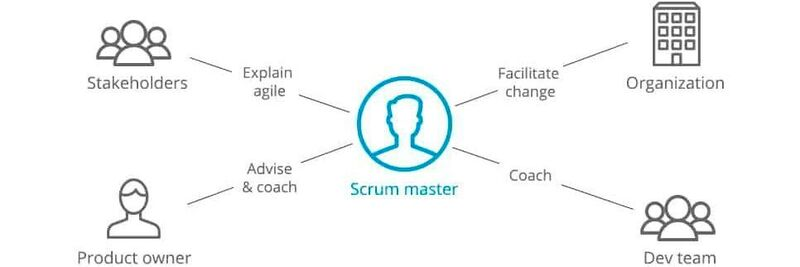

# 1.	Definition Scrum Master

"Der Scrum Master ist eine von drei [Rollen](Rollen_Scrum.md) die es in [Scrum](Scrum.md) gibt. Als Scrum Master trägt man die Verantwortung, dass das Scrum Team möglichst effektiv und ungestört arbeiten kann. Also die Person, die darauf achtet, dass die wenigen Scrum Regeln des [Scrum Guide](Scrum_Guide.md) reibungslos [...] funktionieren und dass alle Beteiligten die Scrum - Theorie, Praktiken, Regeln und Werte verstehen lernen."[^1]

# 2. Aufgaben des Scrum Masters

Allgemein ist der Scrum Master für die Umsetzung von Scrum verantwortlich. Seine Aufgaben sind dabei vielfältig. Er agiert als Moderator, Vermittler, Prozessbegleiter, Unterstützer und Coach. Er hilft Entwicklern und dem [Product Owner](Product_Owner.md) – den beiden anderen Verantwortlichkeiten, die Scrum als Framework definiert – dabei, Ziele gemeinsam zu erreichen, indem er seine Kollegen befähigt und die Zusammenarbeit fördert. Darüber hinaus wirkt er auch in Richtung der Organisation.[^2] Konkrete Aufgaben umfassen
*	Schutz des Scrum Teams vor unnötigen Einflüssen von außen
*	Moderation von Meetings ([Daily Scrum](Daily_Scrum.md))
*	Coachen des Entwicklungsteams in Selbstorganisation und funktionsübergreifender Teamarbeit
*	Beseitigung von Impediments und Flaschenhälsen
*	Unterstützung der Organisation bei der Einführung von Scrum
*	Arbeit an Organisationsveränderungen, die dem Team helfen, produktiver zu sein[^3]
*	Sicherstellen, dass alle im Scrum Team die Ziele richtig verstehen[^6]

 

Abbildung 1: Der Scrum Master ist ausschlaggebend für das Management des Teams und weitere Stakeholder im Unternehmen

# 3.	Profil eines guten Scrum Masters

Die [Prinzipien von Scrum](Scrum_Priciples.md) mit seinen Verantwortlichkeiten, Events und Artefakten zu kennen reicht nicht aus, um ein guter Scrum Master zu sein. Die breit gefächerten Aufgaben eines Scrum-Masters lassen bereits erahnen, welche Kompetenzen einen Scrum Master auszeichnen. Um  ein  Scrum  Team  und  sein  Environment  effektiv  unterstützen  zu  können,  werden  folgende Eigenschaften benötigt: 

*	Kommunikativ:
Er kommuniziert mit dem Team klar, offen und stets transparent. Er zögert nicht Probleme anzusprechen.[^4]
*	Motivierend:
"Ein guter Scrum Master sollte „unbequem sein, ohne unangenehm zu sein“". Das bedeutet er motiviert das Team zu immer besseren Leistungen und stellt wichtige Fragen, auch wenn das heißt, dass das Team die Komfortzone verlassen muss.[^4]
*	Teamfähig:
"Wie alle Mitglieder des Scrum Teams sollte der Scrum Master absolut team stark sein. Da er ständig mit verschiedenen Teams und Stakeholdern im Unternehmen in Kontakt ist und an den Schnittstellen arbeitet, ist die Teamfähigkeit eine der wichtigsten Eigenschaften des Scrum Masters. Denn er ist derjenige, der die mentale Infrastruktur für das agile Arbeiten im Unternehmen schafft."[^5]
*	Wissend: 
Natürlich hat der Scrum Master den Scrum Guide verinnerlicht. Wenn es innerhalb des Teams Fragen zu Scrum gibt, sollte der Scrum Master die Antwort darauf kennen und in der Lage sein weiterhelfen zu können.[^5]

# 4.	Kritik an der Bezeichnung

Die Bezeichnung „Master“ erfährt immer wieder Kritik. So impliziere „Master“ eine Hierarchie innerhalb einer Organisation. Diese Implikation ist jedoch irreführend, ein Scrum Master ist keine Führungskraft im herkömmlichen Sinne. Ein Scrum Master ist ein Master of Scrum. Er ist ein Experte in der Theorie und Praxis von Scrum. Durch seine Arbeit ist er ein Dienstleister für den Product Owner, die Entwickler und die gesamte Organisation. Der Scrum Master ist kein Projektleiter und besitzt weder Weisungsbefugnis oder Entscheidungsgewalt noch trägt er die Verantwortung für das gesamte Projekt. Er ist weder Untergebener noch Vorgesetzter, sondern agiert auf Augenhöhe mit seinen Kollegen.[^2] 

# Siehe auch

*	[Rollen](Rollen_Scrum.md)
*	[Scrum](Scrum.md)
* [Scrum Guide](Scrum_Guide.md)
*	[Product Owner](Product_Owner.md)
*	[Prinzipien von Scrum](Scrum_Priciples.md)

# Weiterführende Literatur

* [SCRUM MASTER 2.0 : Das nächste Level](https://www.hanser-elibrary.com/doi/book/10.3139/9783446468764)
* [Scrum: Schnelleinstieg](https://ebookcentral.proquest.com/lib/erlangen/detail.action?docID=5646208)
* [How to Kill the Scrum Monster : Quick Start to Agile Scrum Methodology and the Scrum Master Role](https://link.springer.com/book/10.1007%2F978-1-4842-3691-8)

# Quellen

[^1]: [scrum events](https://www.scrum-events.de/was-sind-die-aufgaben-des-scrum-masters.html)
[^2]: [t2 Informatik](https://t2informatik.de/wissen-kompakt/scrum-master/)
[^3]: [it agile](https://www.it-agile.de/agiles-wissen/scrum/was-macht-der-scrum-master-den-ganzen-tag/)
[^4]: [mint solutions](https://www.mint-solutions.de/mint-blog/agilitaet/scrum-master-umfrage-2/)
[^5]: [karrieretutor](https://blog.karrieretutor.de/gefragte-berufe/scrum-master/)
[^6]: [hays](https://www.hays.de/jobprofile/scrum-master)

[Abbildung 1]: [dev insider](https://www.dev-insider.de/5-gruende-warum-scrum-und-agile-scheitern-a-814640/)
