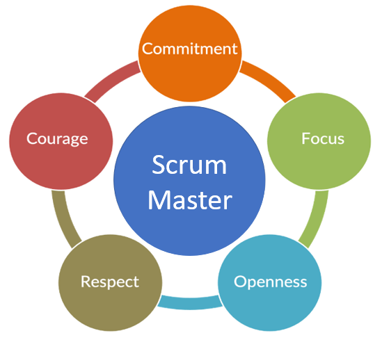

Scrum ist ein Rahmenwerk aus Regeln, Prinzipien und Werte. Die Scrum Werte stellen einen wichtigen Bestandteil der Scrum Methode dar, denn bei Scrum geht es um mehr als nur um Regeln und Prinzipien. Diese Werte wurden nicht explizit als Teil von Scrum erfunden, aber dennoch geben sie der Arbeit, dem Verhalten und den Handlungen in Scrum eine Richtung vor. Alle Aktivitäten, die innerhalb von Scrum durchgeführt werden, sollen diese Werte verstärken und nicht schmälern oder untergraben. Nur so können ihre Vorteile realisiert werden[^1]. Diese Werte werden nun genauer erläutert. 

# 5 Scrum Values

Das Konzept definiert 5 verschiedene Werte, die für den Erfolg von großer Bedeutung sind. Diese sind Commitment, Fokus (Focus), Offenheit (Openness), Respekt (Respect) und Mut (Courage).

 [^2]

## Commitment

Commitment im Kontext von Scrum bezeichnet die Hingabe, mit der eine Aufgabe erledigt wird und bezieht sich auf das Handeln und die Intensität des Einsatzes. Dabei geht es nicht um das Endergebnis, da dieses für komplexe Herausforderungen unter komplexen Umständen oft unsicher und unvorhersehbar ist. Unabhängig davon ist Commitment ein wichtiger Scrum-Wert, der das Verhalten der Akteure bestimmt.[^1]   

Nachfolgend ein paar Beispiele:

*	Engagement für Team und Zusammenarbeit
*	(Selbst-)Verpflichtung zur Qualität
*	(Selbst-)Verpflichtung zum Lernen
*	(Selbst-)Verpflichtung zu den agilen Werten und Prinzipien
*	Engagement für Sprint Goal

## Fokus

Unter dem Wert Fokus ist in erster Linie die Fokussierung auf die Erreichung des Sprint-Ziels gemeint. Um das Beste aus jedem Sprint herauszuholen, muss sich jedes Teammitglied auf die anstehende Aufgabe konzentrieren und darauf, wie diese sich auf das Sprint-Ziel auswirkt. Fokus vermeidet so die Verschwendung von Zeit und Kapazitäten, wodurch die Erreichung des Ziels erleichtert wird. Um den Teammitgliedern bei dieser Fokussierung auf ihre Tätigkeiten zu helfen, kann beispielsweise der sogenannte „[Scrum-Master](Scrum_Master.md)“ die Anzahl der Aufgaben oder Prioritäten, die jede Person während des Sprints zugewiesen bekommt, begrenzen[^3].

## Offenheit

Die Empirie von Scrum erfordert Transparenz, Offenheit und Ehrlichkeit. Der Erfolg agiler Arbeitsweisen basiert darauf, den gemeinsamen Arbeitsfortschritt transparent zu machen und regelmäßig aus den Ergebnissen zu lernen. Offenheit bedeutet, dass jedes Team-Mitglied seine Bedenken zu einem Vorgehen äußert oder eigene Schwierigkeiten offenlegt[^4].  

Die Akteure sind offen für:

*	die Zusammenarbeit über Disziplinen, Fähigkeiten und Berufsbilder hinweg
*	die Zusammenarbeit mit Interessensgruppen und dem weiteren Umfeld
*	den Austausch von Feedback und das Lernen voneinander
*	Veränderungen, da sich die Welt, in der sie tätig sind, unvorhersehbar, unerwartet und ständig verändert

Der [Scrum-Master](Scrum_Master.md) kann diese Offenheit durch die Transparenz gegenüber seinem Team fördern, denn ehrliches Feedback in den täglichen Scrum-Meetings führt zu einer höheren Ehrlichkeit und Offenheit aller Teammitglieder[^3]

## Respekt

Gegenseitiger Respekt ist die Grundlage für eine effektive Zusammenarbeit bei der agilen Arbeit in einem Team. Respekt in Form von Wertschätzung, Verständnis und Rücksichtnahme bilden in gewisser Hinsicht das Fundament für die anderen Werte[^4]. Keine einzelne Person ist dabei wertvoller als eine andere, sondern Respekt bedeutet in diesem Kontext, das Vertrauen in die anderen Teammitgliedern bei deren Erfüllung ihrer Aufgaben, das Anhören und die Berücksichtigung ihrer Ideen, sowie die Anerkennung ihrer Leistungen.

## Mut

Mut ist ein wichtiger Faktor bei der Bewältigung von komplexen Aufgaben in agilen Teams. Scrum-Teams benötigen Mut um gegenüber sich selbst und anderen Stakeholdern ehrlich, offen und transparent über den Projektfortschritt zu sein. Des Weiteren spielt dieser auch bei dem Ausprobieren neuer Techniken und Methoden, bei der Führung offener Dialoge und bei dem Tragen der Konsequenzen der eigenen Entscheidungen, eine wichtige Rolle[^3].

# Siehe auch

* [Scrum_Master](Scrum_Master.md)
* [Scrum_Principles](Scrum_Principles.md)
* [Scrum_Rules](Scrum_Rules.md)
* [Scrum_Transparenz](Scrum_Transparenz.md)
* [Scrum_Artefakte](Scrum_Artefakte.md)

# Weiterführende Literatur

* [The-5-Scrum-Values](https://www.visual-paradigm.com/scrum/the-5-scrum-values/)
* [Die fünf Werte im SCRUM-Framework](https://www.mitsm.de/wissen/scrum-wissen/scrum-values/)
* Holger Koschek: Geschichten vom Scrum: Von Sprints, Retrospektiven und agilen Werten. 2. Auflage (1. Auflage 2009). dpunkt.verlag, Heidelberg 2014

# Quellen

[^1]: [The Scrum Values](https://guntherverheyen.com/the-scrum-values/)
[^2]: [Bild](https://scrumorg-website-prod.s3.amazonaws.com/drupal/inline-images/SV4.png)
[^3]: [What are the 5 Scrum Values?](https://www.wrike.com/blog/scrum-values-guide/)
[^4]: [Agile Werte und Scrum](https://changemanagement.biz/2019/03/scrum-und-agile-werte-agile-arbeitsweise-auf-einem-stabilen-fundament/#fokus)

