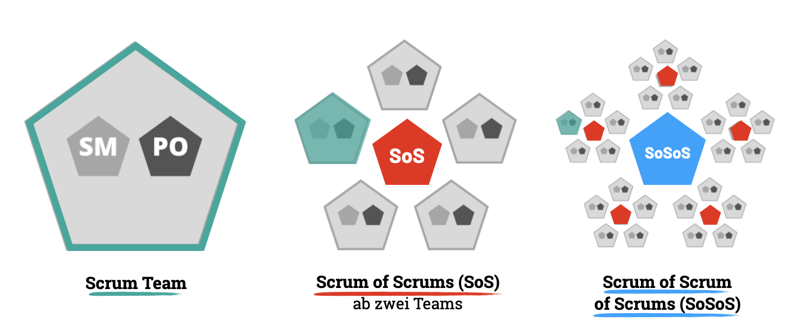
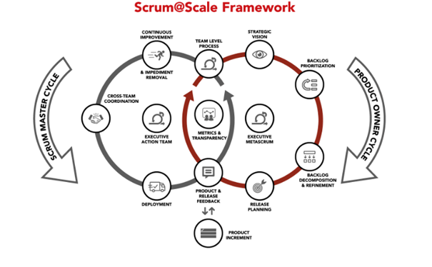

Scrum at Scale (oder Scrum@Scale) ist ein Framework zur Skalierung von Scrum. Es wurde von Jeff Sutherland im Jahr 2014 erfunden. Der Autor war einer der Schöpfer von Scrum und Unterzeichner des berühmten Agilen Manifests.
Scrum wurde ursprünglich entwickelt, um Teams bei der Bereitstellung von Produkten in einer komplexen Umgebung zu unterstützen. Scrum at Scale zielt darauf ab, mehreren Teams zu helfen, Produkte gemeinsam in derselben komplexen Umgebung zu liefern. Nach dem Scrum@Scale-Konzept ist jeder Teil eines austauschbaren Scrum-Teams. Je nach Zielsetzung schließen sich Netzwerke von Scrum-Teams zusammen, um ein Ökosystem zu bilden.[^1]

# Konzept

Scrum@Scale setzt über alle Organisationsebenen konsequent auf Scrum. Dabei ist das Framework durch folgenden einfachen Aufbau gekennzeichnet, mit einem Scrum of Scrums als zentralen Baustein. Damit kann man Scrum theoretisch beliebig über die folgenden Ebenen skalieren.[^2]
 *  Teams arbeiten regulär nach Scrum mit einem [Product Owner](Product_Owner.md) (PO), einem Scrum Master und einer optimalen Teamgröße bis zu 5 Entwickler.
 * Ab zwei Teams synchronisiert ein [Scrum of Scrums](Scrum_of_Scrums.md)
 (SoS) die Arbeit der angeschlossenen Scrum-Teams, optimale Größe eines SoS sind 4 bis 5 Teams.
*  Ein Scrum of Scrum of Scrums (SoSoS) synchronisiert die Arbeit mehrerer Scrum of Scrum (SoS). 
 

[Abbildung 1 zu Scrum@Scale](https://digitaleneuordnung.de/blog/scrum-at-scale/)

Somit entsteht ein pyramidenförmiger Organisationsaufbau, mit SoS als zentralem Konzept.
Scrum@Scale beruht auf den Grundlagen von Scrum und der Theorie zu komplexen adaptiven Systemen. Bei Scrum@Scale sind alle Teil eines austauschbaren Scrum-Teams.[^3] Je nach den vorgegebenen Zielen werden mehrere Scrum-Teamnetzwerke zu einem ganzen Ökosystem zusammengefasst. Scrum@Scale ist für die Skalierung von Scrum in Großunternehmen konzipiert.

 

[Abbildung 2 zu Scrum@Scale](https://www.palladio-consulting.de/scrum-at-scale/)

Das Framework lässt sich in zwei Zyklen darstellen.

# Die zwei Zyklen

Im Kern besteht Scrum at Scale aus zwei parallel verlaufenden Prozessen:

1. Einem **Product Owner Zyklus**, der das ‚Was‘ des Produktes definiert sowie
2. einem **Scrum Master Zyklus**, der das ‚Wie‘ der Entwicklungsarbeiten festlegt.

## Product Owner Zyklus
Konzentrieren wir uns zunächst auf das ‚Was‘. In jedem nach Scrum arbeitenden Entwicklungsteam verantwortet ein Product Owner ein Teil des Produkts. Die Product Owners von bis zu fünf Scrum Teams finden sich in einem Product Owner Team zusammen, ein sogenannter Chief Product Owner (CPO) fungiert als oberster Repräsentant. Gemeinsam arbeiten die Product Owner eine Produktvision & -roadmap sowie eine Definition of Done heraus. Zudem identifizieren Sie Abhängigkeiten und Redundanzen mit Hilfe eines gemeinsamen Product Backlogs. Übersteigt die Produktgröße 25 entwickelnde Teams, dann wird ein Executive MetaScrum (EMS) ins Leben gerufen. Diese oberste Instanz setzt die strategischen Prioritäten und Ziele für das Gesamtergebnis.[^4]

## Scrum Master Zyklus 
Kommen wir nun zum ‚Wie‘ Zyklus. Scrum at Scale sieht bis fünf Scrum Teams ein SoS Team vor. Ein Scrum-of-Scrums Master (SoSM) stellt dabei die Einhaltung von Scrum at Scale in allen Teams sicher. Sein Fokus liegt insbesondere auf organisatorischer, prozessualer und inhaltlicher Integration. Steigt Produktumfang und -komplexität weiter an, ist damit eine größere Entwicklungsmannschaft erforderlich, wächst Scaled at Agile weiter zum Scrum-of-Scrums-of-Scrums Ansatz. Das Limit liegt nun bei 25 synchronisierten Teams. Nun ist ebenfalls ein Execution Action Team (EAT) bestehend aus einem Product Owner und Scrum Master erforderlich. Ausgestattet mit einem politischen Mandat und ausreichendem Budget verantwortet und optimiert das EAT organisationsübergreifend die Ablaufqualität von Scrum auf Basis eines Organizational Transformation Backlogs.[^4]
# Zusammenfassung

Mit Hilfe von Scrum@Scale können Unternehmen und Organisationen im eigenen Tempo organisch wachsen und eine vielzahl von Teams, durch die skalenfreie Architektur des Konzeptes, koordinieren.
Die Konzepte des Frameworks sind gut dokumentiert und im Vergleich zu anderen Frameworks weniger präskriptiv. Daher kann Scrum at Scale im gesamten Unternehmen angewendet werden, wenn Scrum auf Teamebene effektiv eingesetzt wird.
Bei Anwendung von Scrum@Scale, sollte man sich vor der Skalierung auf Scrum-Praktiken konzentrieren und ein EAT einrichten, das befugt ist, Änderungen vorzunehmen und Hindernisse zu beseitigen. [^1]

# Siehe auch

* [Product Owner](Product_Owner.md)
* [Scrum of Scrums](Scrum_of_Scrums.md)

# Weiterführende Literatur
* [Agile Development at 
Scale: The Next FrontierTorgeir Din](https://ieeexplore.ieee.org/stamp/stamp.jsp?arnumber=8648272)
* [The Official Scrum@Scale Guide](https://www.scrumatscale.com/scrum-at-scale-guide/)

# Quellen

[^1]:[How to scale Scrum across a company with the help of Scrum@Scale](https://hygger.io/guides/agile/agile-at-scale/scrumscale/)
[^2]:[Scrum@Scale – Ein echtes “Scrum of Scrums” Framework](https://digitaleneuordnung.de/blog/scrum-at-scale/)
[^3]:[The Scrum@Scale Guide] (ttps://www.scruminc.com/wp-content/uploads/2014/07/Scrum-at-Scale-A-Modular-Approach.pdf)
[^4]:[Scrum At Scale – die wichtigsten Infos zum agilen Skalierungsansatz](https://www.palladio-consulting.de/scrum-at-scale/)