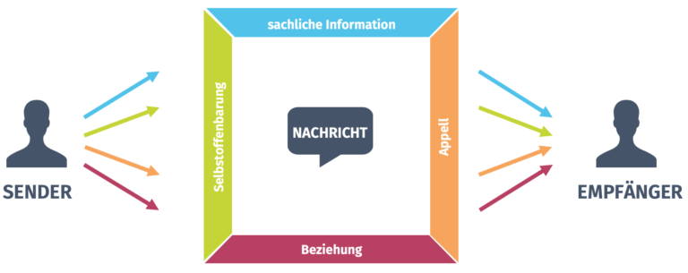

Selbstoffenbarung ist ein zentraler Aspekt des sogenannten Vier-Seiten-Modells und stellt sie als wesentlicher Teil der Kommunikation im Projekt einen erfolgskritischen Faktor für das Projektmanagement dar.

# Vier-Seiten-Modell

Das Vier-Seiten-Modell, postuliert von dem Kommunikationspsychologen Friedemann Schulz von Thun im Jahre 1981, beschreibt, dass jede Äußerung eines Senders vier Dimensionen beinhaltet [^1]. Diese vier Dimensionen enthalten je eine Ebene an Informationen, welche zusammen den gesamten Informationsgehalt einer Botschaft darstellen und das sogenannte Kommunikationsquadrat bilden [^1].

Das Kommunikationsquadrat ist eine bildliche Visualisierung der Theorie, nachdem jede Seite des Quadrats eine Dimension widerspiegelt [^1]. In der Abbildung sind die vier Dimensionen einer Nachricht sowie die Bezüge zu Sender und Empfänger dargestellt [^8].

## Ebenen des Vier-Seiten-Modell

### Sachebene

Mithilfe der Sachebene des Modells übermittelt der Sender die Daten und Fakten seiner Botschaft [^5]. Demnach geht es hierbei ausschließlich um die rein sachlichen Informationen, welche der Sender klar und verständlich vermitteln möchte [^2] [^4]. Wahrheit, Relevanz und Hinlänglichkeit bilden drei wesentliche Parameter eines jeden Sachinhalts [^2]. 

### Beziehungsebene 

Die Beziehungsebene gibt Auskunft darüber, wie der Sender der Nachricht zu dem Empfänger steht [^1]. Diese Hinweise über die Beziehung können implizit und explizit gestaltet sein und werden durch Formulierung, Tonfall, Mimik und Gestik vermittelt [^1]. Der Sender zeigt seine Einschätzung der Beziehung zwischen Sender und Empfänger, was die Form von Wertschätzung, Respekt, Wohlwollen, Gleichgültigkeit oder Verachtung annehmen kann [^2].

### Apell 

Durch den Appell soll eine Reaktion im Empfänger der Botschaft in Form einer Handlung provoziert werden [^4]. In dem Sinne unternimmt der Sender offen oder verdeckt den Versuch den Empfänger veranlassen, etwas zu tun oder zu unterlassen [^2]. Geschieht dies auf offene Weise entstehen Aufforderungen oder Bitten, währenddessen verdeckte Appelle als Manipulation bezeichnet werden [^2].

## Selbstoffenbarung

„Wenn jemand etwas von sich gibt, gibt er auch etwas von sich. Jede Äußerung enthält gewollt oder unfreiwillig eine Kostprobe der Persönlichkeit […]“ [^1]. Die Ebene der Selbstoffenbarung beinhaltet Informationen ausschließlich über den Sender der Botschaft [^3].

Die Offenbarung dieser Informationen kann zum Beispiel in Form einer gewollten und bewussten Selbstdarstellung („Ich-Botschaft“) oder unbeabsichtigter und unbewusster Selbstenthüllung erfolgen [^1] [^3]. Daher gibt die Selbstoffenbarung Auskunft über die Persönlichkeit und den Charakter des Senders, sowie über seine inneren Gedanken oder Gefühle [^2].

# Selbstoffenbarung im Projektmanagement

## Klassisch

Die effektive Kommunikation in einem Projekt stellt einen kritischen Erfolgsfaktor dar [^6]. Der tägliche Bedarf, die benötigten Informationen zu erhalten sowie anderen wichtige Informationen zu geben, macht Projekte überhaupt erst möglich [^6]. 

Eines der größtes Hindernisse für eine effektive Kommunikation ist die Unfähigkeit eines Teammitglied zur Selbstoffenbarung, bewusst oder unbewusst seiner inneren Gefühle und Gedanken über das Projekt zu teilen [^6]. „Anger, jealousy, resentment, fear, distrust, prejudice and insecurity are some of the common [inner] feelings that conspire to block the communications flow“ [^6]. „Wut, Eifersucht, Groll, Angst, Misstrauen, Vorurteile und Unsicherheit sind einige der häufigsten [inneren] Gefühle, die den Kommunikationsfluss blockieren“ [^6].

## Agil

Die richtige Kommunikation ist in Scrum ebenfalls besonders wichtig, um die notwendige Transparenz zu erreichen und die entscheidende Anpassung der Prozesse mithilfe der Feedback-Events, wie v.a. mit der Retrospektive, zu fördern[^7]. Die Selbstoffenbarung nimmt hierbei eine entscheidende Rolle ein [^7].

Jedes Mitglied des Scrum-Teams entscheidet selbst, welche inneren Gedanken, Gefühle und Eindrücke mit dem Team geteilt werden sollen, um Transparenz zu erreichen [^7]. Daher müssen sich die Mitglieder selbst Schwerpunkte zur persönlichen Verbesserung für eine bessere Selbstoffenbarung setzen, was allerdings eine konstruktive Umgebung ohne Hemmungen voraussetzt [^7].

# Siehe auch

* [Link auf diese Seite](Selbstoffenbarung.md)
*	[Projektkommunikation](Projektkommunikation.md)
*	[SCRUM](SCRUM.md)
*	[Retrospective](Retrospective.md)
*	[Scrum_Transparenz](Scrum_Transparenz.md)

# Weiterführende Literatur

Mehr zu Selbstoffenbarung und Kommunikation im Projektmanagement:
* [Kommunikation im Projektmanagement](https://link.springer.com/content/pdf/10.1007/978-3-658-13388-7.pdf)
* [Konflikte](https://link.springer.com/chapter/10.1007/978-3-642-21243-7_22)
* [Techniken für Klarheit und Verbindlichkeit](https://link.springer.com/chapter/10.1007/978-3-540-72051-5_11)
* [Soft Skills in Agilen Projekten](http://www.richtigcito.com/mediapool/86/862555/data/Agiles_Projektmanagement_-_Soft_Skills.pdf)

# Quellen

[^1]: [das Kommunikationsquadrat](https://www.schulz-von-thun.de/die-modelle/das-kommunikationsquadrat)

[^2]: [Vier-Seiten-Modell ](https://de.wikipedia.org/wiki/Vier-Seiten-Modell)

[^3]: [DAS VIER-SEITEN-MODELL](https://www.fhchp.de/wp-content/uploads/2018/11/friedemann-schulz-von-thun-1.pdf)

[^4]: [KOMMUNIKATION IM PROJEKT: DAS SOLLTEST DU WISSEN](https://www.projektmanagement-maschinenbau.de/kommunikation-im-projekt-das-solltest-du-wissen/)

[^5]: [Kommunikationsquadrat – Vier Seiten einer Botschaft](https://www.berufsstrategie.de/bewerbung-karriere-soft-skills/kommunikationsmodelle-kommunikationsquadrat.php)

[^6]: [Communications - the project manager's essential tool](https://www.pmi.org/learning/library/communication-essential-tool-3614)

[^7]: [So gelingt konstruktives Feedback im Team](https://www.cio.de/a/so-gelingt-konstruktives-feedback-im-team,3244848)

# Abbildungen

[^8]: [Kommunikationsquadrat ](https://intense-eu.info/courses/onlinekurs-transition-coaches-deutsch/lessons/the-4-sides-of-a-message-or-communication-square-copy-2/)