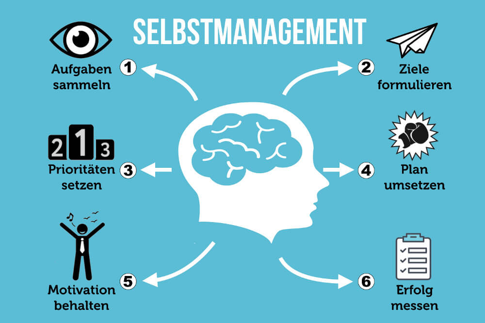

Self-management bezeichnet die Fähigkeit unabhängig von anderen und völlig selbstständig seinen Berufsalltag zu gestalten. Dies bedeutet, dass man seinen Arbeitsalltag selbstständig aufbaut, die Selbstgestaltung umfasst mehrere Punkte, wie z.B. die Planung. Organisation sowie die Motivation und Zielsetzung. 
Um es konkreter zu beschreiben, geht es darum, dass man lernt sich eine Übersicht zu schaffen und seine Aufgaben selbstständig einzuteilen und abzuarbeiten, sie zu priorisieren und organisieren zu können und dabei seine Motivation beizubehalten. 
Im Wesentlichen geht es darum effektiver Entscheidungen treffen zu können und den Prozess zu erleichtern. Vor allem Führungspositionen und Manager wenden diese Kompetenz an, als eine Methode um ihre Produktivität und Leistungsfähigkeiten dauerhaft zu verbessern.
Self-management wird gerne mit Zeitmanagement verwechselt, jedoch ist das Zeitmanagement lediglich eine Teil Kompetenz die in das Self-management mitwirkt. Self-management umfasst um einige mehr Kompetenzen, die benötigt werden, um es richtig umzusetzen.

# Inhaltsverzeichnis
* [Selfmanagement Methoden](#selfmanagement-methoden)  
* [Pomodoro Methode](#pomodoro-methode)  
* [Amore Methode](#amore-methode)  
* [80-20 Pareto-Prinzip](#80-20-pareto-prinzip)  
* [Eisenhower-Methode](#eisenhower-methode)  
* [SMART-Methode](#smart-methode)  
* [ALPEN-Methode](#alpen-methode)
    

# Selfmanagement Methoden

Self-management umfasst viele Methoden, die man anwenden kann, nur um dieses Thema anzuschneiden werden hier einige dieser Methoden aufgezählt.

## [Pomodoro Methode](Pomodoro.md)
Bei dieser Methode geht es darum Aufgaben in einem bestimmten Zeitraum zu erledigen und daraufhin immer wieder Pausen einzulegen. Dies hilft die Aufgaben in diesem Zeitraum so konzentriert wie möglich durchzuziehen.
## Amore Methode
Die einzelnen Buchstaben der Methode beschreiben die Formulierung der Ziele, die man sich setzt. Das A steht für ambitiös, was bedeutet, dass das Ziel ambitioniert sein sollte. Des Weiteren steht das M für motiviert, das O für Organisiert, das R für Realistisch und das E für echt. Im Allgemeinen basiert die Idee dieser Methode darauf, dass mit Liebe am Ziel gearbeitet werden sollte, wie der Name bereits vorwegnimmt. 
## 80-20 Pareto-Prinzip
Bei dieser Methode geht es darum, dass idealerweise 20 Prozent in das Projekt investiert wird und das Resultat einen 80-prozentigen Effekt hat. Diese Methode benötigt allerdings viel Zeit im Aufbauprozess.
## [Eisenhower-Methode](Eisenhower_Matrix.md)
Bei dieser Methode werden die Aufgaben aufgeteilt, wodurch einem der Priorisierungs-prozess erleichtert wird. Die Aufgaben werden wie folgt aufgeteilt: 
Wichtig/eilig, wichtig/nicht eilig, unwichtig/eilig, unwichtig/nicht eilig. 
Zu dieser Methode gibt es einige ähnliche Methoden wie z.B. die ABC-Methode, wo die Aufgaben jedoch nur in 3 Kategorien aufgeteilt werden (sehr wichtig, weniger wichtig und kaum wichtig).
## SMART-Methode
Hier geht es um die Organisation und Priorisierung der Ziele, die man sich vornimmt.
Wobei die Ziele in Kriterien eingeteilt werden und der Fokus liegt darin sie positiv zu formulieren. Die Kriterien sind wie folgt: Spezifisch, messbar, aktionsorientiert, realistisch und terminiert. 
## ALPEN-Methode 
Bei dieser Methode geht es darum sich einen Überblick zu schaffen, was erledigt werden muss und dies in eine Liste umzuformulieren und diese des weiteren zu priorisieren. Am Ende des Tages schafft man sich eine Übersicht was geschafft werden muss und die Aufgaben die übrig bleiben werden auf den nächsten Tag verschoben. 

# Fazit
Im Allgemeinen lässt sich sagen, dass man durch effektives Selbstmanagement strukturierter und effizienter arbeitet, man viele Kompetenzen dazu lernen kann, viel stress vermeidet werden kann und im Allgemeinen die work-life-balance um einiges verbessert wird. 
Jedoch bietet das Self-management nicht nur Vorteile für den Manager oder die Führungsperson, die diese Methoden anwendet, sondern auch für den Arbeitgeber der durch die entstehende Produktivität seine Vorteile ziehen kann, wie z.B. der daraus entstehende Profit. 

# Aspekt 1

Aspekte zu Themen können ganz unterschiedlich sein:

* Verschiedene Teile eines Themas 
* Historische Entwicklung
* Kritik 

*lustiges Testbild*

# Aspekt 2

* das
* hier 
* ist
* eine 
* Punkteliste
  - mit unterpunkt

## Hier eine Ebene-2-Überschrift unter Aspekt 2

So kann man eine Tabelle erstellen:

| First Header  | Second Header |
| ------------- | ------------- |
| Content Cell  | Content Cell  |
| Content Cell  | Content Cell  |

## Hier gleich noch eine Ebene-2-Überschrift :-)

Wenn man hier noch ein bisschen untergliedern will kann man noch eine Ebene einfügen.

### Ebene-3-Überschrift

Vorsicht: nicht zu tief verschachteln. Faustregel: Wenn man mehr als 3 
Ebenen benötigt, dann passt meist was mit dem Aufbau nicht.

# Aspekt n

1. das
2. hier 
4. ist 
4. eine
7. nummerierte liste
   1. und hier eine Ebene tiefer

# Siehe auch

* Verlinkungen zu angrenzenden Themen
* [Link auf diese Seite](Self_Management.md)

# Weiterführende Literatur

* Weiterfuehrende Literatur zum Thema z.B. Bücher, Webseiten, Blogs, Videos, Wissenschaftliche Literatur, ...

# Quellen

[^1]: [Selbstmanagement – Definition, Erklärung und Tipps (Frankfurter Allgemeine)](https://stellenmarkt.faz.net/karriere-lounge/selbstmanagement-definition-erklaerung-tipps/)
[^2]: [Selbstmanagement - Methoden und Definition (Karriere Bibel)](https://karrierebibel.de/selbstmanagement/)

