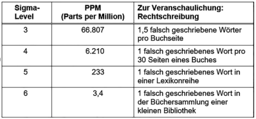

# Historie
Six Sigma wurde in den 1980-Jahren von Motorola entwickelt, einem US-amerikanischen Hersteller von Mobiltelefonen. Das Unternehmen geriet in große Schwierigkeiten, als japanische Unternehmen den Markt ebenfalls bedienten, jedoch zu geringeren Preisen. Motorola reagierte mit Maßnahmen zur Kostenreduzierung und erkannte, dass es einen Zusammenhang zwischen Qualität und Kosten gibt, wodurch Six Sigma entwickelt wurde.[^1]

# Definition

Six Sigma ist eine systematische und strukturierte Methode zur nachhaltigen Verbesserung von Prozessen, Abläufen und Produkten in allen Bereichen eines Unternehmens. Sie verfolgt dabei zwei Ziele gleichzeitig: Völlige Kundenzufriedenheit und maximalen Unternehmenserfolg.[^1]
Sigma σ ist das Kurzzeichen für die Standardabweichung. Sie beschreibt die Abweichung der Daten vom Mittelwert, das heißt, je größer die Standardabweichung, desto breiter sind die Werte eines Merkmals gestreut. Das sogenannte Sigma-Level hängt von der Anzahl an Standardabweichungen ab, die zwischen den Mittelwert einer Datenmenge und den festgelegten Spezifikationsgrenzen passt. Die Spezifikationsgrenzen schließen den Toleranzbereich ein, in dem ein Ergebnis als fehlerfrei angesehen wird. Wenn zwischen dem Mittelwert und den Spezifikationsgrenzen sechs Standardabweichungen passen, spricht man von einem Six-Sigma-Prozess.[^1]

[^1]

Ziele von Six-Sigma sind die Reduzierung von Fehlerkosten und die Verbesserung des Unternehmensergebnis. Die Ergebnisverbesserung korreliert mit sinkenden Fehlerkosten. Fehlerkosten sind beispielsweise Ausschuss, Nacharbeit und Garantieleistungen.[^1]

Die Sigma-Skala korreliert direkt mit den Fehlerkosten: Je höher der Sigma-Level, desto geringer die Fehlerkosten. Den Zusammenhang zwischen Qualität und Kosten kann man grafisch mit zwei Kurven visualisieren. Je besser die Qualität im Unternehmen, desto niedriger sind die Fehlerkosten. Jedoch muss, um eine hohe Qualität zu erreichen, etwas getan werden, zum Beispiel in Form von vorbeugenden Maßnahmen oder nachfolgenden Prüfungen. Damit ergibt sich eine gegenläufig ansteigende Kurve. Traditionell sucht ein Unternehmen nun den optimalen Punkt, den Kompromiss aus Fehlerkosten und Fehlervermeidung bzw. Fehlerentdeckung.[^1]

[^1]

Durch Six Sigma können Prozesse verbessert werden, sodass sich die Steigung der Kurve für die Kosten für Prüfung und Vorbeugung ändert. Prüfungen und Vorbeugung sind dann nicht mehr in dem ursprünglichen Maß notwendig. Die Kurve wird flacher, und der optimale Punkt rutscht in Richtung bessere Qualität bei geringeren Kosten.[^1]

# DMAIC

Ein Six-Sigma Projekt besteht aus fünf aufeinander aufbauenden Phasen: Define, Measure, Analyse, Improve und Control.[^1]

In der Define-Phase wird die Basis für den Projekterfolg geschaffen: Die Aufgabenstellung wird erfasst, die zuständigen Akteure werden bestimmt und der Projekt- und Terminplan wird fixiert. Am Ende dieser Phase ist die Ausgangssituation klar und eindeutig beschrieben und ein wichtiger Grundstein für das Projekt ist gelegt.[^1]

Im nächsten Schritt der sogenannten Measure-Phase wird der Ist-Zustand des Prozesses, der verbessert werden soll, erfasst. Durch die Modellierung werden bereits neue Kenntnisse über den Prozess gewonnen, wodurch schon einfache Verbesserungsmöglichkeiten offensichtlich werden. Am Ende dieser Phase muss der Zustand des Prozesses hinsichtlich seiner Fähigkeit und Fehlerkosten für alle Beteiligten transparent und verstanden sein und es müssen Daten für die Analyse vorliegen.[^1]

Nachdem die Einflussgrößen im Prozess erfasst wurden, werden in der Analyse-Phase die weniger wichtigen Inputs sukzessive rausgefiltert, bis nur noch die signifikanten Inputs übrigbleiben. Anschließend werden die kritischen Inputs als Problemverursacher identifiziert. Wenn man weiß, welche Inputs wirklich Einfluss auf das Prozessergebnis haben, kann man diese so verändern, dass sie zu einer Verbesserung des Prozesses führen.[^1]

Im Anschluss wird in der Improve-Phase zu jedem signifikanten Input aus den Ergebnissen der Analyse-Phase eine Maßnahme abgeleitet. Die erforderlichen Maßnahmen werden definiert, geplant, umgesetzt und am Ende wird deren Wirksamkeit nachgewiesen.[^1]

Nach Abschließen der Control-Phase wird schließlich sichergestellt, dass der Prozess dauerhaft verbessert bleibt und dass das erarbeitete Wissen weitergegeben wird.[^1]

[^1]: Melzer, A. (2019). Six Sigma - Kompakt und Praxisnah: Prozessverbesserung Effizient und Erfolgreich Implementieren (2. Aufl.)

