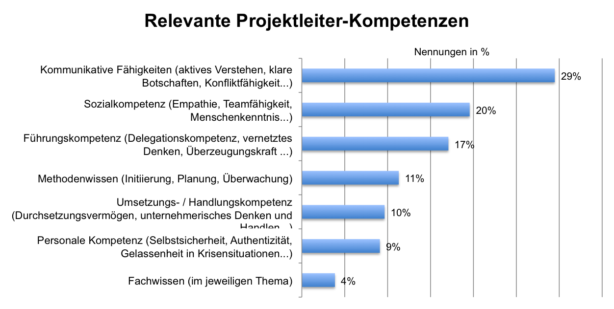

In einem Projekt sind viele Menschen beteiligt, die ein komplexes soziales Gefüge voller Unterschiede bilden. Dabei ist die soziale Kompetenz der beteiligten Personen, auch [Soft Skills](Softskills_im_Projektmanagement.md) genannt, von entscheidender Bedeutung. Abgesehen von den inhaltlichen und fachlichen Faktoren beeinflussen die menschlichen, also die „weichen Faktoren“, den Erfolg eines Projekts maßgeblich. Die Projektarbeit kann aber nur in einem Team erfolgen, welche als Projektteam zielgerichtet kreative Lösungsansätze für komplizierte Problemstellungen erarbeitet. Hierbei haben die verschiedenen Teammitglieder zugewiesene Rollen und Kompetenzen, die sie im Projekt ausüben. Im Folgenden werden die Projektrollen ausführlich erläutert.[^1][^2]

# Projektrollen

*	Projektauftraggeber: Er gilt als erfolgskritisch, da er Aufträge delegiert und der Vertragspartner des Projekts ist. Der Auftraggebende hat an Projektsitzungen teilzunehmen und muss strategische Entscheidungen treffen.
*	Projektleiter: Die Durchführung und Zielerreichung des Projekts muss er sicherstellen. Der Leiter übernimmt die Führung des Teams und muss methodische, fachliche sowie soziale Kompetenzen aufweisen. Der Projektverlauf muss ständig kontrolliert und das Controlling der Arbeit durchgeführt werden. Management von Stakeholdern, Ausübung und Limitation von Macht, Grenzziehung, Überprüfung bei der Einhaltung von sozialen Regeln und die Konfliktauflösung zählen zu weiteren Aufgabengebieten.
*	Projektmitglied: Muss das fachliche Know-How vorweisen. Selbstbewusstsein, Flexibilität und Durchsetzungsvermögen sind Voraussetzung. Aber auch die Mitglieder müssen sozial anpassungsfähig sein und gemeinsam eine Lösung finden.
*	Projektcoach: Der Coach berät das Team während der Planungsphase und hilft bei der Konfliktbewältigung innerhalb der Gruppe. Rahmenbedingungen für die Entwicklung werden vorgegeben, dennoch muss er den „roten Faden“ verfolgen und dessen Einhaltung überprüfen.[^1][^3]

## Projektleiter

Der Projektmanager nimmt eine herausragende Rolle ein und muss viele Kompetenzen aufweisen, um ein Team zu führen. Dabei gibt es eine unterschiedliche Gewichtung dieser, wie in dieser [Grafik](https://pm-blog.com/2010/07/01/was-muss-ein-projektleiter-konnen/) veranschaulicht wird.

Aus der Abbildung wird ersichtlich, dass für die befragten Teilnehmer kommunikative Fähigkeiten und soziale Kompetenz am wichtigsten sind, Führungskompetenz nicht unwichtig ist und das Fachwissen am unwichtigsten. Folgendermaßen dürfen die sozialen Aspekte nicht vernachlässigt werden und müssen bei der Projektleiterwahl entscheidend sein. Die soziale Kompetenz soll folgendermaßen näher betrachtet werden. 

# Soziale Kompetenz

Ein Projektleiter und die anderen Teilnehmer müssen sich an Regeln halten und eine gewisse soziale Kompetenz im Umgang mit dem Gegenüber aufweisen. Diese lässt sich in verschiedene Komponenten aufteilen, die bei der Kommunikation und Zielerreichung förderlich sind. Teamkompetenz, Empathie, Problemlösungsfähigkeit, Konfliktfähigkeit, Reflexionsfähigkeit, Kritikfähigkeit und Führungskompetenz stellen wichtige Grundlagen dar.[^4]

# Erfolgsfaktoren eines Projekts

Damit ein Projekt erfolgreich beendet werden kann, müssen einige Prinzipien eingehalten werden. Das gesamte Team muss am Ende abliefern, denn das Projekt sollte penibel strukturiert sein, klare Zielvorgaben für alle Projektteilnehmer haben, Verantwortung den entsprechenden Personen zuweisen, transparent mit dem Projektzustand umgehen, die Risiken frühzeitig erkennen, schnell auf Probleme und Störungen reagieren und detailliert bei der Projektanalyse vorgehen.[^1]

# Fazit und Folgen für das Unternehmen 

Daraus lassen sich Konsequenzen für das Unternehmen und die Projektleitung ableiten. Es soll vermehrt Wert auf soziale Aspekte in den andauernden Projekten gelegt werden. Andererseits müssen Projektleiter und zum Beispiel IT-Mitarbeiter soziale und kommunikative Fähigkeiten in Schulungen verbessern. Bei der Führungskompetenz der Projektleiter muss erheblich nachgebessert werden. Abschließend sollte mehr Unterstützung z. B. durch Projektcoaching zur Verfügung gestellt werden.[^2]

# Siehe auch

* [Soft Skills im Projektmanagement](Softskills_im_Projektmanagement.md)

# Weiterführende Literatur

* [Soziale Arbeit zwischen Wissenschaft und Profession](https://link.springer.com/content/pdf/10.1007%2F978-3-531-91741-2.pdf)

# Quellen

[^1]: [Soziale Arbeit](https://link.springer.com/content/pdf/10.1007%2F978-3-531-91741-2.pdf)
[^2]: [Soziale Kompetenz](https://www.grin.com/document/19189)
[^3]: [Handbuch Projektmanagement](https://link.springer.com/content/pdf/10.1007/978-3-662-57878-0.pdf)
[^4]: [Soziale Kompetenz – ein Muss für Projektleiter?](https://dieprojektmanager.com/soziale-kompetenz-ein-muss-fuer-projektleiter/)

