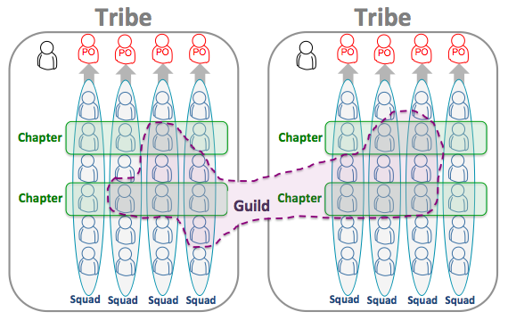

Das Unternehmen Spotify setzte noch zu Beginn das Scrum Projektmanagement um. Nachdem Spotify mit der Zeit größer wurde, passten nicht mehr alle Prinzipien und Regeln von Scrum zum Unternehmen und der Unternehmenskultur. Basierend auf Scrum bzw. aus Scrum heraus hat Spotify ein eigenes Projektmanagementmodell angefertigt[^1]. 
Das Spotify Modell besteht aus vier Hauptkomponenten: [Squads](#squads), [Tribes](#tribes), [Chaptern](#chapters) und [Guilds](#guilds)[^2].

[^2]

//Notes: Community > Struktur 

Hier ganz am Anfang keine Überschrift einfügen - das passiert automatisch basierend auf dem `title`-Attribut
oben im Front-Matter (Bereich zwischen den `---`).

# Bsp
 Hier ein Beispieltext mit ein paar Verlinkungen

 Hier wurde beispielhaft auf externe Seiten verlinkt. Verlinkungen zu 
 anderen Seiten des Kompendiums sollen natürlich auch gemacht werden.

 Literatur kann via Fußnoten angegeben werden[^1]. Es gibt auch das PMBOK[^2].
 Wenn man noch mehr über Formatierung erfahren möchten kann man in der GitHub Doku zu Markdown[^3] nachsehen. 
 Und wenn man es ganz genau wissen will gibt es noch mehr Doku[^4]. 

 Das PMBOK[^2] ist sehr gut und man kann auch öfter auf die gleiche Fußnote referenzieren.

 Omd [Dunnerwedder](https://de.wiktionary.org/wiki/Donnerwetter) badscherdnass a weng weng? 

# Squads

Die Squads sind mit Scrum Teams vergleichbar, sie bilden die Basis des Spotify Modells[^1]. In der Regel sind weniger als acht Leute in einem Squad enthalten[^2]. Squads sind crossfunktional tragen die "End-To-End" Verantwortung für ein Feature oder einen bestimmten Bereich. Diese Verantwortung erstreckt sich von der Idee, über die Ausarbeitung, den konzeptionellen Entwurf und der Entwicklung bis zum kommerziellen Erfolg. Die Squads haben volle Freiheit bei der Wahl und Ausübung ihrer Methoden[^3]. Aufgrund ihrer Autonomität gibt es keine Teamleiter in Squads, jedoch gibt es Product Owner, welche die Prioritäten für die Aufgaben, die von den Squads erledigt werden müssen, vorgibt. Zusätzlich haz jedes Squad einen Agile Coach, welcher hilft, potentielle Hindernisse zu erkennen, zu beseitigen und zu der Verbesserung der Arbeitsweisen beiträgt. Zusätzlich dazu organisiert er das "Sprint Planning Meeting" und die "Retrospektive"[^2]. 

# Tribes

Ein Tribe ist eine Gruppe von Squads, die am gleichen oder an miteinander verbundenen Produkten oder Dienstleistungen arbeiten. Dementsprechend kann die Größe eines Tribes variieren, jedoch ich die Maximalgröße eines Tribes 150 Personen[^2][^3].
Die Tribes haben einen oder mehrere "Tribe-Leads", welche die Aufgabe haben, für die Squads eine optimale Arbeitsumgebung zu schaffen[^2][^3]. Durch regelmäßge Tribe Meetings werden die Mitglieder eines Tribes über die Arbeit der anderen Squads auf dem Laufenden gehalten[^2].

# Chapters

Ein Chapter ist mit einer Abteilung aus einer "traditionellen Organisation" vergleichbar [^3]. Es ist eine Gruppe, bestehend aus Mitgliedern eines Tribes, welche alle über die gleichen Fachkompetnezen und Expertise verfügen. In Chaptern kommt es unter der Leitung einer Chapter-Führung zum regelmäßigen Austausch zwischen den Mitgliedern über beispielsweise neue themenbezogenen Erfahrungen, die sie gemacht, neues Wissen, das sie erlangt haben oder Herausforderungen, die es in ihrem Gebiete gibt[^2]. Ein Mitglied, das sein Squad wechselt, aber nicht seinen Tribe, bleibt im gleichen Chapter [^3].

# Guilds

Guilds sind Gruppen von Mitarbeitern, welche sich Fachwissen oder Interessen teilen. Anders als Chaperts sind sie unabhängig von Tribes, also können sie sich über das ganze Unternehmen erstrecken[^2]. Jeder kann einer Guild jederzeit beitreten und sie auch jederzeit verlassen. Die Teilnahme an einer Guild ist freiwillig[^3]. Guilds greifen in der Regel auf informelle Kommunikationsmethoden zurück[^1]. Regelmäßige Treffen der Guild werden vom "Guild Koordinator" organisiert. An diesen treffen sich alle Mitglieder einer Guild und tauschen sich zu den Themen der Guild aus[^2].

# Anwendungsmöglichkeiten in klassischen Unternehmen

# Aspekt 1

Aspekte zu Themen können ganz unterschiedlich sein:

* Verschiedene Teile eines Themas 
* Historische Entwicklung
* Kritik 

*lustiges Testbild*

# Aspekt 2

* das
* hier 
* ist
* eine 
* Punkteliste
  - mit unterpunkt

## Hier eine Ebene-2-Überschrift unter Aspekt 2

So kann man eine Tabelle erstellen:

| First Header  | Second Header |
| ------------- | ------------- |
| Content Cell  | Content Cell  |
| Content Cell  | Content Cell  |

## Hier gleich noch eine Ebene-2-Überschrift :-)

Wenn man hier noch ein bisschen untergliedern will kann man noch eine Ebene einfügen.

### Ebene-3-Überschrift

Vorsicht: nicht zu tief verschachteln. Faustregel: Wenn man mehr als 3 
Ebenen benötigt, dann passt meist was mit dem Aufbau nicht.

# Aspekt n

1. das
2. hier 
4. ist 
4. eine
7. nummerierte liste
   1. und hier eine Ebene tiefer

# Siehe auch

* Verlinkungen zu angrenzenden Themen
* [Link auf diese Seite](Spotify_Projectmanagement_Model.md)

# Weiterführende Literatur

* Weiterfuehrende Literatur zum Thema z.B. Bücher, Webseiten, Blogs, Videos, Wissenschaftliche Literatur, ...

# Quellen

[^1]: [Spotify Engineering Culture - Part 1](https://www.youtube.com/watch?v=Yvfz4HGtoPc)
[^2]: [Das Spotify Modell: Agile und Scrum für große Organisationen](https://agilescrumgroup.de/spotify-modell/)
[^3]: [Das Spotify Model als Blaupause für eine agile Organisation](https://digitaleneuordnung.de/blog/spotify-model/#squads)
[^4]: [WIE KANN MAN DAS SPOTIFY MODELL IN KLASSISCHEN UNTERNEHMEN UMSETZEN?](https://agile-unternehmen.de/spotify-modell-in-klassischen-unternehmen/)

