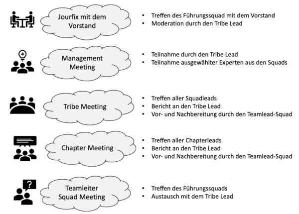

Das Unternehmen Spotify setzte noch zu Beginn das [SCRUM](SCRUM.md) Projektmanagement um. Nachdem Spotify mit der Zeit größer wurde, passten nicht mehr alle Prinzipien und Regeln von [[SCRUM](SCRUM.md) zum Unternehmen und der Unternehmenskultur. Basierend auf [SCRUM](SCRUM.md) bzw. aus [SCRUM](SCRUM.md) heraus hat Spotify ein eigenes Projektmanagementmodell angefertigt[^1]. 
Das Spotify Modell besteht aus vier Hauptkomponenten: [Squads](#squads), [Tribes](#tribes), [Chaptern](#chapters) und [Guilds](#guilds)[^2].

[^2]

# Squads

Die Squads sind mit [SCRUM](SCRUM.md)-Teams vergleichbar, sie bilden die Basis des Spotify Modells[^1]. In der Regel sind weniger als acht Leute in einem Squad enthalten[^2]. Squads sind crossfunktional tragen die "End-To-End" Verantwortung für ein Feature oder einen bestimmten Bereich. Diese Verantwortung erstreckt sich von der Idee, über die Ausarbeitung, den konzeptionellen Entwurf und der Entwicklung bis zum kommerziellen Erfolg. Die Squads haben volle Freiheit bei der Wahl und Ausübung ihrer Methoden[^3]. Aufgrund ihrer Autonomität gibt es keine Teamleiter in Squads, jedoch gibt es Product Owner, welche die Prioritäten für die Aufgaben, die von den Squads erledigt werden müssen, vorgibt. Zusätzlich haz jedes Squad einen Agile Coach, welcher hilft, potentielle Hindernisse zu erkennen, zu beseitigen und zu der Verbesserung der Arbeitsweisen beiträgt. Zusätzlich dazu organisiert er das "Sprint Planning Meeting" und die "Retrospektive"[^2]. 

# Tribes

Ein Tribe ist eine Gruppe von [Squads](#squads), die am gleichen oder an miteinander verbundenen Produkten oder Dienstleistungen arbeiten. Dementsprechend kann die Größe eines Tribes variieren, jedoch ich die Maximalgröße eines Tribes 150 Personen[^2][^3].
Die Tribes haben einen oder mehrere "Tribe-Leads", welche die Aufgabe haben, für die Squads eine optimale Arbeitsumgebung zu schaffen[^2][^3]. Durch regelmäßge Tribe Meetings werden die Mitglieder eines Tribes über die Arbeit der anderen Squads auf dem Laufenden gehalten[^2].

# Chapters

Ein Chapter ist mit einer Abteilung aus einer "traditionellen Organisation" vergleichbar [^3]. Es ist eine Gruppe, bestehend aus Mitgliedern eines [Tribes](#tribes), welche alle über die gleichen Fachkompetnezen und Expertise verfügen. In Chaptern kommt es unter der Leitung einer Chapter-Führung zum regelmäßigen Austausch zwischen den Mitgliedern über beispielsweise neue themenbezogenen Erfahrungen, die sie gemacht, neues Wissen, das sie erlangt haben oder Herausforderungen, die es in ihrem Gebiete gibt[^2]. Ein Mitglied, das sein [Squad](#squads) wechselt, aber nicht seinen [Tribe](#tribes), bleibt im gleichen Chapter [^3].

# Guilds

Guilds sind Gruppen von Mitarbeitern, welche sich Fachwissen oder Interessen teilen. Anders als [Chapters](#chapters) sind sie unabhängig von [Tribes](#tribes), also können sie sich über das ganze Unternehmen erstrecken[^2]. Jeder kann einer Guild jederzeit beitreten und sie auch jederzeit verlassen. Die Teilnahme an einer Guild ist freiwillig[^3]. Guilds greifen in der Regel auf informelle Kommunikationsmethoden zurück[^1]. Regelmäßige Treffen der Guild werden vom "Guild Koordinator" organisiert. An diesen treffen sich alle Mitglieder einer Guild und tauschen sich zu den Themen der Guild aus[^2].

# Umsetztung des Spotify Modells in klassischen Unternehmen

Obwohl das Spotify-Modell ein agiles Modell ist, kann man Teile davon in klassischen Unternehmen, welche bereits bzw. noch alte Strukturen haben, umsetzten. Klassische Abteilungen kann man aufteilen und aus ihnen [Squads](#squads) bilden, wo bei die Leitung ein [Squad](#squads) aus Führungskräften übernimmt. Jeder [Squad](#squads) wählt einen Repräsentanten des [Squads](#squads). [Chapters](#chapters) übernehmen die Aufgaben, u.a. Regeln und Normen für z.B. genutzte Technologien zu setzten und zu überwachen. Die [Squads](#squads) werden in passenden [Tribes](#tribes) zusammengefasst, [Guilds](#guilds) werden vorerst in keiner Form umgesetzt. Der Informationsfluss wird der neuen Struktur mit Meetings auf mehreren Ebenen angepasst [^4]. 
[^4]

Als Letztes muss das Controlling angepasst werden, um die Steuerbarkeit zu erhalten, dabei gibt es zwei Wege, die eingeschlagen werden können, das "Hard Controlling" mit betriebswirtschaftlichen Kennzahlen und das "Soft Controlling" [^4]. 

# Siehe auch

* Verlinkungen zu angrenzenden Themen
* [SCRUM](SCRUM.md)
* [Selbstorganisierende Teams](Selbstorganisierende_Teams.md)

# Weiterführende Literatur

* [WIE KANN MAN DAS SPOTIFY MODELL IN KLASSISCHEN UNTERNEHMEN UMSETZEN?](https://agile-unternehmen.de/spotify-modell-in-klassischen-unternehmen/)
* [Agile Transformation leicht gemacht: Was wir vom Spotify Modell lernen können und wie es sich von SAFe unterscheidet](https://www.affinis.de/fachartikel/projektmanagement/agile-transformation-leicht-gemacht-was-wir-vom-spotify-modell-lernen-koennen-und-wie-es-sich-von-safe-unterscheidet/)

# Quellen

[^1]: [Spotify Engineering Culture - Part 1](https://www.youtube.com/watch?v=Yvfz4HGtoPc)
[^2]: [Das Spotify Modell: Agile und Scrum für große Organisationen](https://agilescrumgroup.de/spotify-modell/)
[^3]: [Das Spotify Model als Blaupause für eine agile Organisation](https://digitaleneuordnung.de/blog/spotify-model/#squads)
[^4]: [WIE KANN MAN DAS SPOTIFY MODELL IN KLASSISCHEN UNTERNEHMEN UMSETZEN?](https://agile-unternehmen.de/spotify-modell-in-klassischen-unternehmen/)

