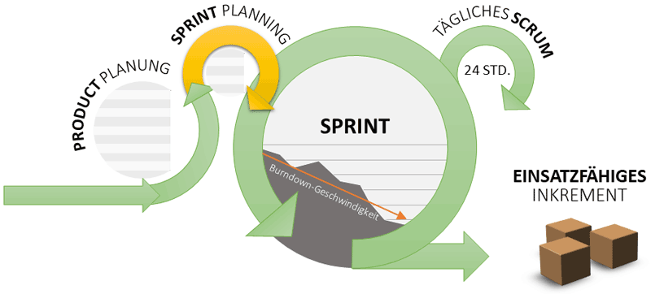

Sprint Planung (Von englischem Sprint Planing) ist einer von alle fünf "Events" des agilen Tools Scrum.

Hier ganz am Anfang keine Überschrift einfügen - das passiert automatisch basierend auf dem `title`-Attribut
oben im Front-Matter (Bereich zwischen den `---`).

# Sprint Planung

Spint-Planung[^1] ist das Sprint-Planungsmeeting. Es ist da, um zu definieren `was` zu machen ist und `wie` dies umgesetzt werden soll. Das Ziel von Sprint-Planungsmeeting ist von [Produk-Backlog](https://www.teamworkblog.de/2018/05/beispiel-fur-eine-partyplanung-mit-scrum.html) das [Sprin-Backlog](https://www.teamworkblog.de/2018/05/beispiel-fur-eine-partyplanung-mit-scrum.html) zu erstellen.

Sprint Planung ist ein "EVENT" in SCRUM.
Die andere Events sind Spint, Daily Scrum, Sprint Review, Retrospektive. Events sind ein zentralles strukturelles Element von Scrum. Event[^2] nach Scrum haben eine ganz spezielle Charakteristika[^2]. Sie müssen regelmäßig stattfinden. Es sorgt für den interaktiven Charakter von Scrum sicherzustellen. Für jedes Event nach Scrum ist ein fester Zeitraum vorgegeben. Zum Beispiel Daily Scrum ist jeden Tag 15 min[^3].

# Das Meeting
Das Event Sprint-Planing steht am Anfang eines Spints. Bei dem Sprint-Planungsmeeting ist das Entwicklerteam und der Product-Owner dabei. Beide zusammen planen den nächsten Sprint. Das Blick wird gerichtet auf den nächste 2 oder 3 Wochen (unterschiedlich um je nachdem wie lange der Sprint dauert). Die Sprint-Planing dient dazu die Anfordeung, die in Product-Backlog vorhanden sind, mit dem Team durchzusprechen und zwar die wichtigsten Requiraments und daraus das sogenanten Sprint-Backlog zu formen. Die Anforderung in den Sprint hineinzunehmen, die dann in diesem Sprint auch umgesetzt wird. Also das Ziel des Events ist aus dem Product-Backlog die wichtigsten Anforderungen in Sprint-Backlog zu überführen. Deswegen ist die Sprint-Planing in zwei getielt. 

## 1) WAS?
In dem Erstenteil spielt der Product-Owner eine sehr wichtige Rolle – hier wird besprochen und geklärt WAS an Anforderungen umgesetzt werden sollen, also das Fachliche hinter den Anforderungen möglich ist. Hier muss das Entwickler verstanden haben, um was es geht. Was die Anforderungen sind?; Was Fachlich hinter den Anforderungen steht. 

## 2) WIE?
Das Zweite Teil findet ohne Product-Owner statt, da das Team die Anforderungen diskutiert, die das Developerteam in dem Sprint abarbeiten möchte oder kann. Das Kriterium ist hier WIE? Also von dem User-Storys vom Product-Backlog bildet das Team die Tasks sogenanntes Sptint-Backlog, damit das Team weiß, was zu tun ist. Hier im Sprint-Backlog hänge die User-Storys und daneben der einzelne Task, die abzuarbeiten sind.

## 3) Definition of Done DoD
Im Sprint-Palning Event ist eine sehr wichtige Sache – Definition of Done DoD[^4]. Es bedeutet, dass der Product-Owner schließt einen Vertrag mit dem Entwicklerteam, wo drinsteht, welche Anforderung die User-Storys haben müssen, damit sie in den Sprint genommen werden. Das Team muss verstanden haben, um was es geht.

# Sprint-Planing erklärt anhand eins Beispiels.

Nehmen wir an, unser Kunde will eine statische [HTML-Webseite](https://stadtprofil-fuerth.de/#contact) für seine Portfolio bauen lassen. Der Product-Owner hat schon mit ihm abgestimmt, welche Anforderungen er hat. Im Product-Backlog stehen schon die auflistete User-Storys priosiert. Der PO wählt die wichtige für den nächst stehenden Sprint Anforderungen. Gegeben sei, dass das User-Story `Als Nutzer der Webseite will ich ein Kontakt-Formular, um Fragen die Firma zu stellen`.
Der PO trifft sich mit dem Entwicklerteam (Sprint-Planing). Er stellt die Wünsche des Kunden und die User-Story vor. Dann diskutiert das Developerteam unter sich, ob es möglich ist umzusetzen und wie es umzusetzen. Das Team entscheidet sich zuerst, um die Frontend sich zu kümmern. Von dem User-Story werden die Tasks gebildet und in Sprint-Backlog hineingenommen. 
Mögliche Aufgaben: 

* `<button>, <input>, <form> an Designvorgaben anpassen` 
* `Layout aufsetzen` 
* `Schriftart anbinden` 
* usw. 

Und so fängt der Sprint. 

# Quellen

[^1]: [Sprint Planing| Projektmagzin](https://www.projektmagazin.de/methoden/sprint-planning)
[^2]: [Die Events in SCRUM](https://www.agile-heroes.de/magazine/scrum-events/)
[^3]: [Timeboxing](https://projektmanagement-zentrum.ch/2019/03/04/scrum-events/)
[^4]: [Sprint-Planungsmeeting](https://projektmanagement-zentrum.ch/2019/03/04/scrum-events/)

