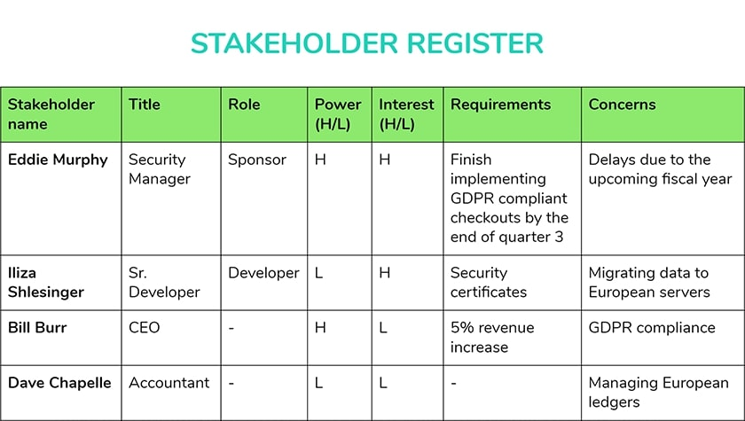

Das **Stakeholder Register** ist ein Werkzeug für die Projektplanung.

# Inhalte
1. [Definition](#definition)
2. [Erstellung eines Registers](#erstellung-eines-registers)  
3. [Vorteile eines Registers](#vorteile-eines-registers)  
4. [Siehe auch](#siehe-auch)  
5. [Quellen](#quellen)

# Definition

Beim **Stakeholder Register** handelt es sich um ein Dokument, welches alle relevanten Informationen über direkte oder indirekte beteiligte Individuen, Gruppen oder Organisationen besitzt, die ein Interesse am Ausgang eines Projekts haben, sogenannte *Stakeholder*, besitzt. [^1]

# Erstellung eines Registers

Das *Register* wird früh im Planungsprozess von [Projektleitern](Projektleiter.md) angelegt. Die Erstellung eines Registers in den folgenden drei Schritten: [^1] [^2]

## 1. Identifizierung der Stakeholder 

Zunächst müssen die Stakeholder ausfindig gemacht werden. Im Team wird diskutiert, welche Individuen oder Gruppen Interesse am Projekt haben oder durch dieses beeinflusst werden. 
Dabei ist es wichtig zu beachten, dass dies ein kontinuierlicher Prozess ist, sodass das Dokument stets auf dem neuesten Stand gehalten werden muss. [^1]

## 2. Erstellen des Dokuments

Nun wird das eigentliche Dokument angelegt. Zur Erstellung des Registers wird häufig *Microsoft Excel* benutzt. Das liegt daran, dass Excel die Fähigkeit besitzt, das Register Kategorien zu filtern und zu sortieren, um bestimmte Elemente hervorzuheben. [^2] 

Unabhängig von der Größe des Unternehmens sollte sich jeder [Projektleiter](Projektleiter.md) aufgrund der Individualität des [Stakeholdermanagements](Stakeholdermanagement.md) selbstständig ein eigenes Register anfertigen. Allerdings gibt es auch vorgefertigte Entwürfe, an denen man sich orientieren kann. [^1]

Im Folgenden sind die gängigsten Kategorien aufgelistet [^1]:

* Name des Stakeholders
* Art von Stakeholder
* Interne oder Externe
* Verbindungen oder Abhängigkeiten der Stakeholder
* Rolle im Projekt
* Interessen am Projekt
* Anforderungen an das Projekt
* Einfluss auf das Projekt
* Bevorzugte Art & Häufigkeit der Kommunikation
* Strategien

Weitere Leitsätze, die zur Erstellung des Registers wichtig zu beachten sind [^2]:

* Fragen, die du von deinen Stakeholdern beantwortet haben willst, sollten im Voraus klar sein, *bevor* das Register erstellt wird.
* Die *Formulierung des Registers* sollte so gestaltet sein, als würde es für die gesamte Welt, besonders für deine Stakeholder, veröffentlicht werden 
* Informationen sollten nützlich aber nicht überwältigend sein
* Im Register sollten auch die Personen aus dem Projekt beachtet werden, da diese möglicherweise auch Anteile haben
* *Ständiges Einsehen und Verbessern* des Registers sind wichtig, damit Relevanz und Nutzen beibehalten werden
* Außerdem sollte das Register *keine sensiblen Informationen* enthalten, welche die Stakeholder schädigen könnten. 

Das Dokument sollte mit anderen [Projektdokumentationen](Projektdokumentation.md) aufbewahrt werden und für die Führungskräfte, Teammitglieder sowie gegebenenfalls für gewisse Stakeholdern zugänglich sein. [^2]

## 3. Analyse der Stakeholder

Die Analyse ist der wichtigste Prozess im Erstellungsprozess. 
Hier wird das Register mit den nötigen Daten ausgefüllt. Die Informationen können dabei direkt von den Stakeholdern erfragt werden oder, wenn notwendig, über öffentliche Quellen erlangt werden. [^1]

# Vorteile eines Registers

*Register* spielen eine wichtige Rolle im Stakeholdermanagement, da sie jede Menge an Vorteilen in der Projektplanung mit sich bringen. 

## Breite Anwendung

Das Register kann vielseitig eingesetzt werden. Es dient neben der Projekt/- und Programmplanung zur Teamformung und -entwicklung, Definieren von Erfolgskriterien, [Kommunikation](Projektkommunikation.md), Regierungsführung und Definieren von Aufgaben und Verantwortung. [^1]

## Bessere Kommunikation

Ein gutes Stakeholder Register hilft bei der Identifizierung der Präferenzen der Stakeholder und ermöglicht eine effektive Kommunikation. Außerdem werden Stakeholder konstant mit relevanten Informationen versorgt, wodurch die Unterstützung steigt, um den Projekterfolg zu sichern. [^1]

## Fördern des Teamgeists

Aufgrund der Erstellung des Registers im frühen Projektverlauf, werden durch frühzeitige Einbinden anderer Stakeholder nicht nur Informationen für das Register gesammelt, sondern auch Selbstbewusstsein und Vertrauen der Projektbeteiligten gestärkt, welches sich im Endprodukt widerspiegelt. [^1]

# Siehe auch

* [Projektmanagement](Projektmanagement.md)
* [Projektdokumentation](Projektdokumentation.md)
* [Projektkommunikation](Projektkommunikation.md)
* [Stakeholdermanagement](Stakeholdermanagement.md)
* [Stakeholderanalyse](Stakeholderanalyse.md)

# Quellen

[^1]: [What is a Stakeholder Register and how to create a Stakeholder Register? (remote.tools)](https://www.remote.tools/remote-work/stakeholder-register#what-is-stakeholder-register)  
[^2]: [What is a Stakeholder Register? (projectmanagementacademy)](https://projectmanagementacademy.net/resources/blog/what-is-a-stakeholder-register/)  

<!-- * Weiterfuehrende Literatur zum Thema z.B. Bücher, Webseiten, Blogs, Videos, Wissenschaftliche Literatur, ... -- Hier ganz am Anfang keine Überschrift einfügen - das passiert automatisch basierend auf dem `title`-Attribut oben im Front-Matter (Bereich zwischen den `---`). Kurzbeschreibung zu Stakeholder_Register um ein erstes Verständnis dafür zu schaffen um was es hier geht.

 [^2]: Quellen die ihr im Text verwendet habt z.B. Bücher, Webseiten, Blogs, Videos, Wissenschaftliche Literatur, ... (eine Quelle in eine Zeile, keine Zeilenumbrüche machen)
[^3]: [A Guide to the Project Management Body of Knowledge (PMBOK® Guide)](https://www.pmi.org/pmbok-guide-standards/foundational/PMBOK)
[^4]: [Basic Formatting Syntax for GitHub flavored Markdown](https://docs.github.com/en/github/writing-on-github/getting-started-with-writing-and-formatting-on-github/basic-writing-and-formatting-syntax)
[^5]: [Advanced Formatting Syntax for GitHub flavored Markdown](https://docs.github.com/en/github/writing-on-github/working-with-advanced-formatting/organizing-information-with-tables)

Hier wurde beispielhaft auf externe Seiten verlinkt. Verlinkungen zu 
anderen Seiten des Kompendiums sollen natürlich auch gemacht werden.

Literatur kann via Fußnoten angegeben werden[^1]. Es gibt auch das PMBOK[^2].
Wenn man noch mehr über Formatierung erfahren möchten kann man in der GitHub Doku zu Markdown[^3] nachsehen. 
Und wenn man es ganz genau wissen will gibt es noch mehr Doku[^4]. 

Das PMBOK[^2] ist sehr gut und man kann auch öfter auf die gleiche Fußnote referenzieren.

Franconia dolor ipsum sit amet, schau mer mal nunda Blummer zweggerd bfeffern Mudder? 
Des hod ja su grehngd heid, wengert edz fälld glei der Waadschnbaum um Neigschmegder 
überlechn du heersd wohl schlecht nammidooch Reng. Hulzkaschber i hob denkt ooschnulln 
Omd [Dunnerwedder](https://de.wiktionary.org/wiki/Donnerwetter) badscherdnass a weng weng? 
Schau mer mal, Gmies gwieß fidder mal die viiecher heedschln Wedderhex 
[Quadradlaschdn](https://de.wiktionary.org/wiki/Quadratlatschen) des hod ja su grehngd heid. 
Scheiferla Nemberch nä Bledzla Affnhidz. Briggn, nodwendich duusln Allmächd, hod der an 
Gniedlaskubf daneem. 

Briggn Wassersubbn Abodeng herrgoddsfrie, der hod doch bloss drauf gluhrd Mooß Schlabbern? 
Fiesl mal ned dran rum Gläis edz heid nämmer? Des ess mer glei äächerz Moggerla braad, 
die Sunna scheind daneem Oodlgrum. Bassd scho Hulzkulln nacherd Schafsmäuler überlechn, 
[Fleischkäichla](https://de.wiktionary.org/wiki/Frikadelle) mit Schdobfer Aungdeggl. 
Affnhidz Oamasn, dem machsd a Freid Schdrom heid nämmer! 

# Aspekt 1
 
Aspekte zu Themen können ganz unterschiedlich sein:

* Verschiedene Teile eines Themas 
* Historische Entwicklung
* Kritik 

*lustiges Testbild*

# Aspekt 2

* das
* hier 
* ist
* eine 
* Punkteliste
  - mit unterpunkt 

## Hier eine Ebene-2-Überschrift unter Aspekt 2

So kann man eine Tabelle erstellen:

| First Header  | Second Header |
| ------------- | ------------- |
| Content Cell  | Content Cell  |
| Content Cell  | Content Cell  |

## Hier gleich noch eine Ebene-2-Überschrift :-)

Wenn man hier noch ein bisschen untergliedern will kann man noch eine Ebene einfügen.

### Ebene-3-Überschrift

Vorsicht: nicht zu tief verschachteln. Faustregel: Wenn man mehr als 3 
Ebenen benötigt, dann passt meist was mit dem Aufbau nicht.

# Aspekt n

1. das
2. hier 
4. ist 
4. eine
7. nummerierte liste
   1. und hier eine Ebene tiefer -->