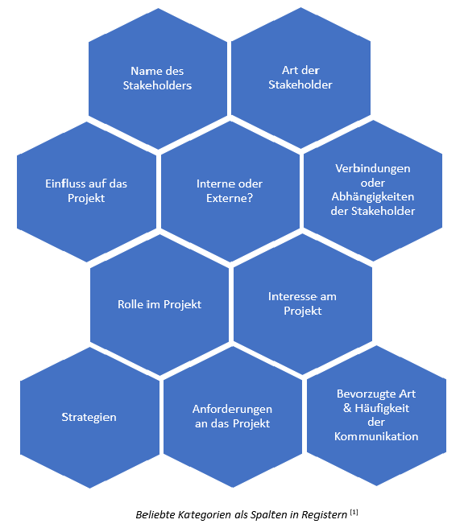

Das **Stakeholder Register** ist ein Werkzeug für die Projektplanung.

# Inhalte
* [Definition](#definition)
* [Erstellung eines Registers](#erstellung-eines-registers)  
  * [Identifizierung der Stakeholder](#identifizierung-der-stakeholder)
  * [Erstellen des Dokuments](#erstellen-des-dokuments)
  * [Analyse der Stakeholder](#analyse-der-stakeholder)
* [Vorteile eines Registers](#vorteile-eines-registers)  
* [Siehe auch](#siehe-auch)  
* [Quellen](#quellen)

# Definition

Beim **Stakeholder Register** handelt es sich um ein Dokument, welches alle relevanten Informationen über direkte oder indirekte beteiligte Individuen, Gruppen oder Organisationen, die ein Interesse am Ausgang eines [Projekts](Projekt.md) haben, sogenannte *Stakeholder*, besitzt. [^1]

# Erstellung eines Registers

Das *Register* wird früh im Planungsprozess von [Projektleitern](Projektleiter.md) angelegt. Die Erstellung eines Registers erfolgt in drei Schritten. [^1] [^2]

## Identifizierung der Stakeholder 

Zunächst müssen die Stakeholder ausfindig gemacht werden. Im Team diskutieren die [Projektmitarbeiter](Projektmitarbeiter.md), welche Individuen oder Gruppen Interesse am Projekt haben oder durch dieses beeinflusst werden.  
Dabei ist es wichtig zu beachten, dass dies ein kontinuierlicher Prozess ist, damit das Dokument stets auf dem neuesten Stand gehalten wird. [^1]

## Erstellen des Dokuments

Nun wird das eigentliche Dokument angelegt. Zur Erstellung des Registers wird häufig *Microsoft Excel* benutzt. In Excel kann das Register nach Kategorien gefiltert und sortiert werden, um bestimmte Elemente hervorzuheben. [^2] 

Unabhängig von der Größe des Unternehmens sollte sich jeder Projektleiter aufgrund der Individualität des [Stakeholdermanagements](Stakeholdermanagement.md) selbstständig ein eigenes Register anfertigen. Häufig unterscheiden sich die Kategorien der Tabelle, da sich der Fokus von Projekt zu Projekt unterscheidet.
Allerdings gibt es auch vorgefertigte Entwürfe, die als Orientierung oder Vorlage dienen können. [^1]

In folgender Abbildung sind die gängigsten Kategorien zu sehen:

<!-- * Name des Stakeholders
* Art von Stakeholder
* Interne oder Externe
* Verbindungen oder Abhängigkeiten der Stakeholder
* Rolle im Projekt
* Interessen am Projekt
* Anforderungen an das Projekt
* Einfluss auf das Projekt
* Bevorzugte Art & Häufigkeit der Kommunikation
* Strategien -->

Weitere Leitsätze, die bei der Erstellung des Registerszu beachten sind [^2] :

* Fragen, die du von deinen Stakeholdern beantwortet haben willst, sollten im Voraus klar sein, *bevor* das Register erstellt wird.
* Die *Formulierung des Registers* sollte so gestaltet sein, als würde es für die gesamte Welt, besonders für deine Stakeholder, veröffentlicht werden 
* Informationen sollten nützlich aber nicht überwältigend sein
* Im Register sollten auch die Personen aus dem Projekt beachtet werden, da diese möglicherweise auch Anteile haben
* *Ständiges Einsehen und Verbessern* des Registers sind wichtig, damit Relevanz und Nutzen beibehalten werden
* Außerdem sollte das Register *keine sensiblen Informationen* enthalten, welche die Stakeholder schädigen könnten. 

Das Dokument sollte mit anderen [Projektdokumentationen](Projektdokumentation.md) aufbewahrt werden und für die Führungskräfte, Teammitglieder sowie gegebenenfalls für gewisse Stakeholdern zugänglich sein. [^2]

 [^3]

## Analyse der Stakeholder

Die [*Stakeholderanalyse*](Stakeholderanalyse.md) ist der wichtigste Prozess im Erstellungsprozess. 
Hier wird das Register mit den nötigen Daten ausgefüllt. Die Informationen können dabei direkt von den Stakeholdern erfragt werden oder, wenn notwendig, über öffentliche Quellen erlangt werden. [^1]

# Vorteile eines Registers

Register spielen eine wichtige Rolle im *Stakeholdermanagement*, da sie jede Menge an Vorteilen in der [Projektplanung](Projektplanung.md) mit sich bringen. 

## Breite Anwendung

Das Register kann vielseitig eingesetzt werden. Es dient neben der Programm/- und Projektplanung zur Teamformung und -entwicklung sowie zum Definieren von Erfolgskriterien, [Projektkommunikation](Projektkommunikation.md), Regierungsführung und Definieren von Aufgaben und Verantwortung. [^1]

## Bessere Kommunikation

Ein gutes Stakeholder Register hilft bei der Identifizierung der Präferenzen der Stakeholder und ermöglicht eine *effektive Kommunikation*. Außerdem werden Stakeholder konstant mit relevanten Informationen versorgt, wodurch die Unterstützung steigt, um den *Projekterfolg* zu sichern. [^1]

## Fördern des Teamgeists

Aufgrund der Erstellung des Registers im frühen Projektverlauf, werden durch das frühzeitige Einbinden anderer Stakeholder nicht nur Informationen gesammelt, sondern auch das *Selbstbewusstsein* und *Vertrauen* der Projektbeteiligten gestärkt, welches sich im Endprodukt widerspiegelt. [^1]

# Siehe auch

* [Projektmanagement](Projektmanagement.md)
* [Projektdokumentation](Projektdokumentation.md)
* [Projektkommunikation](Projektkommunikation.md)
* [Stakeholdermanagement](Stakeholdermanagement.md)
* [Stakeholderanalyse](Stakeholderanalyse.md)

# Weiterführende Literatur

* [Snyder Dionisio, C. (2017). A Project Manager's Book of Forms: A Companion to the PMBOK Guide. Vereinigtes Königreich: Wiley.](https://www.google.de/books/edition/A_Project_Manager_s_Book_of_Forms/wa82DwAAQBAJ?hl=de&gbpv=1&dq=%22Stakeholder+register%22+-wikipedia&pg=PA12&printsec=frontcover)

# Quellen

[^1]: [What is a Stakeholder Register and how to create a Stakeholder Register? (remote.tools)](https://www.remote.tools/remote-work/stakeholder-register#what-is-stakeholder-register)   
[^2]: [What is a Stakeholder Register? (projectmanagementacademy)](https://projectmanagementacademy.net/resources/blog/what-is-a-stakeholder-register/)   
[^3]: [How to Create a Stakeholder Management Plan [+ Templates]](https://www.paymoapp.com/blog/stakeholder-management-plan/)