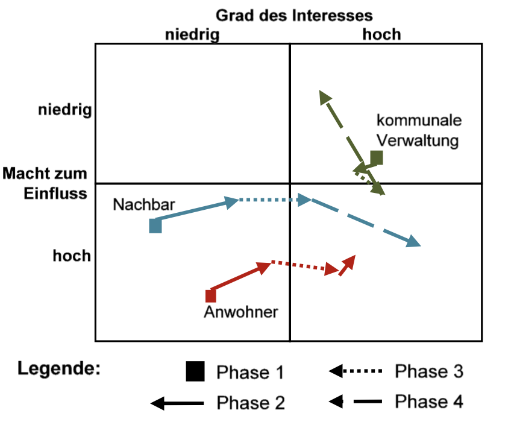

# Stakeholderanalyse

Eine Stakeholderanalyse hat das Ziel die Interessensgruppen eines [Projekts](Projekt.md) und deren Einfluss auf Entscheidungen zu identifizieren. Hierbei werden die Stakeholder zueinander in Beziehung gesetzt und kategorisiert. Somit können Sie durch Strategien gezielt gesteuert und in eine gewollte Richtung gelenkt werden.
Kurzbeschreibung zu Stakeholderanalyse um ein erstes Verständnis dafür zu schaffen um was es hier geht [^1][^2].

## Hintergrund

Der Begriff [Stakeholder](Stakeholder.md) beschreibt in diesem Sinne ein direktes Interesse an einem [Projekt](Projekt.md) von einzelnen Personen, Gruppen, Unternehmen oder Vereinigungen. Viele Stakeholder wollen bei den Verläufen von Projekten mitsprechen und so ihre Belange zu Ihrem Vorteil durchsetzen [^3].

[Stakeholder](Stakeholder.md) können in intern und extern gegliedert werden. Nachfolgend sind einige Beispiele von möglichen Stakeholdern aufgezählt [^4]:

* Konkurrenten
*	Umweltverbände
*	Medien
*	Anwohner
*	Mitarbeiter
* Politik
*	Gewerkschaften
*	Investoren
*	Kunden

Die Notwendigkeit eines [Stakeholdermanagements](Stakeholdermanagement.md) ist essenziell. Ein ungeplantes Einschreiten bzw. ein nicht erwartetes Handeln von [Stakeholdern](Stakeholder.md) kann Projekte in zeit- und kostentechnischer gefährden, wenn nicht sogar zum Scheitern bringen. Daher ist es das oberste Ziel des [Stakeholdermanagements](Stakeholdermanagement.md), die [Stakeholder](Stakeholder.md) einzuschätzen, zu kontrollieren und eine Akzeptanz für das Projekt zu schaffen. Aus diesem Grund ist eine umfangreiche Analyse der Interessensgruppen und deren Einstellungen zu gewissen Themen unabdingbar. Dies geschieht anhand einer [Stakeholderanalyse](Stakeholderanalyse.md) [^5]. 

## Anwendung

In einem ersten Schritt sind alle relevanten [Stakeholder](Stakeholder.md) des Projekts zu identifizieren. Hierbei sollten alle berücksichtigt werden, die in irgendeiner Art und Weise mit dem Projekt in Verbindung stehen. Hierbei kann bereits eine Kategorisierung in interne und externe [Stakeholder](Stakeholder.md) stattfinden sowie wichtige Schlüsselfunktionen der Personen oder Interessensgruppen notiert werden. Für die Identifikation der [Stakeholder](Stakeholder.md) existieren verschiedene Verfahren. Einige werden nachfolgend beispielhaft aufgelistet [^5]:

* Identifikation durch Experten/Delphimethode 
* Eigene Identifikation durch Stakeholder (Aufruf an Interessierte, sich zu melden) 
* Identifikation durch andere Stakeholder (Interviews und Diskussionen) 
* Identifikation durch Sekundärforschung und statistische Daten 
* Identifikation durch mündliche oder schriftliche Berichte über große Ereignisse 
* Identifikation durch Kreativitätstechniken wie Brainstorming 
* Identifikation durch SWOT-Analysen 

Anschließend muss die Einstellung der Stakeholder gegenüber dem Projekt bewertet werden. Hierbei wird beispielsweise zwischen positiv, neutral und negativ unterschieden. Die Interessen der Stakeholder lassen sich aus seinen Bedürfnissen ableiten und spiegeln sich in Hinsicht auf das Projekt als konkrete Erwartungen und Ziele wider [^5].

Ein nächster wichtiger Schritt ist die Bewertung der Relevanz der betroffenen Stakeholder.  In diesem Zusammenhang wird sich die Frage gestellt, wer wie wichtig für das betroffene Projekt ist. So kann ein Ranking erstellt werden, um die bedeutungsvollsten Interessensgruppen von dem Projekt zu überzeugen. Anschließend sollen diese mit passenden Strategien und Maßnahmen in das Projekt eingebunden werden. So wird sich die Unterstützung von diesen Parteien gesichert.

Es ist zu bedenken, dass sich die Meinung von Stakeholdern auch während eines Projekts ändern kann. Aus diesem Grund ist es auch im Rahmen des [Projektcontrollings](Projektcontrolling.md) essenziell, die Interessengruppen auf dem Laufenden zu halten und sich mit diesen abzustimmen, damit ein erfolgreicher [Projektabschluss](Projektabschluss.md) erfolgen kann [^4].

Ein Template für eine Stakeholderanalyse könnte beispielsweise folgendermaßen aussehen [^4]::

Ein zusätzlich oft genutztes Tool ist die Macht/Interesse-Matrx nach Johnson/Scholes (1999)[^5]:

Abschließend sollte es nach dem Abschluss des Projektes eine Kontrolle der Zielerreichung geben und wie zuverlässig die Stakeholderanalyse funktioniert hat. Somit kann für zukünftige Projekte aus den Erfahrungen gelernt werden.

# Quellen

[^1]: [www.controlling-wiki.de](https://www.controlling-wiki.com/de/index.php/Stakeholderanalyse)
[^2]: [wwww.betriebswirtschaft-lernen.net](https://www.betriebswirtschaft-lernen.net/erklaerung/stakeholderanalyse/)
[^3]: [www.projektmanagement-manufaktur.de](https://projektmanagement-manufaktur.de/stakeholderanalyse)
[^4]: [www.strategische-wettbewerbsbeobachtung.com](https://www.strategische-wettbewerbsbeobachtung.com/wiki/stakeholderanalyse/)
[^5]: [Krips D., 2017, Stakeholdermanagement, Springer Verlag](https://link.springer.com/book/10.1007/978-3-662-55634-4)
