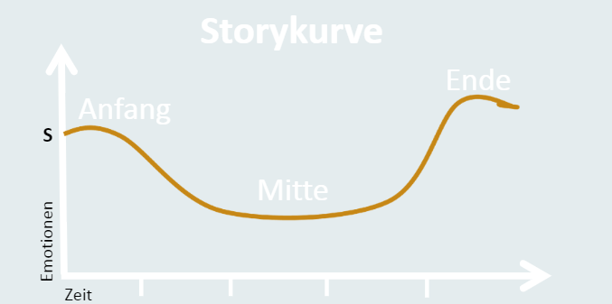

*"Es war einmal… der Mensch. Und mit ihm eine Geschichte. Storytelling, die Kunst des Erzählens, ist so alt wie die Menschheit. Geschichten haben eine einzigartige Kraft, richtig eingesetzt sorgen sie für starkes Projekt Management[^1]."*

# Storytelling

Storytelling ist eine weit verbreitete Erzählmethode der Rhetorik, welche in vielen verschiedenen Bereichen ihre Anwendung findet. Sei es die Religion, in der Psychotherapie oder als generelle Kunstform. Auch in Unternehmen findet das Storytelling ihren Nutzen, wobei es im Folgenden um das Storytelling im Projektmanagement gehen soll[^2].

## Was ist Storytelling im Projektmanagement?

Geschichten haben meist einen tieferen Sinn. Durch das Storytelling wird versucht dem Publikum etwas zu vermitteln:

* Weitergabe von Wissen
* Wiedergabe von Erfahrung 
* Übertragung von Lebensweisheiten
* Vermittlung von Werten und Normen

Dies kann man ebenfalls auf das Projektmanagement anwenden. Durch die Einführung der Kollegen und Mitarbeiter als Projektmanager kann man durch eine gut erzählte Geschichte mit Vermittlung von relevanten Projekt-bezogenen Inhalten, die Projektinvolvierten abholen und ihnen den Sinn und die Wichtigkeit des Projekts verdeutlichen. Dadurch kann man deren intrinsische Motivation steigern, was sowohl für die Mentalität der Mitarbeiter förderlich ist, als auch diese produktiver arbeiten lässt[^1]. 

## Praktische Anwendung

Zunächst ist es wichtig zu verstehen, dass es hier nicht um pure Fakten und Statistiken geht. Hierbei geht es darum die Mitarbeiter durch kreative und emotionale Geschichten zu begeistern und von dem Projekt zu überzeugen. Man muss ein Mittelmaß zwischen Fantasie und projektbezogenen Inhalten finden. Die Thematik muss dabei passend und nicht zu realitätsfern gewählt sein[^1]. Beispielsweise kann man bei der Entwicklung einer App, welche für mehr Barrierefreiheit sorgen soll, die Sichtweise betroffener Personen und deren Geschichten erzählen, um so das Engagement der Mitarbeiter zu steigern, da ihnen der Sinn hinter dem bevorstehenden Projekt klar ist.

  
## Der Aufbau einer passenden Geschichte

*Storytelling durch Erzählen zum Projekterfolg[^3]*

### Einführung / Kick-Off

Die Einführung ist einer der wichtigsten Momente im Projekt. Sie zeigt die Ziele, die Herangehensweise und den Weg auf. Hierbei können Geschichten wie oben bereits erwähnt, ein guter Anfang sein, um den tieferen Sinn des Projekts zu vermitteln. Da Projekte ein insgesamt einmaliges Vorhaben sind, welches geplant und strukturiert ist, kann man auch den gesamten Ablauf des Projekts als Geschichte erzählen und interessant verpacken. Durch ein spannendes Kick-Off, bei welchem man die Mitarbeiter als Protagonisten vorstellt, können Mitarbeiter sich mit neuen Kollegen verknüpfen und sind gespannt auf den Projektablauf[^1]. Hierbei erlernen die Mitarbeiter ihre zukünftigen Zuständigkeiten und Aufgaben von selbst, anstatt starrer Zuweisungen.

### Hauptteil / Projektprozess

Nun muss man den Kollegen den Projektprozess und die Projektdurchführung durch die Geschichte vermitteln. Hierbei kann man mögliche Probleme als Antagonisten darstellen. Neue Erfahrung und Wissen, welches die Mitarbeiter während dem Projekt erwerben, sollten kein Hindernis. Sie sollten eine Chance sein, die eigenen Fähigkeiten zu verbessern und den eigenen Horizont zu erweitern, was man dementsprechend in der Geschichte vermitteln sollte. Wie die Grafik aufzeigt, ist die Durchführung des Projekts im Vergleich zum Anfang und Ende, weniger spannend und monotone Aufgaben gehören ebenfalls dazu. Deshalb ist es wichtig, auch das den Menschen durch die Geschichte mitzuteilen, aber trotzdem immer das Ziel im Blick zu behalten.

### Projektabschluss

Abschließend kann man, fantasievoll verpackt, die konkreten Ziele erläutern, wo es Abweichung geben könnte und welche Probleme oder Aufgaben man in der Realität erfolgreich gelöst hat.

Nach dem tatsächlichen Projektabschluss kann man ebenfalls das Projekte durch eine Geschichte wiederholen und sowohl Kritikpunkte als auch positives hervorheben.

# Weiterführende Literatur

* [Storytelling - Geschichten für Projektmanager] (https://www.gohswriter.de/storytelling-geschichten-fuer-projektmanager/)

# Quellen

[^1]: [Storytelling im Projektmanagement](https://zistemo.de/blog/storytelling-im-projektmanagement/)
[^2]: [Storytelling: Definition, Aufbau, 10 Tipps + 3 Beispiele](https://karrierebibel.de/storytelling/)
[^3]: [Storytelling – durch Erzählen zum Projekterfolg](https://docplayer.org/31538949-Storytelling-durch-erzaehlen-zum-projekterfolg.html)
[^4]: [Storytelling (Methode)](https://de.wikipedia.org/wiki/Storytelling_(Methode))
