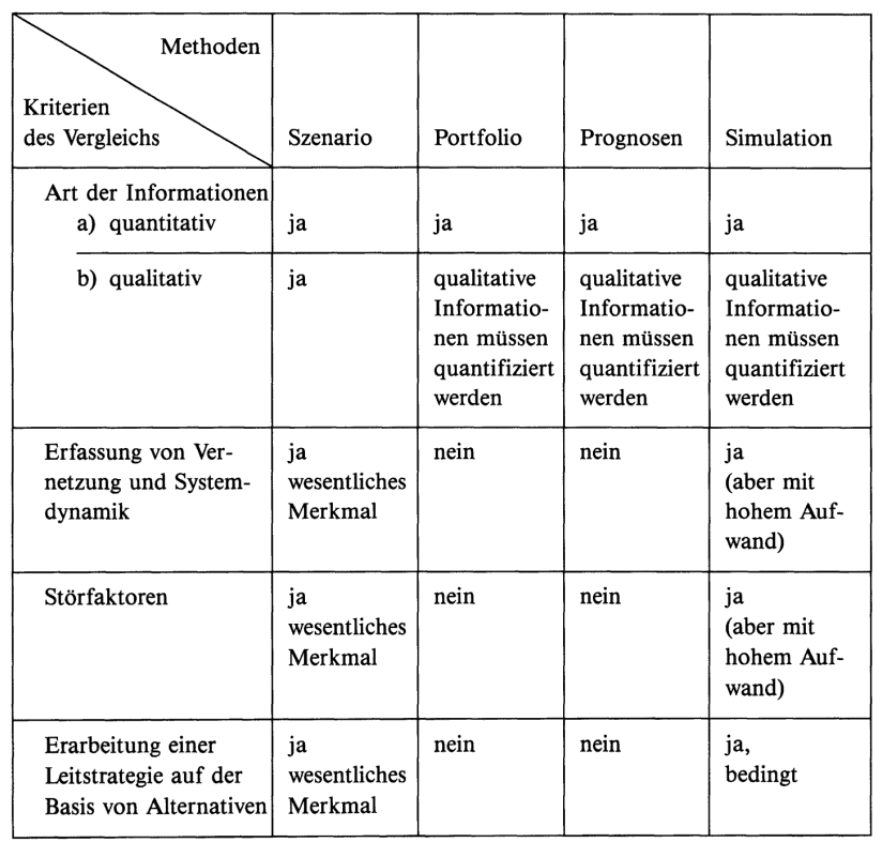

Ein Szenario ist eine "hypotetische Aufeinanderfolge von Ereignissen, die zur Beachtung kausaler Zusammenhänge konstruiert wird."[^1]
Die Szenariotechnik nutzt also realistische Prognosen, um mithilfe dieser Vorhersagen Entstehungsprozesse möglicher Probleme
oder auch Vorteile zu verstehen. Anhand dieses Verständnisses können die eigenen Aktionen geplant und angepasst werden um gesetzte Ziele 
zu erreichen.

## Vorgehen

Den Grundstein des Verfahrens bilden in der Regel ein positives Extrem-Szenario(Best Case), sowie ein negatives Extrem-Szenario(Worst Case).
Häufig zu sehen ist zum Beispiel auch das sogenannte Trend-Szenario, welches dasjenige Szenario ist, das als am wahrscheinlichsten erklärt wird.[^2]
Analysiert man diese möglichen Ergebnisse, sodass weitestgehend Erklärungen für die Entwicklung zu dem jeweiligen Endzustand gefunden wurden, 
lassen sich deutlich einfacher Entscheidungen treffen, die einen zwar nicht mit Garantie, jedoch mit größerer Wahrscheinlichkeit in Richtung
des Best-Case-Szenarios bringen.

## Herkunft und Anwendungsbereiche

Ihren Ursprung hat die Technik im militärischen Bereich[^3], heutzutage findet sie jedoch in zahlreichen Feldern Gebrauch. Dazu gehören Politik, 
Wissenschaft, Wirtschaft, aber auch in der Psychologie und Psychotherapie.[^2]

## Vergleich mit anderen Methoden

Abb.1[^3] Hier wird die Szenariotechnik anhand ausgewählter Kriterien mit ähnlichen Verfahren verglichen. Einen tieferen Einblick ins Portfoliomanagement
finden Sie im zugehörigen [Artikel](https://github.com/ManagingProjectsSuccessfully/ManagingProjectsSuccessfully.github.io/blob/main/kb/Projektportfoliomanagement.md).

Kurzbeschreibung zu Szenario_Technik um ein erstes Verständnis dafür zu schaffen um was es hier geht.

Hier ganz am Anfang keine Überschrift einfügen - das passiert automatisch basierend auf dem `title`-Attribut
oben im Front-Matter (Bereich zwischen den `---`).

# Hier ein Beispieltext mit ein paar Verlinkungen

Hier wurde beispielhaft auf externe Seiten verlinkt. Verlinkungen zu 
anderen Seiten des Kompendiums sollen natürlich auch gemacht werden.

Literatur kann via Fußnoten angegeben werden[^1]. Es gibt auch das PMBOK[^2].
Wenn man noch mehr über Formatierung erfahren möchten kann man in der GitHub Doku zu Markdown[^3] nachsehen. 
Und wenn man es ganz genau wissen will gibt es noch mehr Doku[^4]. 

Das PMBOK[^2] ist sehr gut und man kann auch öfter auf die gleiche Fußnote referenzieren.

Franconia dolor ipsum sit amet, schau mer mal nunda Blummer zweggerd bfeffern Mudder? 
Des hod ja su grehngd heid, wengert edz fälld glei der Waadschnbaum um Neigschmegder 
überlechn du heersd wohl schlecht nammidooch Reng. Hulzkaschber i hob denkt ooschnulln 
Omd [Dunnerwedder](https://de.wiktionary.org/wiki/Donnerwetter) badscherdnass a weng weng? 
Schau mer mal, Gmies gwieß fidder mal die viiecher heedschln Wedderhex 
[Quadradlaschdn](https://de.wiktionary.org/wiki/Quadratlatschen) des hod ja su grehngd heid. 
Scheiferla Nemberch nä Bledzla Affnhidz. Briggn, nodwendich duusln Allmächd, hod der an 
Gniedlaskubf daneem. 

Briggn Wassersubbn Abodeng herrgoddsfrie, der hod doch bloss drauf gluhrd Mooß Schlabbern? 
Fiesl mal ned dran rum Gläis edz heid nämmer? Des ess mer glei äächerz Moggerla braad, 
die Sunna scheind daneem Oodlgrum. Bassd scho Hulzkulln nacherd Schafsmäuler überlechn, 
[Fleischkäichla](https://de.wiktionary.org/wiki/Frikadelle) mit Schdobfer Aungdeggl. 
Affnhidz Oamasn, dem machsd a Freid Schdrom heid nämmer! 

# Aspekt 1

Aspekte zu Themen können ganz unterschiedlich sein:

* Verschiedene Teile eines Themas 
* Historische Entwicklung
* Kritik 

*lustiges Testbild*

# Aspekt 2

* das
* hier 
* ist
* eine 
* Punkteliste
  - mit unterpunkt

## Hier eine Ebene-2-Überschrift unter Aspekt 2

So kann man eine Tabelle erstellen:

| First Header  | Second Header |
| ------------- | ------------- |
| Content Cell  | Content Cell  |
| Content Cell  | Content Cell  |

## Hier gleich noch eine Ebene-2-Überschrift :-)

Wenn man hier noch ein bisschen untergliedern will kann man noch eine Ebene einfügen.

### Ebene-3-Überschrift

Vorsicht: nicht zu tief verschachteln. Faustregel: Wenn man mehr als 3 
Ebenen benötigt, dann passt meist was mit dem Aufbau nicht.

# Aspekt n

1. das
2. hier 
4. ist 
4. eine
7. nummerierte liste
   1. und hier eine Ebene tiefer

# Siehe auch

* Verlinkungen zu angrenzenden Themen
* [Link auf diese Seite](Szenario_Technik.md)

# Weiterführende Literatur

* Weiterfuehrende Literatur zum Thema z.B. Bücher, Webseiten, Blogs, Videos, Wissenschaftliche Literatur, ...

# Quellen

[^1]: https://www.duden.de/rechtschreibung/Szenario#bedeutungen
[^2]: https://de.wikipedia.org/wiki/Szenariotechnik
[^3]: https://books.google.de/books?hl=en&lr=&id=IwXyBgAAQBAJ&oi=fnd&pg=PA255&dq=Szenario+technik&ots=n8xhd-v6GO&sig=ZBDkIuKaDVY-umf8WjX9ALC1DnE&redir_esc=y#v=onepage&q=Szenario%20technik&f=false
[Basic Formatting Syntax for GitHub flavored Markdown](https://docs.github.com/en/github/writing-on-github/getting-started-with-writing-and-formatting-on-github/basic-writing-and-formatting-syntax)
[^4]: [Advanced Formatting Syntax for GitHub flavored Markdown](https://docs.github.com/en/github/writing-on-github/working-with-advanced-formatting/organizing-information-with-tables)

