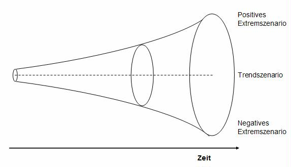
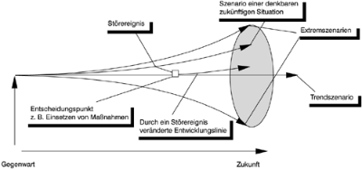

Ein Szenario ist eine "hypothetische Aufeinanderfolge von Ereignissen, die zur Beachtung kausaler Zusammenhänge konstruiert wird."[^1]
Die Szenariotechnik nutzt also realistische Prognosen, um mithilfe dieser Vorhersagen Entstehungsprozesse möglicher Probleme
oder auch Vorteile zu verstehen. Anhand dieses Verständnisses können die eigenen Aktionen geplant und angepasst werden um gesetzte Ziele 
zu erreichen.

## Vorgehen

Den Grundstein des Verfahrens bildet in der Regel die Erarbetung eines positiven Extrem-Szenarios (Best Case), sowie eines negativen Extrem-Szenarios (Worst Case).
Häufig zu sehen ist auch das sogenannte Trend-Szenario, welches dasjenige Szenario ist, das unter unveränderten Umwelteinflüssen und ohne Störereignisse entstehen würde.[^2]
Analysiert man diese möglichen Ergebnisse, sodass weitestgehend Erklärungen für die Entwicklung zu dem jeweiligen Endzustand gefunden wurden, 
lassen sich deutlich einfacher Entscheidungen treffen, die einen mit größerer Wahrscheinlichkeit in Richtung
des Best-Case-Szenarios bringen.

Abb.1[^5]: Der Szenariotrichter ist eine Visualisierung des Prozesses und zeigt die wachsende Diskrepanz zwischen den beden Extremszenarien und den 
Verlauf des Trendszenarios, welches sich in der Regel ungefähr in der Mitte der extremen Prognosen befindet. Trends sind in nahezu jedem (v.a. wirtschaftlichen) Bereich beobachtbar und können sehr hilfreich sein um Prognosen zu treffen. So findet man Trends zum Beispiel auch in der
[Kosten-Trend-Analyse](https://github.com/ManagingProjectsSuccessfully/ManagingProjectsSuccessfully.github.io/blob/main/kb/Kosten_Trend_Analyse.md), 
sowie in der [Meilensteintrendanalyse](https://github.com/ManagingProjectsSuccessfully/ManagingProjectsSuccessfully.github.io/blob/main/kb/Meilensteintrendanalyse.md).

Der Zeitverlauf startet in der Gegenwart (linkes Ende) und führt bis zu einem gewünschten Zeitpunkt in der Zukunft (rechtes Ende). Der Abstand zwischen
der oberen und unteren Begrenzung repräsentiert die unterschiedlichen Bewertungen der jeweiligen Situationen. Bei dieser Abbildung ist auch in der Gegenwart
eine Diskrepanz zwischen den Szenarien zu erkennen, welche durch alternative Sichtweisen und Meinungen zur aktuellen Situation erklärt wird.[^2]
Andere Abbildungen verzichten auf dieses Merkmal (s. Abb.2).

Abb.2[^4]: Alternative Darstellung des Szenariotrichters mit Beispielbeschriftung.

## Herkunft und Anwendungsbereiche

Ihren Ursprung hat die Technik im militärischen Bereich[^3][^6], heutzutage findet sie jedoch in zahlreichen Feldern Gebrauch. Dazu gehören Politik, 
Wissenschaft, Wirtschaft, aber auch in der Psychologie und Psychotherapie.[^2] Diese nahezu universelle Einsatzmöglichkeit hängt mit der allgemeinen
Definition und Vorgehensweise der Szenariotechnik zusammen. In jedem Bereich können realistische Positiv-, sowie Negativszenarien ermittelt werden
und Gegen- oder Präventivmaßnahmen ausgearbeitet werden. So eignet sich die Methode sehr gut um Projekt erfolgreich zu leiten und durchzuführen, da
das Team auf möglichst viele Risiken vorbereitet wird.

## Vor- und Nachteile

Abb.1[^3] Hier wird die Szenariotechnik anhand ausgewählter Kriterien mit ähnlichen Verfahren verglichen, sodass die Vorteile der Technik gut erkennbar sind. 
Einen tieferen Einblick ins Portfoliomanagement finden Sie im zugehörigen [Artikel](https://github.com/ManagingProjectsSuccessfully/ManagingProjectsSuccessfully.github.io/blob/main/kb/Projektportfoliomanagement.md). 
In diesem Vergleich schneidet die Szenariotechnik am besten ab, auch wenn sie selbstverständlich Nachteile hat. Einerseits ist die Methode recht aufwendig, da verschiedenste Szenarien, sowie entsprechende Maßnahmen entworfen und formuliert werden müssen. Eine weitere Herausforderung ist es dabei, das Modell in der Gesamtheit so übersichtlich und verständlich wie möglich zu halten. Da aber jeder berücksichtigte Einflussfaktor die Anzahl der möglichen Szenarien vervielfacht[^2], ist es kaum möglich, eine ausführliche Analyse zu erstellen, ohne sehr viel Zeit und Arbeit zu investieren.
Ein weiteres Problem bilden Extrem-Ereignisse, sogenannte "Wild Cards", wie Kriege oder eine globale Pandemie[^2]. Diese in die Planung miteinzubeziehen ist
kaum umsetzbar, da entsprechende Vorkehrungsmaßnahmen enorm hohe Kosten bergen.

# Siehe auch

* [Szenarioanalyse](https://de.wikipedia.org/wiki/Szenarioanalyse)
* [Link auf diese Seite](Szenario_Technik.md)

# Weiterführende Literatur

* [Szenario-Technik: Instrumente für die unternehmerische und persönliche Erfolgsplanung](https://books.google.de/books?hl=en&lr=&id=IwXyBgAAQBAJ&oi=fnd&pg=PA255&dq=Szenario+technik&ots=n8xhd-v6GO&sig=ZBDkIuKaDVY-umf8WjX9ALC1DnE&redir_esc=y#v=onepage&q=Szenario%20technik&f=false)

# Quellen

[^1]: https://www.duden.de/rechtschreibung/Szenario#bedeutungen
[^2]: https://de.wikipedia.org/wiki/Szenariotechnik
[^3]: https://books.google.de/books?hl=en&lr=&id=IwXyBgAAQBAJ&oi=fnd&pg=PA255&dq=Szenario+technik&ots=n8xhd-v6GO&sig=ZBDkIuKaDVY-umf8WjX9ALC1DnE&redir_esc=y#v=onepage&q=Szenario%20technik&f=false
[^4]: https://www.lexoffice.de/lexikon/szenariotechnik/
[^5]: [Von Benutzer:Beschloss - eigenerstellt, CC BY-SA 3.0] https://commons.wikimedia.org/w/index.php?curid=23781638
[^6]: https://www.grin.com/document/115846

