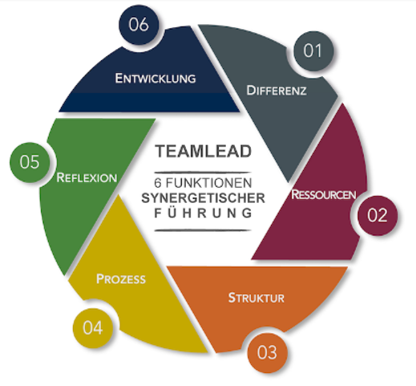

# **Teammanagement**  
„Teammanagement umfasst die aktive und zielorientierte Steuerung einer kleinen Gruppe von Personen, die gemeinsam mit geteilter Zielsetzung an einer Aufgabe, an einem [Projekt](Projekt.md) bzw. einem Thema arbeiten“.[^1] Rund um das Thema Teammanagement gibt es zahlreiche Theorien, Konzepte und Modelle. Diverse Managementstile werden definiert und verschiedenste Führungsinstrumente, Führungsmethoden und Führungstechniken empfohlen. Einer der Stile ist auch das synergetische Teammanagement. [^2]

## **Synergetisches Teammanagement**

Synergetische Führung lautet das Geheimrezept, mit dem Manager aus einzelnen Gruppen erfolgreiche Teams machen. Die einfachste Definition der Synergie beim Management stellt fest, dass die Ganzheit etwas Größeres aIs die Summe der einzelnen Bestandteile ist. Die Beziehungen eben sind der wertvollste Teil der Ganzheit, der sie katalysiert und verstärkt sowie jeden Teil im Einzelnen aktiviert. Die Synergie ist also das Wesen eines erfolgreichen Managements, denn sie vereinigt Schöpfungskräfte der Menschen. Der Hauptzweck der synergetischen Führung eines Teams ist das Potenzial des Teams zu maximieren und somit mit neuen Herausforderungen umzugehen.

## **Synergetische Führung** [^3]
Das größte Potenzial eines Teams liegt nicht in den einzelnen Teammitgliedern. Es liegt in den Schnittstellen zwischen ihnen. Denn ein Team besteht nun einmal nicht nur aus einer Ansammlung dyadischer Beziehungen. Um dieses Potenzial durch richtiges Teammanagement auszuschöpfen, sind einige Managamentaufgaben zu bewältigen: 

 
Abbildung 3 [^4]

* **Differenzmanagement** setzt die Grenzen und sichert [Zielklarheit](Ziel_Planung.md). Ein Team braucht einen klaren Auftrag (Systemzweck) und muss sich als Einheit begreifen denn das stärkt das Gefühl von Sinn und den Teamgeist.  Am besten geschieht das gemeinsam, im konstruktiven Gespräch, wobei es dabei ebenso um Leistungs- wie auch Beziehungsziele des Teams gehen sollte. 

* Unter **[Ressourcenmanagement](Ressourcenplanung.md)** fällt die Akquise materieller und immaterieller, finanzieller und personaler Mittel. Manager müssen dafür sorgen, dass das Team zu nachvollziehbaren und als fair empfundenen Entscheidungen gelangt. Auch die Entscheidung wer im Team aufgenommen wird, ist eine Ressourcenentscheidung. 
* **Strukturmanagement** setzt sich mit der sozialen Komplexität im Team auseinander. Hier geht es vor allem um die Festlegung klarer Rollen und Verantwortlichkeiten. Trotz der klaren Festlegung sollten Manager aber auch dafür Sorge tragen, dass Mitarbeiter in der Lage sind, sich kreativ mit neuen komplexen Herausforderungen und [Konflikten](Konfliktmanagement.md) auseinanderzusetzen.

* Das Managen von zeitlicher Komplexität ist Aufgabe des **Prozessmanagements**. Die Ablaufplanung muss die durch die interne Rollendifferenzierung bedingten Anschluss- und Synchronisierungsprobleme lösen. 
* **Reflexionsmanagement** sichert die Überlebensfähigkeit des Teams, indem die eigene Funktionalität analysiert und verbessert wird. Synergetisches Management führt zur Ergreifung geeigneter Gegenmaßnahmen, denn es impliziert negativen Stress im Team aufmerksam wahrzunehmen. 
* **[Entwicklungsmanagement](Entwicklungsprojekte.md)** schließlich verhindert die Überlastung des Systems aufgrund überfordernder Aufgaben oder zu hoher Komplexität. 

| Differenz  | Ressourcen  | Struktur| Prozess  | Reflexion  | Entwicklung|
| :------------ |:---------------:| -----:| :------------ |:---------------:| -----:|
|  Teamgeist stärken                         | Team zusammenstellen        | Arbeit strukturieren            |Selbstmanagement und Flexibilität fördern | Leistungsprobleme interpretieren und lösen | Teilaufgaben outsourcen
| Teamexterne Schnittstellen kooperieren | Ressourcenbedarf ermitteln  | Verantwortlichkeiten Definieren |Standardprozesse implementieren           | Team permanent herausfordern | Auf nächsthöherer Ebene eskalieren
| Mitarbeiter individuell führen         | Team entwickeln             |  Teamrollen aushandeln          | Operatives Vorgehen definieren           | Monitoring relevanter Daten | [Projekt abschließen](Projektabschluss.md) und [Projekt auflösen](Projektaufloesung.md)

# **Fazit**
Zusammenfassend lässt sich sagen, dass nichts heute so wichtig ist wie die Entwicklung einer synergetischen Denkweise. Nur so können wir größere Fortschritte erzielen, indem wir unsere Potenziale für das Gemeinwohl bündeln.  Nachhaltig erfolgreiche Unternehmen sind deshalb erfolgreich, weil funktionierende Teams einen überdurchschnittlichen Beitrag, durch ihre effektive und produktive Arbeitsweise, zum Gesamterfolg beitragen. Gutes Teammangament ist eine win-win Situation für das Unternehmen, den [Teamleiter](Teamleiter.md) und die Mitarbeiter. Das wichtige ist der Managementstil an den man sich orientiert. [^5]

# **Quellen** 
[^1]: Dr. Schawel, C. und Billing, F. (2018). Top 100 Management Tools (6. Auflage). Springer  
[^2]: vgl. https://www.mitarbeitermotivation-anleitungen.de/mitarbeiterfuehrung/teamfuehrung/  
[^3]: vgl. [Podcast](https://teamlead.partners/resources/media/Graf-Rascher-Schmutte-(2018)-Fuer-ein-besseres-%C2%ADZusammenspiel---Synergetisch-fuehren---managerseminare-MS249AR03.mp3)  
[^4]: https://teamlead.partners/  
[^5]: vgl. Nele GrafStephanie RascherAndre M. Schmutte. Teamlead- Führung 4.0, Springer

