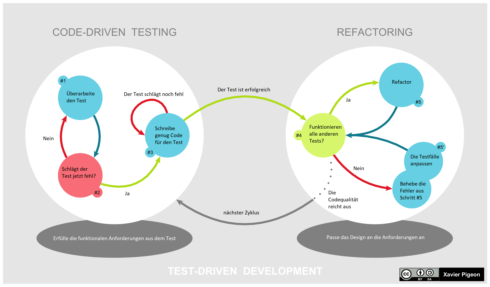

Im Kontext der Softwareentwicklung bezeichnet Test Driven Development (**TDD**) die Strategie, vor der Entwicklung von Code bereits die Tests dafür zu erstellen und den eigentlichen Code erst danach zu entwickeln.[^1][^2]

# Vorgehensweise

Ursprünglich vorgestellt wurde der Ansatz 2002 von Kent Beck, einem Mitentwickler des [Extreme Programming](Xtreme_Programming.md), in seinem Buch "Test-Driven Development By Example"[^1]. 

Darin zeigte er die erfolgreiche Anwendung an verschiedenen Beispielen und erklärte dessen Zyklus "Red/green/refactor", der die Entwicklung in drei Phasen einteilt, die immer wieder nacheinander ablaufen. Red und Green beziehen sich dabei auf die Farben für fehlgeschlagene (rot) und erfolgreiche (grün) Tests in vielen Entwicklungsumgebungen, [Refactor](https://de.wikipedia.org/wiki/Refactoring) beschriebt die Überarbeitung des Codes.

## Der RGR-Zyklus

Das Projekt wird in kleine Funktionalitäten unterteilt, die nacheinander hinzugefügt werden sollen. 

| Schritt  | Aufgabe |
| ------------- | ------------- |
| Red  | Schreibe einen neuen Test für die Funktion, die du einbauen möchtest. Weil das Programm die Funktion noch nicht beherrscht, muss er fehlschlagen.  |
| Green  | Schreibe deinen Code so um, dass der Code funktioniert. Dabei wird nicht auf guten Stil (z.B. Kommentare, Vermeidung von Duplikationen) geachtet, wichtig ist die Funktion.  |
| Refactor  | Jetzt wird der funktionierende Code überarbeitet, sodass er weiterhin funktioniert, aber die Richtlinien zu gutem Stil erfüllt, die im zweiten Schritt ignoriert wurden.  |

*Übersicht zum Vorgehen beim Test Driven Development*[^3]

# Auswirkung von TDD auf den Projekterfolg

Zu der Auswirkung des TTD-Ansatzes auf den Erfolg von Projekten gibt es einige Untersuchungen, die aber wegen der individuellen Unterschiede zwischen Projekten nicht auf alle Projekte generalisierbar sind.

Eine Fallstudie bei IBM[^2] verglich die Ergebnisse eines Teams aus relativ unerfahrenen Entwickler:innen, die mit TDD arbeiteten, mit denen eines erfahreneren Teams, die das weniger formale [Ad hoc-Testen](https://en.wikipedia.org/wiki/Ad_hoc_testing) verwendeten. Die Projekte waren ähnlich, die Produktivität wurde durch den Mehraufwand des TDD-Teams kaum beeinträchtigt, die Fehlerdichte nahm um 40% ab.

Eine andere Studie verglich die Ergebnisse von Studierenden an der Politecnico di Torino in einem Javakurs[^4], die TDD verwendeten, mit denen einer Kontrollgruppe, die Tests erst nach dem Schreiben ihres Codes erstellte. Es wurde beobachtet, dass die Studierenden aus der TDD-Gruppe mehr Tests schrieben, was eine Korrelation mit einer besseren Qualität der jeweils schlechtesten Ergebnisse der Gruppen zeigte, im Durchschnitt der Gruppen aber keinen Vorteil brachte. Dessen Ursache sehen die Autoren darin, dass es schwieriger ist, mit wenigen Tests alle wichtigen Funktionen abzudecken, mit mehreren Tests ist das einfacher und weniger vom (innerhalb der Gruppe unterschiedlichen) Können der Studierenden abhängig. Die Korrelation "viele Tests" mit "bessere Mindestqualität" zeigte sich jedoch zwischen allen Studierenden, unabhängig von dem TDD- oder traditionellen Ansatz. Wegen verschiedener Effekte warnen die Autoren auch hier, die Ergebnisse zu generalisieren.

# Synergieeffekte mit Extreme Programming (XP)

Der ursprüngliche Entdecker des Konzepts TDD, Kent Beck, spielte auch eine wichtige Rolle bei der Entwicklung des [Xtreme Programming](Xtreme_Programming.md) (XP). In seinem Buch über TDD[^1] geht er deshalb auf Seite 217 noch speziell darauf ein, wie sich die Grundsätze dieser beiden Arbeitsweisen kombinieren lassen.

1. Ein Problem beim Pair-Programming des XP kann sein, dass die Entwickler:innen versuchen, unterschiedliche Probleme zu lösen oder das Problem unterschiedlich interpretieren. Die Orientierung an Tests im TDD vermeidet dass, sodass allen immer klar ist, woran sie gerade arbeiten sollen.
2. TDD bietet mit seinen Tests sinnvolle Meilensteine, an denen das Konzept "Bei Müdigkeit aufhören" des XP gut umsetzbar ist.
3. Auch die kontinuierliche Integration wird durch die klaren Durchläufe des RGR-Zyklus unterstützt.
4. Das [YAGNI-Prinzip](https://de.wikipedia.org/wiki/YAGNI) des XP hilft, die Testfälle einfacher zu halten, umgekehrt werden auch keine unnötigen Funktionen eingebaut, wenn sie nicht zum Bestehen der Tests benötigt werden.
5. Das Refactoring am Ende des RGR-Zyklus garantiert die Einhaltung der XP-Regeln (z.B. die Abwesenheit von Duplikaten).
6. Wenn neue Funktionen bereits ausreichend getestet sind, ist es weniger risikoreich, sie bei Kund:innen bereits einzusetzen, was die [Continuous Delivery](https://de.wikipedia.org/wiki/Continuous_Delivery) erleichtert.

# Siehe auch

* [Xtreme Programming](Xtreme_Programming.md)
* [Bottom-Up Planning](Bottom_Up_Planning.md)

# Weiterführende Literatur

* [Test Driven Development (TDD): Die Testgetriebene Entwicklung einfach erklärt - IONOS](https://www.ionos.de/digitalguide/websites/web-entwicklung/was-ist-test-driven-development/)
* [Padberg, Frank and Matthias M. Müller. “About the Return on Investment of Test-driven Development.” (2003).](https://publikationen.bibliothek.kit.edu/1000061750/3933989)
* [R. Ramler and C. Klammer, "Enhancing Acceptance Test-Driven Development with Model-Based Test Generation," 2019 IEEE 19th International Conference on Software Quality, Reliability and Security Companion (QRS-C), 2019, pp. 503-504, doi: 10.1109/QRS-C.2019.00096.](https://ieeexplore.ieee.org/document/8859410)

# Quellen

[^1]: [Kent Beck, "Test-Driven Development By Example"](http://ce.sharif.edu/courses/99-00/1/ce475-1/resources/root/Books/KentBeck_TestDrivenDevelopmentByExample-2002.pdf)
[^2]: [L. Williams, E. M. Maximilien and M. Vouk, "Test-driven development as a defect-reduction practice," 14th International Symposium on Software Reliability Engineering, 2003. ISSRE 2003., 2003, pp. 34-45, doi: 10.1109/ISSRE.2003.1251029.](https://ieeexplore.ieee.org/document/1251029)
[^3]: [Ursprüngliche Abbildung](https://en.wikipedia.org/wiki/File:TDD_Global_Lifecycle.png) veröffentlicht von Xavier Pigeon unter [CC BY-SA 4.0](https://creativecommons.org/licenses/by-sa/4.0/deed.de), Übersetzung ins Deutsche durch Ferdinand Eckl, veröffentlicht unter [CC BY-SA 4.0](https://creativecommons.org/licenses/by-sa/4.0/deed.de)
[^4]: [H. Erdogmus, M. Morisio and M. Torchiano, "On the effectiveness of the test-first approach to programming," in IEEE Transactions on Software Engineering, vol. 31, no. 3, pp. 226-237, March 2005, doi: 10.1109/TSE.2005.37.](https://ieeexplore.ieee.org/document/1423994)
