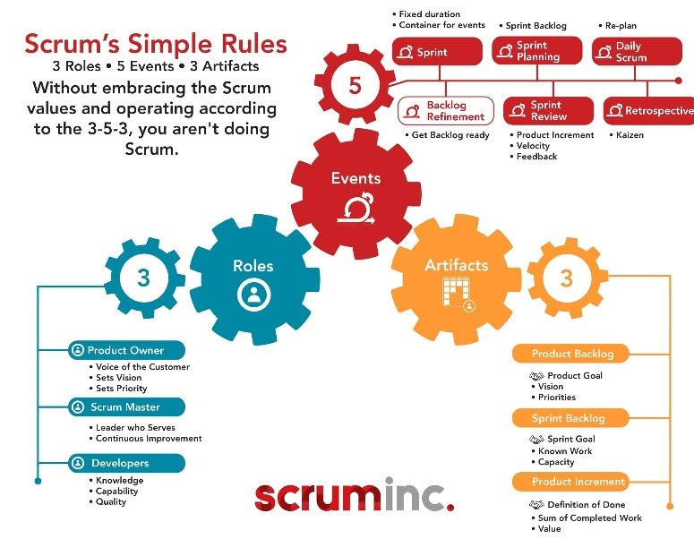

# The 3-5-3 of SCRUM

The 3-5-3 of Scrum umfasst die Methode, nach der sich ein agiles Team in ihrem Projekt organisiert. Hierbei steht 3-5-3 für folgendes: [^1]

### 3 Roles - 5 Events - 3 Attributes

Dies folgt aus dem erweiterten Verständnis für die allgemeine Definition von [SCRUM](SCRUM.md). Dabei wird [SCRUM](SCRUM.md) anhand eines 5-3-5-3-3 Modelles erklärt und erweitert das 3-5-3 Modell um 5 Werte und 3 Verpflichtungen. [^1]

*Das Grundprinzip von 3-5-3*[^2]

## Die 3 Rollen

* [Product Owner (PO)](Product_Owner.md)
* [SCRUM Master](Scrum_Master.md)
* Das Team

Die Aufgaben des [Product Owners](Product_Owner.md) sind primär das Backlog zu pflegen. Dies erfolgt durch eine stetige Priorisierung des [Backlogs](Product_Backlog.md) und eine klare Kommunikation der Inhalte an das Team. Da der [Product Owner](Product_Owner.md) den Kunden vertritt hat dieser auch die Verantwortung die Vision des Kunden zu vermitteln und besitzt daher auch das Recht eine finale Entscheidung zu treffen über das weitere Vorgehen im Projekt. [^2]
Der [SCRUM Master](Scrum_Master.md) ist im Gegensatz zum [Product Owner](Product_Owner.md) mehr in das Team integriert. Dabei ist er nicht explizit Teammitglied sondern sorgt vielmehr dafür, dass das Team gut arbeiten kann. Würde dieser fehlen würde es das Team nicht ungestört arbeiten können, da sie neben ihren übrigen Aufgaben auch die Organisation und Fortschritte im Blick behalten müssen. [^2]
Demnach ist das Team lediglich dafür zuständig das vom Kunden geforderte Produkt zu entwickelt. Dabei ist lediglich das Ziel vorgegeben jedoch nicht die Art und Weise wie dieses Ziel erreicht werden soll. [^2]

## Die 5 Events

* [Sprint](Sprint.md)
* [Daily](Daily_Scrum.md)
* [Sprint Review](Sprint_Review.md)
* [Sprint Retrospective](Retrospective.md)
* [Sprint Planning](Sprint_Planning.md)

Ein [Sprint](Sprint.md) ist ein festgelegter Zeitraum, in welchem die sonstigen Events stattfinden. Die Länge eines [Sprints](Sprint.md) zu Anfang eines Projekts festgelegt und kann zum Beispiel eine zwei oder bis zu vier Wochen umfassen. [^3]
Täglich findet während eines [Sprints](Sprint.md) das [Daily](Daily_Scrum.md) statt. Hiermit wird die Kommunikation zwischen den Teammitgliedern gefördert sowie ein konstanter Austausch über die erreichten Fortschritte. Dabei sollen Impediments sichtbar gemacht werden genauso wie die Zusammenarbeit gesteigert werden. [^3]
Im [Sprint Review](Sprint_Review.md) wird dann der abgeschlossene [Sprint](Sprint.md) bewertet. Dabei wird optimalerweise ein neues [Product Increment](Increment.md) betrachtet und die erreichten Fortschritte durchgesprochen. Hier sollte durch die Stakeholder auch ein Feedback gegeben werden. [^3]
Während einer [Sprint Retrospective](Retrospective.md) wird in kurzer Zeit die Arbeitsweise des [Sprints](Sprint.md) bewertet. So können hier Erfolge gelobt werden und Verbesserungsvorschläge eingebracht werden, welche das Team zu einer gesteigerten Produktivität sowie mehr Freude an der Arbeit verhelfen soll. [^3]
Im [Sprint Planning](Sprint_Planning.md) wird schließlich der neu startende [Sprint](Sprint.md) geplant werden. Dafür muss das Product Backlog, welches in einem Backlog Refinement priorisiert wurde, herangezogen werden. Die wichtigsten Aufgaben werden in den neuen [Sprint](Sprint.md) mitaufgenommen. Oft werden hierfür Tools wie Jira benutzt. [^3]

## Die 3 Artefakte

* [Product Backlog](Product_Backlog.md)
* Sprint Backlog
* [Product Increment](Increment.md)

Im [Product Backlog](Product_Backlog.md) wird das Ziel beschrieben. Dabei werden die dafür nötigen Schritte in sogenannte [User Stories](User_Story.md) aufgeteilt, welche durch den Product Owner priorisiert werden. Man kann es sich vorstellen, wie eine Produkt Roadmap, an welcher sich das Team orientiert. [^2]
Die Kurzform davon ist das Sprint Backlog. Hier werden allein die zu erledigenden Aufgabenpakete für den aktuellen [Sprint](Sprint.md) zusammengefasst. Das verhindert, dass sich die Teammitglieder von den vorgegebenen Zielen abkommen, und bildet den Rahmen für einen Sprint. [^3]
Am Ende eines [Sprints](Sprint.md) wird angestrebt ein potenziell lieferbares Produkt Inkrement vorstellen zu können. Das gibt die Möglichkeit, dass Stakeholder direkt das [Produkt Inkrement](Increment.md) nach jedem [Sprint](Sprint.md) begutachten können, und bietet eine Grundlage, auf der in dem folgenden [Sprint](Sprint.md) weitergearbeitet werden kann. [^2]

# Siehe auch

* [SCRUM](SCRUM.md)
* [Product Owner (PO)](Product_Owner.md)
* [SCRUM Master](Scrum_Master.md)
* [Sprint](Sprint.md)
* [Daily](Daily_Scrum.md)
* [Sprint Review](Sprint_Review.md)
* [Sprint Retrospective](Retrospective.md)
* [Sprint Planning](Sprint_Planning.md)
* [Product Backlog](Product_Backlog.md)
* [Product Increment](Increment.md)

# Weiterführende Literatur

* [Product Owner: Die fünf wichtigsten Aufgaben + eine nützliche Vorlage](https://agilescrumgroup.de/product-owner-aufgaben/)

# Quellen

[^1]: [What is 3-5-3 Structure in Scrum](https://www.zentao.pm/blog/3-5-3-structure-scrum-136.html)
[^2]: [The 3-5-3 of Scrum](https://www.scruminc.com/the-3-5-3-of-scrum/)
[^3]: [Understanding Scrum: The Scrum 5–3–5–3–3](https://medium.com/agile-outside-the-box/understanding-scrum-the-scrum-5-3-5-3-3-d8c2553899df)
