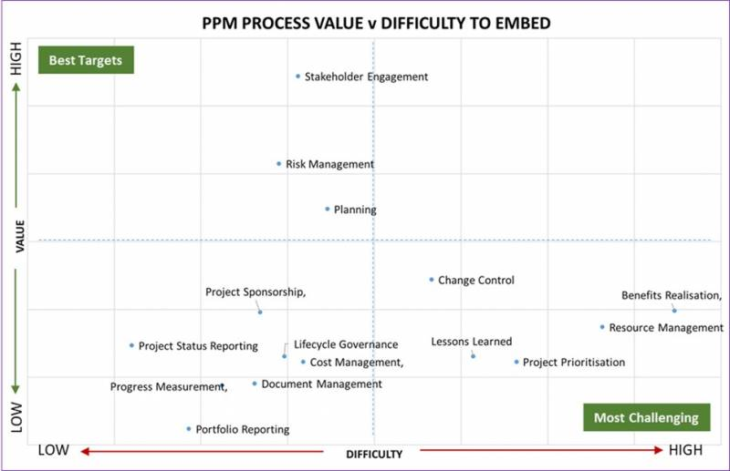

________________________________________________________________________________________________________________

"The State of Project Management" ist ein alljährlicher Bericht verschiedenster Institutionen u.a. der Organisation [Wellingtone](https://wellingtone.co.uk/). In dem Bericht werden zahlreiche namenhafte Unternehmen [^1] aus verschiedenen Sektoren interviewet, um den aktuellen Probleme, Entwicklungen des Projektmanagement als auch Methoden und Ansätze für die Zukunft zu präsentieren, die wiederum Unternehmen dazu bewegen sollen ihre Prozesse im Projektablauf zu hinterfragen und mit neuen Techniken effizienter zu gestalten. 

Im Allgemeinen zeichnet sich seit mehreren Jahren ab, dass beim Projektmanagement über die Performance nachlässt und sowohl Durchführung als auch der Erfolg des Projekt zunehmend abnimmt. Durch die Analyse, Auswertung & Darstellung bestimmter Fragen wird die aktuelle Entwicklung dargestellt. Maturity Levels spiegeln Leistungen wider und durch sogenannte Key Drivers wird beschrieben, welche Faktoren wichtig sind, damit das Projektmanagement erfolgreich ist.[^2][^3]

Das Berichtschema der Organisation [Wellingtone](https://wellingtone.co.uk/) wird im Nachfolgenden mit den wichtigsten Aspekten wiedergegeben. 

# Project Management Basics:

Unter den Project Management Basics sind Fragen zu verstehen, die Aufschluss über aktuelle Entwicklungen im Projektmanagement widerspiegeln und allgemeine Kennzahlen darstellen. So wird im Bericht 2021 festgestellt, ob mit einer festgelegten Methode und Zeitplan, einem Planungsprotokoll und mit möglichen Risikomanagement gearbeitet wird. [^2] Mit Hilfe dieser Fragen können Schlussfolgerungen über ein mögliches Verbesserungspotenzial als auch die Entwicklungsrichtung von Projekt Management dargestellt werden

So wird im diesjährigen Bericht mit Hilfe eines Diagramme Rückschlüsse gewonnen, die aufzeigen, welche Aufgaben die größten Herausforderungen mit dem damit zusammenhängenden Wert im Portfolio des Projektmanagements haben.

[*Abbildung: PPM Process Value vs. Difficulty to embed*](https://wellingtone.co.uk/increase-project-success-the-state-of-project-management/)

# Maturity Levels:

Mit Hilfe der fünf Maturity Levels wird die Reife des Projektmanagements genauer beschrieben. Damit wird Unternehmen aufgezeigt, auf welchem Level sich einzelne Abschnitte im Projektmanagement befinden, um hier besser anzugreifen & eine Entwicklung einzuleiten. [^10]

* Level 1: Beginnend
   - Beschreibt ein Projektmanagement, welches nicht vorhanden ist oder keine oder nur wenig vollständige Prozesse hat. Es werden kein Dokumente erhoben & sind ad-hoc geplant. Daraus resultiert, dass Erfolg oder Misserfolg, Kosten, Zeiten und Qualität des Projekts von einzelnen Personen abhängig sind.
* Level 2: Wiederholbar
   - Im Gegensatz zu Level 1 wird ein systematische Analyse durchgeführt. Mit den gewonnenen Erkenntnissen werden Prozesse festgelegt, wodurch Projektziele, -zeiten und -kosten für die Zukunft abgeschätzt werden können.
* Level 3: Definiert
   - Sämtliche Prozesse sind genausten ausgearbeitet, können wiederholt angewandt werden, transparent und überprüfbar. Die standardisierten Prozesse ermöglichen eine Durchführung von Projekten jeglicher Größe.
* Level 4: Gesteuert
   - Abgrenzend zu Level 3 gibt es in Level 4 eine fest zugeordnete PMO-Funktion für Veränderungen, Kommunikation & Lerneffekte. Alle Projektparameter werden überwacht und gesteuert. Durch die Implementierung des Risikomanagements wird der Erfolg und Misserfolg des Projekts vorhersehbar.
* Level 5: Optimierend
   - Alle Prozesse werden immer wieder betrachtet & verbessert, sodass ein Prozess kontinuierlicher Optimierung entsteht. Performance des eigentlichen Projekts und des PMO werden gemessen und fließen in die Entscheidungsgebung mit ein, wodurch Fehler vermieden werden können. [^11]

# Schlüsselfaktoren:

Unter Schlüsselfaktoren sind einzelne Bereiche des Projektmanagements zu verstehen, die den Erfolg eines Projekts beeinflussen können. Ein Faktor alleine zu betrachten wird den Erfolg auf langfristiger Sicht nicht positiv beeinflussen. Es ist ein Zusammenspiel aus den gesamten Schlüsselfaktoren.

1. Methodik:

Die Methodik, eine Bündelung von Methoden, verhindert Stagnation im Projektmanagement. Hierzu gehören vor allem die Methoden der Analyse-, Kreativität-, Prognose-, Bewertung-, Planung- und Abwicklung. Zu beachten ist, dass die einzelnen Methoden in Abhängigkeit zueinander stehen. So entsteht das Gefühl eines erarbeiteten Kompromisses, der zur besten Lösung führt. [^4]

2. Projektmanagement Office:

Das Projektmanagement Office, kurz PMO, betreut alle Projekte eines Unternehmens. Durch die Steuerung in strategischer Hinsicht, der Ressourcenkoordinierung, der schnellen Entscheidungsfindung aufgrund eines oftmals dynamischen Umfeldes, der Weitergabe wichtiger Informationen an die Geschäftsleitung [^5] sowie der Gewährleistung, dass in allen Projekten die gleichen Methoden angewandt werden, ist das PMO durch Planungs-, Informations- und Erfassungsaufgaben ein wesentlicher Antreiber des Projektmanagements. [^6]

3. Technologien:

Durch den Einsatz von Technologien entsteht eine Effizienzsteigerung, die sich wiederrum auf die Wirtschaftlichkeit der Projekte auswirkt. Zu den Tools gehören unter anderem die Verwendung von Software zum Termin- und Kostenüberblick, Know-How-Datenbanken und eine einfache Kommunikation via Skype, Teams oder ähnlichen. [^7] Je nach Größe des Unternehmens und Anzahl der durchgeführten Projekte im Jahr kommt es zum Einsatz verschiedener Software. Hierzu gehören die Folgenden: 

* Allgemeine Software ist oftmals hinderlich im Bezug auf die Möglichkeit der Nutzung. Dies ist vor allem bei Grafiken ersichtlich. Im Hinblick auf die Verwendbarkeit der Software von Mitarbeiter gibt es nicht viel zu beachten, da es sich hierbei um [Office-Anwendungen](https://www.microsoft.com/de-de/microsoft-365/business/microsoft-365-business-premium?market=de) wie Excel oder Teams handelt. 
* Freeware-Software bietet vor allem die Möglichkeit der grafischen Darstellung übersichtlicher darzustellen und sind einfach in das Projektmanagement mit einzubinden. Jedoch sollte hier Vorsicht gewaltet werden, da vertrauliche und sensible Daten gerade bei cloud-basierten Software von externen Dritten abgegriffen werden können. 
* Professionelle Software ist unausweichlich, sobald ein Unternehmen mehrere Projekte parallel oder im Jahr am Laufen hat. Diese Art von Software kann oftmals auf das Unternehmen angepasst werden. Durch ein einheitliches Erscheinungsbild ist die Verwendung durch die Mitarbeiter einfach gestaltet, muss jedoch erstmals erlernt werden, wozu nicht alle Mitarbeiter bereit sind.
* Web 2.0-Software bietet den Vorteil der ständigen Weiterentwicklung. So ist die direkte Kommunikation bspw. mit dem Stakeholdern ein Vorteil, gleichzeitig aber auch ein Nachteil, da Gruppierungen, welche sich gegen das Projekt aussprechen die nahezu gleiche Informationsbasis zugrunde liegen haben. [^8]

4. Beratung:

Die Beratung ermöglicht dem Unternehmen unterstützende Hilfestellung im Bezug auf die Definition der Projektgrenzen, -kontexte und -pläne sowie die Analyse sozialer und ökologischer Auswirkungen. Des Weiteren ist Beratung entscheidend bei der Implementierung von Investitionen, Software oder auch Auswahl des Auftragsgebers. [^9]

# Die Zukunft von Projektmanagement:

Durch die Auswirkungen von COVID-19 befinden unterschiedliche Branchen in verschiedensten Situationen. So besteht weiterhin eine [Halbleiterknappheit](https://www.wiwo.de/politik/europa/halbleiter-knappheit-eu-erleichtert-finanzierung-von-chipfabriken/27812942.html) und Lieferverzögerungen sind mittlerweile Normalität. Daraus zeichnet sich ab, dass Flexibilität und Resilienz entscheidende Faktoren sind. So zeichnen sich Trends ab wie der Wunsch nach vollständiger Ressourcenplanung, dass feste Teams bessere Ergebnisse erzielen oder auch, dass klassische und agile Tools parallel betrieben werden sollen. [^12] Darüber hinaus glauben 71% der Befraften, dass Menschen mehr Projektmanagement Skills haben sollten und auch in Zukunft immer mehr Projekte mithilfe von Methoden des Projektmanagements erfolgen. [^2]

# Siehe auch:

* [Projektmanagement](Projektmanagement.md)
* [Risikomanagement](Risikomanagement.md)
* [Projekt Management Office](Project_Management_Office.md)
* [Methoden](Methoden.md)
* [Zukunftswerkstatt](Zukunftswerkstatt.md)

# Weiterführende Literatur:

* [Wellington](https://wellingtone.co.uk/)
* [PMI](https://www.pmi.org/)

# Quellen:
[^1]: [The State of Project Management Annual Report 2021 (YouTube)](https://www.youtube.com/watch?v=hZd5SgZWoWU)
[^2]: [Annual Report - The State of Project Management 2021 (PDF)](https://wellingtone.co.uk/wp-content/uploads/2021/03/The-State-of-PM-2021.pdf)
[^3]: [Identifying the State of Project Management (PDF)](https://www.sciencedirect.com/science/article/pii/S1877705816302144)
[^4]: [Lexikon der Projektmanagement-Methoden (Buch)](https://books.google.de/books?hl=de&lr=&id=1dJE3EYYpasC&oi=fnd&pg=PA6&dq=lexikon+der+Projektmanagement-Methoden&ots=8tbNhMWYYg&sig=aObvoIyZxRQIIpZa1DC0Hu7oVjY#v=onepage&q=lexikon%20der%20Projektmanagement-Methoden&f=false)
[^5]: [PMO: Definition, Vorteile & wann ist es gut (Website)](https://www.theprojectgroup.com/blog/pmo-project-management-office/#Kapitel1)
[^6]: [Projektbüro (Wikipedia)](https://de.wikipedia.org/wiki/Projektb%C3%BCro)
[^7]: [Wie Technologien Probleme im Projektmanagement lösen (Website)](https://promx.net/2021/06/wie-technologie-probleme-im-projektmanagement-loest/#)
[^8]: [Projektmanagement - Theorie und Praxis aus einer Hand, Bernd-J. Madauss (PDF)](https://link.springer.com/content/pdf/10.1007%2F978-3-662-54432-7.pdf)
[^9]: [Beartung von Organisationen im Projektmanagement, Reinhard Wagner (PDF)](https://www.projektivisten.de/fileadmin/_migrated/content_uploads/Beratung-von-Organisationen-im-Projektmanagement.pdf)
[^10]: [Cpability Maturity Model (Wikipedia)](https://de.wikipedia.org/wiki/Capability_Maturity_Model)
[^11]: [Projektmanagement Reifegrad (Website)](https://quality-engineering.industrie.de/allgemein/projektmanagement-reifegrad-2/#slider-intro-1)
[^12]: [Die 12 wichtigsten Projektmanagement-Trends 2021 (Website)](https://www.theprojectgroup.com/blog/projektmanagement-trends/)
