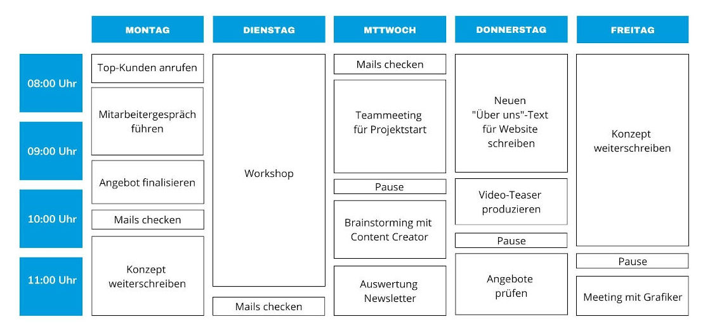

Das Timeboxing ist eine Zeitmanagement-Methode im [Projektmanagement](https://github.com/ManagingProjectsSuccessfully/ManagingProjectsSuccessfully.github.io/blob/main/kb/Projektmanagement.md). Hierbei werden für die zu erledigenden Aufgaben bestimme Zeitslots, die sogenannten Timeboxes, reserviert. Es wird vorher genau festgelegt was in einer Timebox zu erledigen ist und was das Ziel der jeweiligen Timebox ist. Dadurch sind eine klare Planung sowie Struktur der Aufgaben und damit des Projekts garantiert[^1].

# Wie funktioniert Timeboxing?

Die einfache Grundregel des Timeboxing ist die Einteilung der To-dos in Zeitfenster. Die Zeit ist der wichtigste Faktor im Timeboxing und steht maßgeblich für den Projekterfolg. Timeboxing verfolgt das sogenannten Parkinsonschen Gesetz, welches besagt, dass die Erledigung einer Aufgabe umso länger dauert, je mehr Zeit dafür zur Verfügung steht. Ein Zeitfenster, also eine Timebox, kann Minuten, Stunden, Tage oder sogar Wochen umfassen, je nach Aufgabe. Hierbei ist es allerdings wichtig realistische Zeitfenster zu wählen. Die zu erledigenden Aufgaben müssen auch wirklich in der gesetzten Timebox zu bewältigen sein. Es ist zudem wichtig Pausen und extra Timeboxen als Puffer für unvorhersehbaren Mehraufwand einzuplanen. Durch das Timeboxing soll also vermieden werden, dass man sich mit unwichtigen Details aufhält oder gar stagniert. Dementsprechend soll erreicht werden, dass man sich auf das Wesentliche konzentriert und effizient arbeitet. Timeboxing kann sowohl für Gruppen als auch für die persönliche [Zeitplanung](kb/Zeitplanung.md) genutzt werden[^2][^4].

# Der Ablauf von Timeboxing 

1. Erstellung einer To-do Liste über alle zu erledigenden Aufgaben

2. Priorisierung dieser Aufgaben

3. Abschätzung der Dauer der Aufagben

4. Timeboxen setzen und mit Zeitrahmen schriftlich festhalten [^4]

# Harte versus weiche Timeboxen

Vor dem Timeboxing muss entschieden werden ob die jeweiligen Timeboxen hart oder weich sind. Man muss sich bei einem [Projekt](kb/Projekt.md) jedoch nicht auf eine Art Timebox beschränken. Es ist oft sinnvoll zu mixen, je nach dem was eine Aufgabe von einem fordert. Z.B. eignen sich harte Timeboxen umso besser, umso mehr Disziplin eine Aufgabe fordert[^4].

## Harte Timeboxen 
Eine harte Timebox endet, wenn die vorgegebene Zeit abgelaufen ist, unabhängig davon, ob die Aufgabe erledigt werden konnte. Somit stellen harte Timeboxen die Erledigung sämtlicher anstehender Aufgaben sicher, erzeugen aber auch mehr Druck. Sie sind besonders dann sinnvoll, wenn bestimmte Aufgaben wiederholt überarbeitet werden müssen. In einem Meeting kann eine Timebox dazu beitragen, dass wirklich alle Tagesordnungspunkte abgearbeitet werden[^3]. 

## Weiche Timeboxen
Bei weichen Timeboxen muss sich hingegen nicht strikt an die Zeitslots gehalten werden. Sie verstehen sich eher als Hinweis, dass die aktuelle Aufgabe beendet werden sollte und eine Neue bereit steht. Sinnvoll sind sie vor allem bei neuen Aufgaben, bei denen der Arbeitsaufwand vorher noch nicht ganz klar ist. Durch die weiche Timebox kann in einem Team sichergestellt werden, dass alle den gleichen Zeitrahmen verfolgen, dabei jedoch immer noch flexibel sind. In Meetings trägt eine weiche Timebox auch dazu bei, dass alle Tagesordnungspunkte abgearbeitet werden, allerdings mit weniger Druck und ohne möglichen Abbruch gewisser Themen, wie es bei einer harten Timebox der Fall wäre[^3]. 

# Vor- und Nachteile des Timeboxing

## Vorteile

* Klare Struktur 
* Effektives Arbeiten durch verbindlichen Zietrahmen
* Reduzierung von Multitasking und Prokrastination
* Fokus auf das Wesentliche
* Steigert Motivation und Konzentration [^3][^4]

## Nachteile

* Druck
* Erfordert viel Disziplin 
* Qualität leidet bei zu kurz gesetzten Timeboxen
* Weniger Flexibilität
* Weniger Zeit für Kreativität [^3][^4]

# Konkrete Beispiele

 Wochenablauf mit Timeboxing: 

[^4]

Weitere Beispiele:
* Bis zum 10.07 soll das Angebot für den Kunden ausgearbeitet werden
* Die [Stakeholderanalyse](kb/Stakeholderanalyse.md) muss bis 15.12, 12:00 abgeschlossen sein
* Bis übermorgen 15:00 soll die Kostenanalyse überarbeitet werden
* Wir haben jetzt drei Stunden Zeit um xy zu besprechen

# Siehe auch

* [Projekt](kb/Projekt.md)
* [Projektmanagement](kb/Projektmanagement.md)
* [Pomodoro](kb/Pomodoro.md)
* [SCRUM](kb/SCRUM.md)
* [Daily SCRUM](kb/Daily_Scrum.md)
* [Methoden](kb/Methoden.md)
* [Zeitplanung](kb/Zeitplanung.md)
* [Self-Management](kb/Self_Management.md)
* [Ziel Planung](kb/Ziel_Planung.md)

# Weiterführende Literatur

* [Timeboxing 2 - Ein Praxisbeispiel](https://www.youtube.com/watch?v=PK1FGQL9ea0)
* [Zeitmanagement: Timeboxing mit Pomodoro Technik](https://www.leclere-solutions.com/2020/05/18/zeitmanagement-timeboxing-mit-pomodoro-technik/)
* [Time-Boxing bei SCRUM](https://scrum-master.de/Scrum-Meetings/Time-Boxing)

 
# Quellen

[^1]: [Timeboxing: Produktiver arbeiten durch klare Zeiten](https://karrierebibel.de/timeboxing/), abgerufen am 20.11.2021
[^2]: [Timeboxing: So wirst du produktiver!](https://projekte-leicht-gemacht.de/blog/softskills/zeitmanagement/timeboxing/#Was-ist-Timeboxing), abgerufen am 19.11.2021
[^3]: [Testen Sie Timeboxing: Die zielorientierte Zeitmanagement-Strategie](https://asana.com/de/resources/what-is-timeboxing), abgerufen am 22.11.2021
[^4]: [Timeboxing: pünktlich Aufgaben erledigen](https://www.fuer-gruender.de/blog/timeboxing/), abgerufen am 21.11.2021

