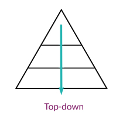

Das Top-Down Planning beschreibt eine Art der [Projektplanung](Projektplanung.md) und Durchführung, bei dem eine bestimmte Richtung, von den oberen Ebenen in die unteren Organisationsebenen, gefolgt wird [^1].
# Inhaltsverzeichnis
```
1 Konzept

2 Kritische Auseinandersetzung mit Top-Down Planning

3 Anwendungen von Top-Down Planning

4 Quellen
```
# Konzept
Das Top-Down Planning erfolgt von "Top" nach "Down", also von oben nach unten [^2]. Das bedeutet, dass Entscheidungen auf oberster Organisationsebene getroffen  und bis an die untersten Ebenen umgesetzt werden. So werden Pläne zentral in einer hohen Ebene erstellt und im Anschluss auf die hierarchisch niedrigeren Ebenen zur Durchführung verteilt [^1].



[*Top-Down Abbildung*](https://lead-conduct.de/2014/05/21/ansaetze-fuer-veraenderungen/)


Diesem Ansatz stehen sowohl das [Bottom-Up Planning](Bottom_Up_Planning.md), als auch das Gegenstrom-Verfahren gegenüber.
Diese Verfahren unterscheiden sich unter anderem in den Stufen des [sozialen](Soziale_Aspekte_des_Projektmanagements.md) Lernens, wodurch die Auswahl des Verfahrens essenziell für den Erfolg des Projekts ist [^5].

Der beschriebene Ansatz lässt sich besonders dem klassischen Projektmanagement zuordnen. Er zeichnet sich durch verbindliche Zielvorgaben der Zentrale und wenig Anpassungs- und Verhandlungsspielräume der dezentralen Bereiche aus. Dies steht im Kontrast zur [agilen](Agiles_Manifest.md) Projektdurchführung. Als [erfolgreich](Erfolgsmessung.md) gilt eine Implemation dann, wenn die durchgeführten Maßnahmen zu der erstrebten Wirkung führt [^1][^4].

#  Kritische Auseinandersetzung mit Top-Down Planning
Aus der Top-Down Planung lassen sich sowohl Vorteile als auch Nachteile ableiten. Nachteile entstehen vor allem, wenn keine Möglichkeit zur Flexibilität besteht oder keine klare Führungsstruktur herrscht. Im Folgenden wird eine Auswahl dieser aufgeführt. 
* Vorteile
  - Das Gesamtziel des Unternehmens spiegelt sich einheitlich in den Teilplänen auf allen Ebenen wider
  - Es besteht keine Konkurrenz von Einzelplänen zueinander
  - Durch verringerten Koordinationsaufwand können Zeit und Ressourcen eingespart werden
  - Mitarbeiter auf niedrigerer Organisationsebene können durch den klaren Führungsstil verbessert delegiert werden
  - Es besteht eine unternehmensweite Einheitlichkeit von Anforderungen
* Nachteile
  - Es besteht keine Möglichkeit zur kollaborativen Entscheidungsfindung, wodurch die kreative Lösung eines Problems durch das jeweilige Team verhindert wird
  - Es besteht die Gefahr, dass unerreichbare und unrealistische Ziele festgelegt werden, in dem Fall, dass das Management keine klare Vorstellung über die niedrigeren Organisationsebenen besitzt[^2]

# Anwendungen von Top-Down Planning
Das Top-Down Planning findet in vielen verschiedenen Bereichen Anwendung. Im Folgenden werden Beispiele aus verschiedenen Sektoren aufgeführt.

| Bereich  | Umsetzung von Top-Down Planning |
| ------------- | ------------- |
| Unternehmen  | Strategien und Unternehmensziele werden auf hoher Ebene definiert und anschließend auf den niedrigeren Organisationsebenen bzw. Geschäftseinheiten spezifiziert und weiterentwickelt[^1].  |
| IT-Systementwicklung  | Systeme werden in aggregierter Ebene oder vereinfacht beschrieben. Anschließend folgt eine Verfeinerung, die zu einer detaillierten Spezifikation führt[^6].  |
| Staat - Bildungssystem  | Innovationen, wie beispielsweise die Einführung neuer Lehrpläne, werden von den Kultusministerien eingeleitet und anschließend auf unterer Organisationsebene, den Schulen, umgesetzt [^4].   |
| Politik  | In der Politik werden Entscheidungen der Regierung getroffen, die bis zur untersten Organisationsebene, dem Bürger, anzuwenden sind. OFtmals findet dieser Ansatz in abgewandelter Form statt, da eine strikte Umsetzung als teilweise zu unflexibel gilt [^5].  |
| Mitarbeiter  | Mitarbeiter eines Unternehmens bringen laut Douglas McGregors Models Theorie X beim Einsatz des Top.Down Management Einsatz die größte Motivation auf. Die Unternehmensumgebung dieses Führungsstils ist oft produktions- oder arbeitsintensiv mit Augenmerk auf monetäre anstatt soziale Anreize [^3].  |
| [8-Step Process for Leading Change](8_Step_Process_for_Leading_Change.md)  | Bei dem von John Kotter vorgestelltem Ansatz wird mithilfe von 8 Schritten Veränderung auf der obersten Organisationsebene festgelegt und durch die Managementebene bis zur untersten Ebene durchgeführt [^3].  |
# Quellen

[^1]: [Nevries et al.(2009): Zentrale Gestaltungsgrößen der operativen Planung](https://link.springer.com/content/pdf/10.1007%2Fs12176-009-0075-2.pdf)
[^2]: [ZIP Forecasting (2021): Bottom-Up-Planung vs. Top-Down-Planung - Vor- und Nachteile](https://zipforecasting.com/de/capacity-planning/bottom-up-planning.html)

[^3]: [Project Management Institute (2017): A Guide to the Project Management Body of Knowledge, S. 255ff.](https://www.pmi.org/pmbok-guide-standards/foundational/PMBOK)

[^4]: [Gräsel, Cornelia; Parchmann, Ilka (2004): Implementationsforschung - oder: der steinige Weg, Unterricht zu verändern - In: Unterrichtswissenschaft 32, S. 196-214](https://nbn-resolving.org/urn:nbn:de:0111-opus-58134)
[^5]: [Koontz, Tomas; Newig, Jens(2014): From Planning to Implementation: Top-Down and
Bottom-Up Approaches for Collaborative Watershed Management, The Policy Studies Journal, Vol. 42, No. 3]( https://doi.org/10.1111/psj.12067)
[^6]: [Alper et al.(2014): Anwendungsorientierte Wirtschaftsinformatik: Strategische Planung, Entwicklung und Nutzung von Informationssystemen](https://link.springer.com/book/10.1007/978-3-658-00521-4)
