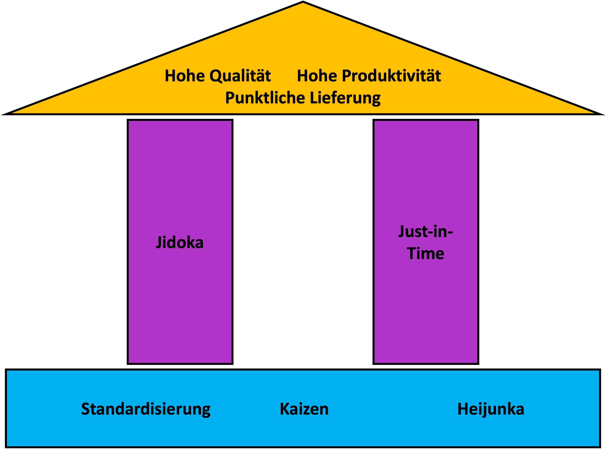

Das Toyota Produktionssystem ist ein für Toyota entwickelter Produktionsprozess für Serienverfahren, dass sich auf die Verbesserung der organisatorischen Abläufe konzentriert. Nach dem zweiten Weltkrieg ergab sich eine Krisensituation für das japanische Unternehmen Toyota, da nur wenige Fertigungsmittel und geringes Kapital zur Verfügung stand. Schlussfolgernd war es wichtig Fahrzeuge effizient zu produzieren. Der Ingenieur Taiichi Ohno entwickelte im Jahr 1950 das Toyota Produktionssystem, indem er Just-in-Time, Jidoka (Automation) und Kaizen in einem System zusammenführte.1 Das Ziel des Produktionssystems ist es hohe Qualität bei hoher Produktivität und pünktlicher Lieferung zu erreichen. Dieses Ziel soll durch Eliminierung von Überbeanspruchung, jegliche Art von Verschwendung und ungleichmäßiger Produktionsauslastung gewährleistet werden. Verglichen wird das Toyota Produktionssystem mit einem Haus. Die Säulen des Hauses bilden die Prinzipien Jidoka und Just-in-Time. Das Fundament, bestehend aus Kaizen, Standardisierung und Heijunka, tragen zur Erreichung des Daches und somit zum Ziel bei.[^2]

Elemente des Toyota Prodkutionssystems

# Jidoka

Die erste der beiden Hauptsäulen stellt das Jidoka Prinzip dar, welches zur Vermeidung von Fehlern führt, indem der Produktionsprozess bei einer Fehlermeldung automatisch unterbrochen und eine Meldung ausgegeben wird. Aufgrund der Autonomisierung von Maschinen ist die Überwachung durch Menschen nicht notwendig. Somit kann ein Toyota Maschinenführer gleichzeitig mehrere Maschinen überwachen. Die Trennung von Mensch und Maschine steigert somit die Arbeitsproduktivität. Das Ziel des Jidoka ist die Sicherung der Qualität und die Steigerung der Produktivität.[^1]

Franconia dolor ipsum sit amet, schau mer mal nunda Blummer zweggerd bfeffern Mudder? 
Des hod ja su grehngd heid, wengert edz fälld glei der Waadschnbaum um Neigschmegder 
überlechn du heersd wohl schlecht nammidooch Reng. Hulzkaschber i hob denkt ooschnulln 
Omd [Dunnerwedder](https://de.wiktionary.org/wiki/Donnerwetter) badscherdnass a weng weng? 
Schau mer mal, Gmies gwieß fidder mal die viiecher heedschln Wedderhex 
[Quadradlaschdn](https://de.wiktionary.org/wiki/Quadratlatschen) des hod ja su grehngd heid. 
Scheiferla Nemberch nä Bledzla Affnhidz. Briggn, nodwendich duusln Allmächd, hod der an 
Gniedlaskubf daneem.

# Just-in-Time

Nach Jidoka stellt Just-in-Time die zweite Säule des Hauses dar. Das Just-in-Time Prinzip bezieht sich auf Prozessanforderungen mit genauen Zeitvorgaben. Hierbei liegt das Grundprinzip darin nur die Menge an Produkten zu produzieren oder zu liefern die bestellt wurden. Das Ziel des Just-in-Time ist es, das richtige Produkt, in der richtigen Mengen- und Zeitvorgabe, sowie in der richtigen Qualität und am richtigen Ort zu einem richtigen Preis zu liefern. Das Prinzip wird an Kundenbedürfnisse angepasst.1

# Kaizen

In der japanischen Kultur ist Kaizen (jap. kai „Veränderung“, zen „zum Guten oder Besseren“) eine Lebens- und Arbeitsphilosophie,
die immer unter Einbeziehung der Belegschaft für eine kontinuierliche und ständige Verbesserung von Produkten und Prozessen, sowie Leistungen in kleinen Schritten steht. Hierbei werden Verbesserungsvorschläge der Belegschaft eigenständig und sofort beurteilt, außerdem vor Ort geprüft und konsequent realisiert. Die Umsetzung der Optimierungen im Sinne des Kaizens erfordern Zeit. Dabei darf die Verbesserung nicht zu einem Mehraufwand der Belegschaft, sowie Platz oder finanzieller Mittel führen. Das Ziel des Kaizens ist die schnelle Realisierung von Verbesserungsvorschlägen und die Beseitigung von Verschwendungen. (Quelle 1 und 3)

# Standardisierung

Die Standardisierung ist eine Komponente der Qualitätssicherung und dient als weiteres Fundament des Hauses. Standards sind verbesserungsfähig und wiederholbar, daher sind sie im Lean-Management die sicherste und effizienteste Art, um Tätigkeiten auszuführen. Für einen kontinuierlichen Verbesserungsprozess und die Eliminierung von Problemstellungen schaffen Standards ein systematisches Verständnis.  Das Ziel der Standarisierung ist die Erreichung von personenunabhängigen Prozessergebnissen, welches zu stabilen Prozessen führen soll, um die Zusammenarbeit mit Prozessen zu anderen Organisationseinheiten zu verbessern.

# Heijunka

Das letzte Fundament des Hauses ist Heijunka. Heijunka ist eine Methodik zur Vermeidung von Überproduktion, bei der es sich um die interne Störfähigkeit und die Akquisition von Materialien handelt. Verglichen wird Heijunka mit einem Steckkartenbrett an dem Produktaufträge und Kapazitäten gruppiert werden. Auf dem Heijunka ist die Fächeranzahl so hoch wie die verfügbare Kapazität. Eine Variante wird erst bei ausreichenden Produktaufträgen eingeplant. Diese Methodik wird oft von Spezialisten für das eigene Zeitmanagement verwendet. Im Hinblick auf die Produktionsvorgänge und die Abarbeitung der Bestellungen schafft Heijunka eine wichtige Gesamtübersicht. Das Ziel der Eliminierung von instabilen Prozessvorgängen oder die Variabilität verfolgt Heijunka, um einen ungleichmäßigen Produktionsdurchlauf zu vermeiden. 1

# Siehe auch

* Verlinkungen zu angrenzenden Themen
* [Link auf diese Seite](Toyota_Produktionssystem.md)

# Weiterführende Literatur

* Weiterfuehrende Literatur zum Thema z.B. Bücher, Webseiten, Blogs, Videos, Wissenschaftliche Literatur, ...

# Quellen

[^1]: Frank Bertagnolli: Lean Management - Einführung und Vertiefung in die japanische Management-Philosophie. Springer Gabler, Wiesbaden 2020, [978-3-658-31240-4] (https://doi.org/10.1007/978-3-658-31240-4).
[^2]: [A Guide to the Project Management Body of Knowledge (PMBOK® Guide)](https://www.pmi.org/pmbok-guide-standards/foundational/PMBOK)
[^3]: [Basic Formatting Syntax for GitHub flavored Markdown](https://docs.github.com/en/github/writing-on-github/getting-started-with-writing-and-formatting-on-github/basic-writing-and-formatting-syntax)
[^4]: [Advanced Formatting Syntax for GitHub flavored Markdown](https://docs.github.com/en/github/writing-on-github/working-with-advanced-formatting/organizing-information-with-tables)

