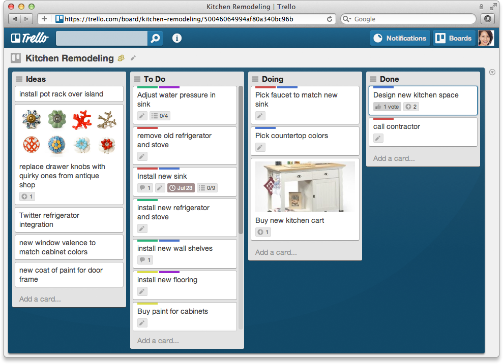

Trello ist ein flexibles Tool, wird meist in Projektmanagement angewendet, mit dem Gruppen oder Teams auf produktive und kreative Weise ihre Pläne aufbauen, Workflows organisieren beziehungsweise Fortschritt überwachen können. Mit Trello werden sowohl große Meilensteine als auch die täglichen Aufgaben gemanagt. Dadurch wird alles rechtzeitig erledigt.

## Eine kurze Geschichte von Trello[^1]
* Im 2010 wird dieser Tool von zwei Programmierern Bobby Grace und Justin Gallagher entwickelt, die  für  Fog Creek Software arbeiten 
* Im 2011 wird ein erster Prototyp vorgeschlagen, genannt als Trellis und nach abgeschlossener Betaphase wird es zum ersten Mal auf der TechCrunch Event mit dem Namen Trello veröffenlicht .
* Im 2012 wird Trello auf drei Plattforme Web-App, iOS und Android betrieben und erreicht 500 000 Mitglieder .
* Im Mai 2015 betritt Trello den internationalen Markt und bietet lokalisierte Versionen für Brasilien, Deutschland und Spanien an1.
* Anfang Januar 2017 wird Atlassian Trello für einen Kaufpreis von 425 Mio. US$ übernehmen.
* im Oktober 2019 kündigte Trello 50 Millionen Nutzer an[^2]  und ist bis jetzt mehr als 20 unterschiedlichen Sprache verfügbar[^3].

## Schlüsselfunktionen 
[Trello](https://de.wikipedia.org/wiki/Kanban-Tafel) fokussiert sich auf seine Kanban Board-Funktion. Nutzer können Taskboard mit verschiedenen editierbaren Spalten erstellen und die Aufgaben zwischen ihnen verschieben. In der Regel kann man die Aufgaben ein von drei Status markiert: To Do, In Progess(Doing), Done.

* Board mit bearbeitbaren Spalten, die ein Projekt darstellen.
* Die Karte ist inhaltsreich und stellt eine Aufgabe dar.
* Zusammenarbeitsorientierte Aspekte wie Beschreibung, Verantwortliche, Fälligkeitsdaten, Tags, Kommentare und Dateianhänge von bis zu 250 MB pro Datei.
* Eine große Sammlung bereits vorhandener Vorlagen für eine Vielzahl von Teamtypen.
* Viele Integrationen von Drittanbietern, die bei der Verbindung mit Squad-Favoriten wie GitHub, Dropbox, Slack, Google Drive usw.
* Power-Ups zum Hinzufügen von Funktionen zu Boards und Karten verfügbar.

## Geschäftsmodell
Einnahmequelle von Trello basiert auf Premium-Prinzip, d.h dass Grundfunktion dauerhaft kostenlos ist , daneben gibt es auch eine kostenpflichtige Premiumversion welche ein allumfassendes Funktionspaket aufweist. Trello teilt vier Tarife für zwischen 0 und $17,50 USD pro Nutzer und Monat auf:  Free, Standard, Premium und Enterprise.
## Vergleich Trello mit seinen Konkurrenten (Asana und Monday.com)

|   | Trello | Asana | monday.com|
| ------------- | ------------- | ------------- | ------------- |
| Platform  | Web-App, Desktop  | Web-App, Desktop  | Web-App, Desktop  |
| Mobile App  | iOS, Android| iOS, Android| iOS, Android
| Integration | Integriere mehr als 200 Apps und Tools[^4]   | Integriere  ca 160 Apps und Tools[^6]  | Über 50 Integrationen mit beliebten Software-Apps sind verfügbar[^8] |
| Preise  | Einfache Preistabelle. Eine kostenlose Version für unbegrentzte Nutzer mit beschränkte Funktion und drei kostenpflichten Versionen: Standard,  Premium, Enterprise ab $5 USD/Nutzer/Monat[^5] | Einfache Preistabelle. Eine kostenlose Version für 15 Nutzer mit beschränkte Funktion und zwei kostenpflichten Versionen: Premium, Enterprise ab $10,99 USD/Nutzer/Monat[^7] | Komplexe Preistabelle. Eine kostenlose Version für 2 Nutzer mit beschränkte Funktion und vier kostenpflichten Versionen:  Basic Standard,  Pro, Enterprise ab $10 USD/Nutzer/Monat |
| Geeinigt für  |Kleine Start-ups und kleine Unternehmen, die nur Kanban verwenden und keine leistungsstarken Projektverwaltungsfunktionen benötigen | IT und Non-IT Team(unabhängig von Anzahl der Größe). Insbesondere die Design- und Marketingteams, da Asana bei der Teamzusammenarbeit einen hohen Rang einnimmt | IT und Non-IT Unternehemen, die eine Vielzahl von Funktionen von Bug Tracking bis CRM benötigen |
| Funktion und Views  | Nur Kanban-Board-Ansicht ist eingebaut | Mehrere  Ansichten sind eingebaut z.B Liste, Tafel, Kalender, Meilensteine und Arbeitsbelastung  | Viele integrierte Ansichten wie Kanban-Board, Zeitleiste, Kalender, Arbeitsauslastung und Liste|
## Quelle
[^1]: [History of Trello](https://en.wikipedia.org/wiki/Trello)
[^2]: [Atlassian launches a whole new Trello](https://techcrunch.com/2021/02/16/atlassian-launches-a-whole-new-trello/)
[^3]: [Changing your language in Trello](https://help.trello.com/article/745-is-trello-available-in-other-languages)
[^4]: [UNBEGRENZTE POWER-UPS](https://trello.com/pricing)
[^5]: [Preisliste von Trello](https://trello.com/pricing)
[^6]: [App Intergrationen](https://asana.com/de/apps)
[^7]: [Preisliste von Asana](https://asana.com/de/pricing)
[^8]: [Integriere all deine Lieblings-Tools nahtlos](https://monday.com/lang/de/integrations/)
[^9]:[Preisgestaltung von Monday.com](https://monday.com/lang/de/pricing/)
