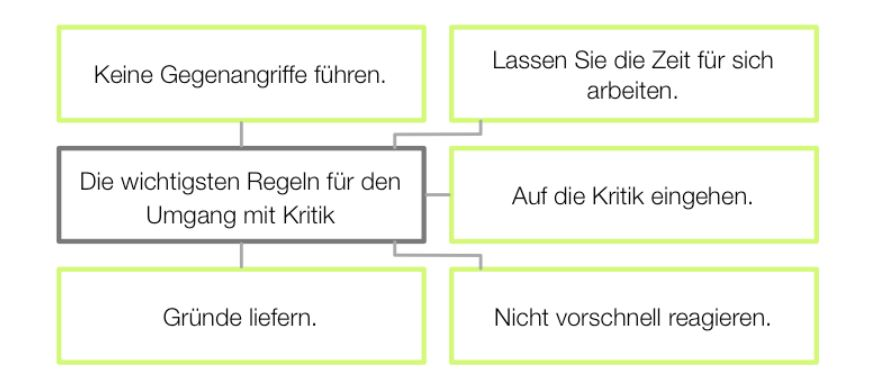

# Umgang mit Kritik
In dem nachfolgenden Artikel wird zuerst der allgemeine Bezug von Umgang mit Kritik und agiles Projektmanagement beleuchtet. Anschließend werden die beiden Komponenten in Verbindung gesetzt und analysiert, wie man mit Kritik im agilen Projektmanagement umgehen kann. 

## Begriffserklärung von Kritik 
Mit Kritik verbinden die meisten Menschen etwas Negatives. Im Allgemeinen versteht man unter Kritik die Beurteilung eines Gegenstandes oder auch einer Handlung. Diese Kritik wird anhand verschiedener Maßstäbe gemessen, z.B. unter verschiedenen [Feedbackregeln](https://www.hochschuldidaktik.uni-freiburg.de/koll_hospi/checklisten/feedback). Synonyme zu [Kritik](https://www.duden.de/rechtschreibung/Kritik) sind unter anderem auch [Monierung](https://www.duden.de/rechtschreibung/Monierung), Beanstandung oder Bemängelung.[^1] 
Zudem werden oft mehrere Kritikarten in bestimmten Situationen unterschieden. Hierfür ein paar Beispiele:

* "Groll" für den Perfektionismus
* "Stolz" bei Liebe
* "Täuschung" bei Erfolg
* "Neid" bei Individualität
* "Geiz" bei Wissen [^2]

Nachfolgend eine kleine Übersicht wie in allgemeinen Situationen mit Kritik umgegangen werden kann [^3]:
 

## Begriffsklärung des Agilen Projektmanagement
Im Agilen Projektmanagement wird anders als beim klassischen [Projektmanagement](Projektmanagement.md) meistens in kleineren interdisziplinäreren Teams kurz und zeitlich beschränkt an einer Sache gearbeitet, um flexibel auf Veränderungen reagieren zu können. Daneben werden regelmäßige Treffen vereinbart, um alle Teams miteinander zu verknüpfen. Somit wird produktiver gearbeitet und es werden schnellere Zwischenergebnisse erzielt.

Die Arbeitsweise im agilen Projektmanagement ist geprägt von Schnelligkeit, Flexibilität und ständigem "Up-to-Date" sein. Diese Arbeitsweise rückt immer mehr in den Vordergrund aufgrund der stetig vorschreitenden Digitalisierung und Globalisierung. Unternehmen werden nach und nach stärker mit steigender Komplexität und Dynamik konfrontiert und müssen unverzüglich darauf reagieren. 
Projektteams müssen in ihrer Vorgehensweise oft über sehr hohe Toleranzen hinsichtlich Qualität, Umfang, Leistung, Zeit und Kosten verfügen. Ebenso ist es notwenig, dass der Auftraggeber des jeweiligen Projekts mitinvolviert ist und eng mit dem Projektteam zusammenarbeitet.[^8] 

Als Referenz für das agile Projektmanagement wird das [Agile Manifest](Agiles_Manifest.md) herangezogen. 
Um Projekte effektiver und schneller zu steuern, gibt es verschiedene Agile Methoden wie z.B. [Scrum](SCRUM.md) und [Design Thinking](Design_Thinking.md) oder auch weitere [Agile Tools](https://www.projektmagazin.de/agile-methoden).[^8] 
Die Kanban-Methode mit den bekannten [Kanban-Boards](Kanban_Boards.md) gehört zu den geläufigsten Tools im Projektmanagement.[^4]

# Der Umgang mit Kritik im agilen Projektmanagement
Durch die Flexibilität und Schnelllebigkeit kann es in einem Projektteam schneller zu Differenzen und dadurch zu Konflikten kommen. Hier ist es einerseits entscheidend, dass die Person selbst gut mit Kritik umgehen kann, als auch gut Kritik äußern kann. Nur so ist eine offene Unternehmensstruktur möglich. [^5]

In der folgenden Tabelle werden Do's und Don'ts aufgelistet, welche in jedem Projektteam zu Beginn eines Projektsstarts vorgestellt bzw. gemeinsam diskutiert werden können [^7]:

|**Do's** | **Don'ts**|
|  :-----:  | :-------: |
|Zuhören & Ausreden lassen| Nicht ausreden lassen|
|Kritik annehmen| Kritik ablehnen|
|Kritik hinterfragen| Alles zu Herzen nehmen|
|Nichts persönlich nehmen| Rechtfertigung|
|Entschuldigen| Beleidigt sein|
|Eigene Meinung äußern| Gegenangriff|
|Kritik als Chance sehen| Fehler auf andere schieben|
|Verbesserungsvorschläge machen| Einfach zustimmen|
|Sich selbst verzeihen können| Emotionen nicht unter Kontrolle haben| 

Ebenfalls sollten Konflikte im Projektteam sofort angesprochen werden, da ansonsten Konflikte und Spannungen weiter eskalieren können. 
Konflikte gehören zum Leben und sich nicht vermeidbar. Die Gründe warum Konflikte entstehen sind sehr unterschiedlich, beweglich und veränderbar. Deshalb eignet es sich in einem Projektteam, die Teamstruktur regelmäßig zu reflektieren. Hierfür sollte ein Verantwortlicher, meistens die Teamführung, festgelegt werden. [^6]

# Siehe auch 

* [Projektmanagement](Projektmanagement.md)
* [Agile Manifest](Agiles_Manifest.md)
* [Agile Tools](https://www.projektmagazin.de/agile-methoden)
* [Kanban-Boards](Kanban_Boards.md)

# Weiterführende Literatur 

* Video: [MIT KRITIK RICHTIG UMGEHEN!](https://www.youtube.com/watch?v=PZtSxFI1nbQ)

# Quellen
[^1]: [Kritik](https://de.wikipedia.org/wiki/Kritik#cite_note-4)
[^2]: [Chefsache Intrinsische Motivation- Der Umgang mit Kritik ist auch individuell](https://link.springer.com/chapter/10.1007%2F978-3-658-18307-3_21)
[^3]: [Umgang mit Kritik und negativen Äußerungen](https://allfacebook.de/pages/whitepaper-umgang-mit-kritik-und-negativen-auserungen-auf-facebook)
[^4]: [Agiles Projektmanagement auf einen Blick](https://www.factro.de/blog/agiles-projektmanagement/)
[^5]: [Kritik als Führungskraft - Mit diesen 5 Tools können Sie richtig mit Kritik umgehen](https://www.jbt.de/kritik-als-fuehrungskraft-mit-diesen-5-tools-koennen-sie-richtig-mit-kritik-umgehen/)
[^6]: [Umgang mit Kritik im Team](https://www.experto.de/businesstipps/umgang-mit-kritik-im-team.html)
[^7]: [Der richtige Umgang mit Kritik: Dos and Don’ts](https://www.stellenanzeigen.de/der-richtige-umgang-mit-kritik-dos-and-donts-sde87255/)
[^8]: [Agiles Projektmanagement](https://www.projektmagazin.de/glossarterm/agiles-projektmanagement)
[^9]: [Mit Kritik richtig umgehen](https://www.youtube.com/watch?v=PZtSxFI1nbQ]

