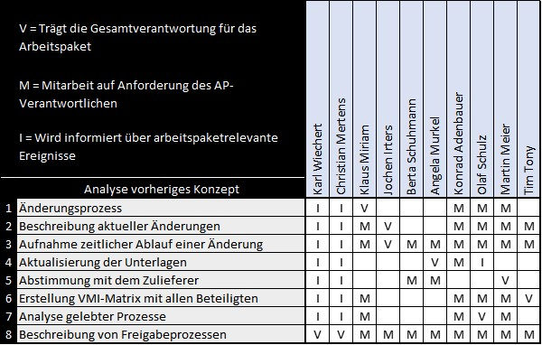

Bei der VMI-Matrix handelt es sich um ein Tool im [Projektmanagement](Projektmanagement.md). Ordnet man die Matrix in den klassischen Projektzyklus ein, so ist diese in der [Projektplanung](Projektplanung.md) anzusiedeln.
Durch die Matrix lassen sich [Verantwortlichkeiten](Verantwortlichkeiten.md) in Bezug auf das [Projekt](Projekt.md) visualisieren und dadurch eindeutig zuordnen. Weiterhin ist auch die Zuordnung von Personen mit unterstützender Tätigkeit sowie zu informierender Personen möglich.
Der Name VMI beschreibt dabei diese Visualisierungsmöglichkeiten, V steht hierbei für [Verantwortlichkeiten](Verantwortlichkeiten.md), M für [Mitarbeit](Projektmitarbeiter.md) und I für informieren. 
Durch die Simplizität bei gleichzeitig leichter Konstruktionsmöglichkeit stellt die VMI-Matrix einen absoluten Klassiker in Bezug auf Projektmanagementinstrumente dar.[^3][^1]

*Beispielhafte VMI-Matrix*[^3]

# Erstellung der Matrix
Bevor die VMI-Matrix erstellt werden kann, ist das Vorliegen eines [Projektstrukturplans](Projektstrukturplan.md) (PSP) zwingend notwendig, da sich die Arbeitspakete der VMI-Matrix aus dem [PSP](Projektstrukturplan.md) ableiten. 
Zur Erstellung einer VMI-Matrix, wie sie in Abbildung 1 vorliegt, ist daher folgendes Vorgehen empfehlenswert: [^5][^3]
* Schritt 1: In der ersten senkrechten Spalte werden die im [PSP](Projektstrukturplan.md) definierten Arbeitspakete eingetragen. 
* Schritt 2: In der obersten waagrechten Zeile werden alle am [Projekt](Projekt.md) beteiligten Stakeholder eingetragen. Die Beteiligten sind hierbei namentlich einzutragen, dadurch ist klar wer der konkrete Ansprechperson ist. 
* Schritt 3: Jedem Arbeitspaket wird genau eine verantwortliche Person (V) zugewiesen. Diese Person erhält ein "V" in der zutreffenden Zelle.
* Schritt 4: Nun werden die Mitarbeitenden (M) für jedes einzelne Arbeitspaket zugewiesen. Dafür wird in die betreffende Zelle der Matrix ein "M" eingetragen. 
* Schritt 5: Zuletzt werden die zu informierenden Personen (I) in der Matrix durch den Buchstaben "I" markiert.
 
# Beschreibung der Dimensionen
Die VMI-Matrix wird im Regelfall von der [Projektleitung](Projektleiter.md) erstellt und verwaltet. Weiterhin wird die Matrix laufend überprüft und bei Bedarf auch angepasst.[^5][^3]
## Verantwortung
Die Zuweisung der "V" Dimension gibt Aufschluss über den die verantwortliche Person des Arbeitspakets. Hierbei sollte pro Arbeitspaket nur eine, bei hochkritischen Arbeitspaketen zwei Personen ausgewiesen werden. Die Aufgaben umfassen unter anderem Prüfung und Sicherstellung der Zielerreichung, dabei sollten auch Termine und Ressourcenvorgaben erfüllt werden. 
## Mitarbeit
Hier werden die für das Arbeitspaket zugewiesenen [Mitarbeitenden](Projektmitarbeiter.md) aufgeführt. 
## Information
Hier werden die Personen aufgeführt, die über den Verlauf der Arbeiten im Arbeitspaket informiert werden müssen. Im Normalfall werden diese Mitarbeitenden nicht selbst in den Arbeitspaketen aktiv, sondern erwarten nur die Information durch den Verantwortlichen.

# Vorteile & Herausforderungen 
Das Verfahren bringt eine Vielzahl von Vorteilen mit sich, dennoch sind bei der Nutzung gewisse Herausforderungen zu bedenken.

## Vorteile
Die Anwendung der VMI-Matrix bringt folgende Vorteile mit sich:
* Klare Kompetenzverteilung
* Transparenz in der Darstellung
* Ermöglicht Informationsmanagement im [Projekt](Projekt.md)
* Stetig und einfach anpassbar, bei sich ändernden Anforderungen
* Erlaubt Überblick über alle Verantwortlichkeiten[^5]

## Herausforderungen
Für eine erfolgreiche Nutzung der VMI sollten die folgenden Herausforderungen beachtet werden:
* Sind zu viele Mitarbeitende involviert? 
* Ist jedem Arbeitspaket ein verantwortliche Person zugewiesen?
* Ist die Darstellung übersichtlich?
* Sind alle Aufgaben abgedeckt?
* Stimmt die Anzahl der Verantwortlichen?
* Zu viele Zuweisungen: Sind die Mitarbeitenden überlastet?[^5][^1]

# Siehe auch

* [RACI](RACI.md)
* [Projektstrukturplan](Projektstrukturplan.md)
* [Projektplanung](Projektplanung.md)
* [Projektleitung](Projektleitung.md)
* [Link auf diese Seite](VMI_Matrix.md)

# Quellen

[^1]: [Kurzbeschreibung VMI-Matrix](https://www.repetico.de/card-77397561)
[^2]: [A Guide to the Project Management Body of Knowledge (PMBOK® Guide)](https://www.pmi.org/pmbok-guide-standards/foundational/PMBOK)
[^3]: [Projektmanagement Handbuch]( https://www.projektmanagementhandbuch.de/handbuch/projektplanung/vmi-matrix/)
[^4]: [Business Wissen]( https://www.business-wissen.de/produkt/4383/vmi-matrix-oder-imv-matrix-information-mitarbeit-verantwortung-der-projektmitarbeiter/)
[^5]: [Wirtschaftswissen]( https://www.wirtschaftswissen.de/marketing-vertrieb/verkauf/vertriebsmanagement/vertriebs-projekte-erfolgreich-managen-mit-der-vmi-matrix/)

