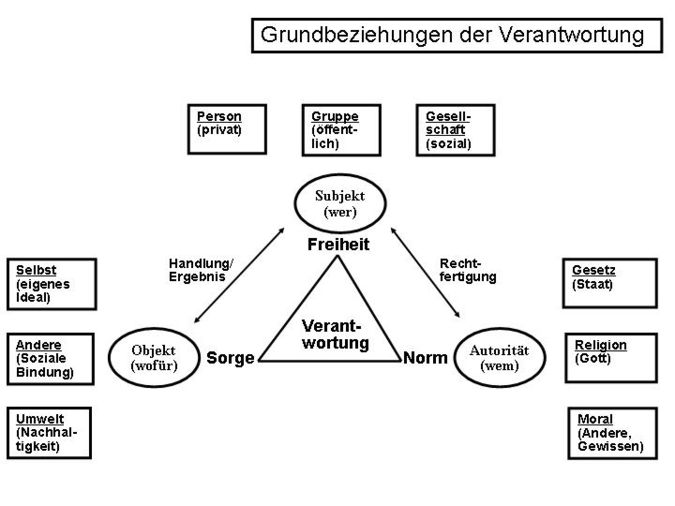
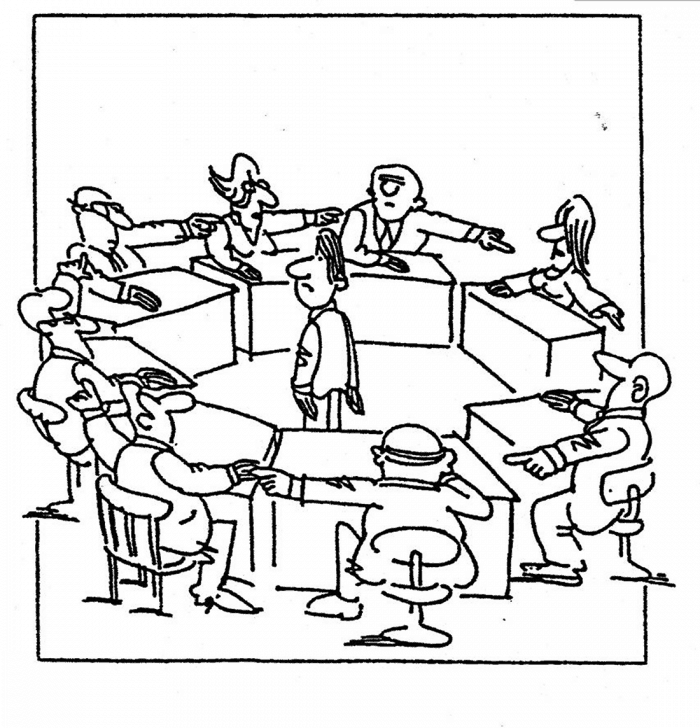

Verantwortlichkeit trägt die Bedeutung des Verantwortlichseins und/oder die Verantwortung für eine bestimmte Handlung tragen. [^1]
In Verbindung mit dem [Projektmanagement](Projektmanagement.md) spielt die Verantwortlichkeit eine entscheidende Rolle.

# Grundlegendes zu Verantwortung

Verantwortung zu tragen kann sich in vielen Situationen und Formen zeigen. Grundsätzlich kann man sagen, dass Verantwortung damit verbunden ist sich im Klaren zu sein, dass auf jede Handlung eventuelle Konsequenzen stoßen können.

Beispiele, die das Tragen der Verantwortung widerspiegeln:

 * Aufziehen eines Kindes
 * Pflegen von Beziehungen
 * [Organisationsprojekte](Organisationsprojekte.md)

Zusätzlich kann man diese Beispiele in freiwillige und nicht freiwillige Übernahme der Verantwortung unterteilen. So wäre die Übernahme der Verantwortung über ein Projekt meist eine freiwillige Aktion. Die Übernahme der Verantwortung über ein Projekt, dass Ihnen ohne Vorwarnung zugewiesen worden ist, wäre unfreiwillig.

Verantwortung wird meist philosophisch erklärt und beschrieben, da es auch sehr vielschichtig und nicht eindeutig ist. Doch mit dem Begriff Verantwortlichkeit wird oft konkret die Zuweisung einer Aufgabe verbunden, wie ein Projekt zu leiten. [^2]

*Grundbeziehungen der Verantwortung erkennen*  [^2]

Verantwortung liegt dem Kongruenzprinzip zugrunde, besteht also aus drei nicht teilbaren Bausteinen: Aufgabe, Befugnis und Rechenschaftspflicht. Laut diesem Prinzip kann eine Person, die eine Aufgabe bekommen hat, nicht ohne die dazugehörige Befugnis handeln. [^3] [^4]

# Projektbezogene Verantwortung

Jedes Projekt hat eine für das Projekt verantwortliche Person. Doch die Verteilung dieser Verantwortung kann variieren.
Beim Einfluss auf die Verantwortlichkeit spielen verschiedene Faktoren eine wichtige Rolle und zeigen voraus wie gut die Ergebnisse sein werden, die ein Projekt erreicht.

## Klare Übertragung der Verantwortung
Der erste wichtige Punkt bei der Verantwortlichkeit ist es eine Konkrete **Übertragung der Verantwortung** klarzumachen. Eine unverbindliche Übertragung kann unter gehen und nicht ernst genommen werden, sodass Projekte zugrunde gehen können. Zusätzlich benötigt man für eine klare Übertragung auch eine offensichtliche Bestätigung vom gegenüber, dem man die Verantwortung übergibt. [^5] [^6]

## Sinnvolle Aufspaltung der Verantwortung
Ein weiterer Faktor, der einen wichtigen Einfluss auf die Verantwortung hat, ist die **Anzahl der Menschen**, denen die Verantwortung gegeben ist. Je mehr Menschen, desto aufgespaltener ist die Verantwortung und desto mehr Menschen verspüren folglich auch kaum Verantwortung. Jeder nimmt an, der andere denkt mit und so kommt es zu [klassischen Missverständnissen](Klassische_Missverstaendnisse.md), Konflikten und Fehlern. Außerdem kann es passieren, dass man zu viel Einfluss auf die eigenen Entscheidungen bekommt, die zu Unsicherheit führen können. [^5]

> Management bedeutet Verantwortung für Ergebnisse 
[^7]

Und diese Verantwortung muss man schlussendlich richtig und sinnvoll aufteilen, damit positive Ergebnisse erscheinen: eindeutige Ziele verbalisieren und bestätigen und die [Aufgabenteilung](Aufgabenteilung.md) sinnvoll gestalten. [^5]

# Rollen und Verantwortung in Projekten

Um ein Projekt erfolgreich auf die Beine zu stellen, muss man zum Anfang des Projektes bestimmte Rollen einteilen. Die Aufgabenteilung trägt hierbei der Erleichterung des Arbeitsprozesses bei, aber es wird auch die Verantwortlichkeit aufgeteilt und das macht das Ergebnis damit vielversprechender.

Die Projekthierarchie schaut folgendermaßen aus:
| Bezeichnung     | Aufgabe |
| ---      | ---       |
| Projektauftraggeber | trägt die Gesamtverantwortung für das Projekt. Repräsentiert das Projekt der Firma/des Unternehmens |
| [Projektleiter](Projektleiter.md) | verantwortlich für das Umsetzen des Projektes mit zu beachtenden Zielen (oft zeitliche Ziele) unter stetiger Kontaktaufnahme zum Projektauftraggeber |
| Teilprojektleiter | verantwortlich für Teilprojekte des Projektleiters |
| [Projektmitarbeiter](Projektmitarbeiter.md) | verantwortlich für das aktive Erreichen der Ziele durch das Erledigen der Arbeit (hier sieht man die Aufteilung der Verantwortlichkeit am deutlichsten) | 

[^8][^9]

# Siehe auch

* [Projektmanagement](Projektmanagement.md)
* [Organisationsprojekte](Organisationsprojekte.md)
* [klassischen Missverständnissen](Klassische_Missverstaendnisse.md)
* [Projektleiter](Projektleiter.md)
* [Aufgabenteilung](Aufgabenteilung.md)
* [Projektmitarbeiter](Projektmitarbeiter.md)

# Weiterführende Literatur

* https://www.tiba.de/wp-content/uploads/Studie_Sustainability-im-Projektmanagement.pdf
* https://www.projektmagazin.de/aufgaben-projektmanager-projektleiter

# Quellen

[^1]: (https://www.duden.de/rechtschreibung/Verantwortlichkeit)
[^2]: (https://de.wikipedia.org/wiki/Verantwortung#cite_note-8)
[^3]: (http://projektmanagement-definitionen.de/glossar/verantwortung/)
[^4]: (https://www.inloox.de/projektmanagement-glossar/verantwortlichkeit/)
[^5]: (https://www.microconsult.de/blog/2020/02/ps_projektverantwortung/)
[^6]: (https://www.kisp.de/verantwortungsverteilung/)
[^7]: (https://link.springer.com/content/pdf/10.1007/978-3-540-39519-5_3.pdf)
[^8]: (https://dieprojektmanager.com/rollen-und-verantwortung-in-projekten/#Vorgehensweise_bei_der_Erstellung_einer_Projektorganisation)
[^9]: (https://www.business-netz.com/Frage-trifft-Antwort/Projektmanagement/6/Projektverantwortung)
